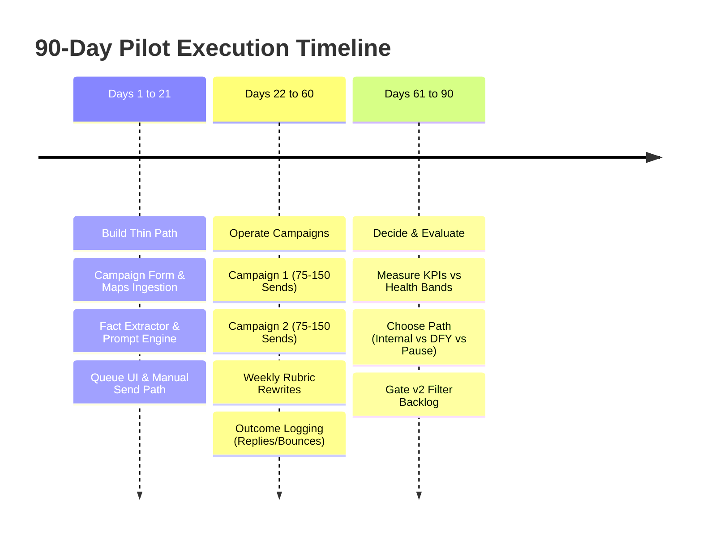

# 90-Day Pilot Plan

## 1. Intent & Business Value
LocalDraft is structured around a rigorous 90-day execution calendar divided into three distinct operational phases: Build (Days 1–21), Operate (Days 22–60), and Decide (Days 61–90). This epic manages the execution milestones, operational pacing, and empirical KPI benchmarks necessary to objectively evaluate whether personalized local outreach works, before making any commitments to enterprise feature additions or SaaS packaging.

## 2. Source Specifications

### The Three Pilot Phases
1. **Days 1–21 — Build the Thin Path**:
   - Deliver the campaign setup form (type, geography, offer brief, tone).
   - Ingest Google Maps local search for 1 metro area across 3 service categories.
   - Deploy public web scraper, fact extractor, and email harvester.
   - Integrate LLM draft generator and citation UI panel.
   - Implement agent queue with the full 10-status model and manual send paths.
2. **Days 22–60 — Operate Live Campaigns**:
   - Run 2 distinct local campaigns dispatching 75–150 human-approved drafts each.
   - Track live operational metrics: send timestamp, bounces, inbound replies, booked meetings, and disqualification reasons.
   - Conduct a mandatory weekly review to rewrite draft rubrics and prompt constraints based on real-world recipient responses and silence.
3. **Days 61–90 — Commercial Decision Gate**:
   - Evaluate quantitative metrics against healthy/kill thresholds.
   - Decide whether to maintain LocalDraft as an internal pipeline tool, commercialize it as a Done-For-You (DFY) agency service, or pause development.
   - Explicitly gate v2 filters (headcount, revenue) on whether list quality proved to be the true commercial bottleneck.

### Pilot Success Metrics & Benchmark Bands
| Metric | Healthy Early Range | Rethink / Kill Trigger | Measurement Method |
|--------|---------------------|------------------------|--------------------|
| **Drafts with verified cited fact** | **70%+** | Majority are name + city only | Fact count >= 1 per generated draft |
| **Listings with reachable email found** | **30%–60%** (by vertical) | Email find rate too low to work queue | Harvester yield / total listings |
| **Positive reply rate** | **3–8 replies / 100 sent** | Near-zero replies after copy/offer tests | Inbound replies / confirmed sent |
| **Agent review time per draft** | **< 4 minutes editing** | Every draft requires complete manual rewrite | Stopwatch / queue edit duration |
| **Complaint / unsubscribe rate** | **Very low** (< 1%) | Pattern of hostile *"how did you get this"* | Logged recipient complaints |

## 3. Scope Boundaries
- **In Scope (v1)**: 90-day calendar tracking, weekly rubric iteration logs, pilot metrics spreadsheet/dashboard, 2 test campaigns (75–150 sends each).
- **Explicit Non-Goals (v2+)**:
  - Premature scaling beyond the single beachhead metro during the 90 days.
  - Multi-agent or enterprise seat management.

## 4. Pacing & Milestone Flow

## 5. Stories

- [Days 1-21 thin-path checklist](days-1-21-thin-path-checklist-2026-09-12.md) (`days-1-21-thin-path-checklist-2026-09-12`): Tracking checklist for building all foundational components of the thin path.
- [Days 22-60 operate campaigns](days-22-60-operate-campaigns-2026-09-12.md) (`days-22-60-operate-campaigns-2026-09-12`): Execution plan for operating two 75–150 draft campaigns with mandatory weekly prompt iterations.
- [Days 61-90 decide path](days-61-90-decide-path-2026-09-12.md) (`days-61-90-decide-path-2026-09-12`): Governance framework for evaluating commercial viability and gating v2 scope additions.
- [Pilot success metrics tracking](pilot-success-metrics-tracking-2026-09-12.md) (`pilot-success-metrics-tracking-2026-09-12`): Dashboard and reporting tools tracking cited facts %, email find %, reply rates, review times, and complaints.

## 6. Milestone Definition of Done
- [ ] Thin-path build checklist exits Days 1–21 with zero critical functional blockers.
- [ ] Two campaigns log at least 75 human-approved sends each during Days 22–60.
- [ ] Weekly prompt rubric changelog documents adjustments based on live feedback.
- [ ] Final pilot scorecard compares actual results directly against the 5 benchmark ranges.
- [ ] Formal commercial decision memo is signed off at Day 90 before building any v2 features.

## 7. Dependencies & Sequencing
- **Prerequisites**: [epic-v1-product-scope](epic-v1-product-scope-2026-09-12.md), [epic-agent-workspace](epic-agent-workspace-2026-09-12.md), [epic-beachhead-gtm](epic-beachhead-gtm-2026-09-12.md).
- **Unblocks**: [epic-recommended-decision](epic-recommended-decision-2026-09-12.md).
