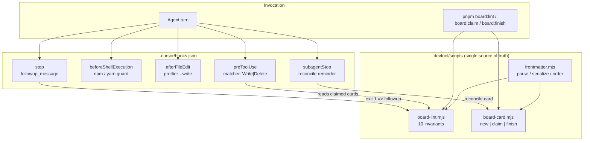
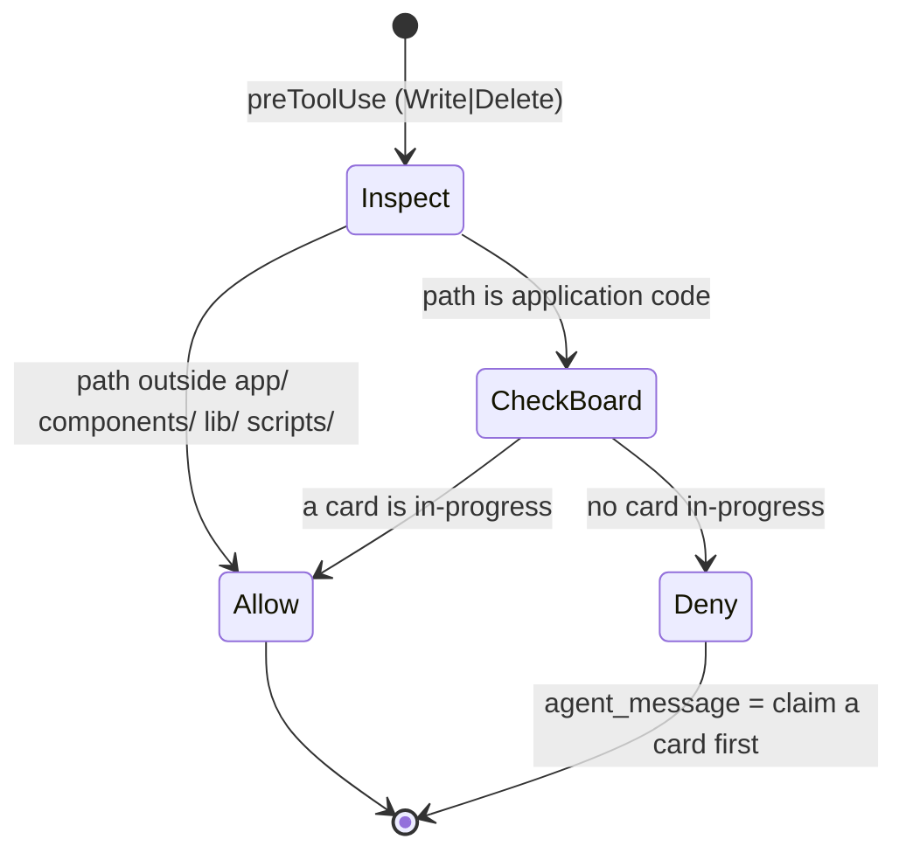

# Agent Process Automation

## 1. Intent & Business Value

The operating rules in [`agenda.md`](../../agenda.md) are complete but advisory: every invariant is enforced only by an agent choosing to read prose and comply. Nothing in the repo can detect a violation, so the board silently accumulates drift — stale Doing cards, unticked acceptance criteria on Done cards, colliding `order` values, and a `package-lock.json` that contradicts the declared pnpm toolchain.

This epic converts the written process into executable checks: a board linter, a card lifecycle CLI, Cursor hooks that gate writes and audit turns, and a committed Cloud Agent environment. The board stops depending on agent diligence and starts failing loudly.

**Key Outcomes:**

- Process violations are detected mechanically, in the same turn they happen.
- Frontmatter serialization is generated, not hand-written from reference prose.
- Parallel agents can claim cards without racing for a single Doing slot.
- Cloud Agent runs boot with dependencies already installed.

## 2. Source Specifications

### A. Measured Drift (audit of 134 cards, 2026-09-20)

| Invariant (source) | Specified in | Observed state |
|---|---|---|
| One Doing card per agent | `kanban-markdown/SKILL.md` §Card protocol 4 | 2 cards `in-progress`; `project-structure-conventions-2026-09-15` stale since 2026-09-16 with every criterion unchecked while its deliverables (`app/README.md`, `components/README.md`, `lib/README.md`, 23 `.gitkeep` files) all exist |
| Done cards have satisfied criteria | `agenda.md` §Hard gate 3–4 | Clean, but only once the rule is scoped: the 4 cards under `done/` with unchecked boxes carry them under `## Further breakdown`, which the card format defines as candidate follow-ups rather than gates |
| `order` is a unique fractional index per column | `references/data-model.md` §Fractional Index Ordering | `bG` and `bH` each held by two backlog cards; `a0` held by both Todo cards. Done has ~20 collisions because a finished card keeps the index it held in its previous column, so uniqueness is enforceable only in active columns |
| `modified` updates on edit | `references/data-model.md` §Frontmatter Fields | Equal to `created` on cards edited after creation |
| `assignee` identifies the claiming agent | `references/data-model.md` §Frontmatter Fields | `null` on every card an agent has touched; only the human operator sets it (`"Andrew"` on `database-connection-and-cli-scaffolding-2026-09-20`), so the per-agent Doing rule is unverifiable |
| Frontmatter carries only documented fields | `references/data-model.md` §Frontmatter Fields | 20 cards carry an undocumented `epic:` key, always `null`, written by the board extension between `assignee` and `dueDate` |
| `pnpm lint` is a usable gate | `package.json` | Already broken on `main`: `eslint-plugin-react@7.37.5` calls `context.getFilename()`, removed in ESLint 10, so `eslint .` crashes on the first file it reads |
| pnpm is the package manager | `package.json` `packageManager: pnpm@9.15.9` | `package-lock.json` committed alongside `pnpm-lock.yaml` |

### B. Cursor Hook Events Available to Cloud Agents

Project hooks live in `.cursor/hooks.json`, are committed with the repo, and run from the project root. Command-based hooks are picked up by Cloud Agents; prompt-based hooks are not. `sessionStart`, `sessionEnd`, the MCP hooks, and the Tab hooks do **not** run in the cloud, and no hooks run during a Cloud Agent's initial read-only turns.

| Event | Can it block? | Return fields this epic uses |
|---|---|---|
| `preToolUse` | Yes | `permission: "allow" \| "deny"`, `agent_message`, `user_message` |
| `beforeShellExecution` | Yes | `permission: "allow" \| "deny" \| "ask"`, `agent_message` |
| `afterFileEdit` | No (observe only) | — (side effects only; receives `file_path`, `edits`) |
| `subagentStart` | Yes (`"ask"` treated as deny) | `permission`, `agent_message` |
| `subagentStop` | No | `followup_message` (consumed only when `status` is `"completed"`) |
| `stop` | No | `followup_message` (auto-submitted as the next user message, capped by `loop_limit`, default 5) |

Constraints that shape the design:

- There is no `beforeFileEdit` event. `afterFileEdit` cannot revert a write, so the pre-write gate must be `preToolUse` with a matcher over write tools (`Write`, `Delete`). Matcher coverage of in-place string edits is not documented, so the gate is a deterrent and **must** be backed by the `stop` audit.
- Hooks fail **open** by default; a crash, timeout, or non-zero exit other than `2` lets the action through unless the hook sets `failClosed: true`.
- Exit code `2` is equivalent to `permission: "deny"`.

### C. Board Invariants to Enforce

The linter is the single definition of a valid board, consumed by both humans (`pnpm board:lint`) and the `stop` hook:

1. `id` equals the filename without `.md`.
2. The documented fields appear in the order and quoting given in `references/data-model.md` §Exact Serialization Format. Fields the board extension writes itself (`epic`) are tolerated in any position; anything else is an unknown field.
3. `status` is one of `backlog`, `todo`, `in-progress`, `review`, `done`; `priority` is one of `critical`, `high`, `medium`, `low`.
4. `status: "done"` implies the file is under `done/` with a non-null `completedAt`; any other status implies the features root with `completedAt: null`.
5. `order` uses base-62 characters only and is unique within each **active** column. Done is exempt.
6. Every `epic:<id>` label resolves to an existing epic card, and that card carries the `epic` label.
7. A done card has no unchecked boxes under `## Acceptance Criteria` or `## N. Milestone Definition of Done`. `## Further breakdown` and fenced code blocks are ignored.
8. Every claimed (`in-progress`) card has a non-null `assignee`, and no assignee holds more than one.
9. `modified` is not earlier than `created`; `completedAt` is not earlier than `created`.
10. Story cards carry both `story` and exactly one `epic:<id>` label; epic cards carry `epic`.

## 3. Scope Boundaries

### In Scope (v1)

- `.devtool/scripts/` board tooling: linter and card lifecycle CLI, with vitest coverage.
- `.cursor/hooks.json` plus command hooks for the story gate, turn-end board audit, write formatting, and package-manager guard.
- `.cursor/environment.json` pinning the Cloud Agent install and start commands.
- `assignee` as the claim token, with the protocol documented in the kanban skill.
- One-time reconciliation of the drift in §2A so the linter starts from a clean board.

### Explicit Non-Goals (v2+)

- GitHub Actions or any hosted CI (`epic-application-architecture-2026-09-15` lists "CI/CD pipeline configuration" as an explicit non-goal; changing that requires amending it there first).
- Git pre-commit / pre-push hooks (husky, lefthook) — Cursor hooks cover the agent path, which is where the drift originates.
- Prompt-based hooks and MCP hooks, which Cloud Agents do not run.
- Rewriting the Kanban board format or replacing the LachyFS extension.
- Automating epic authoring or acceptance-criteria generation.

## 4. Architecture & Flow

### Story gate decision flow

## 5. Stories

- [Kanban board linter](board-lint-script-2026-09-20.md) (`board-lint-script-2026-09-20`): Executable definition of the ten board invariants, exposed as `pnpm board:lint` and covered by vitest.
- [Card lifecycle CLI](card-lifecycle-cli-2026-09-20.md) (`card-lifecycle-cli-2026-09-20`): Generate, claim, and finish cards so frontmatter serialization and fractional ordering are never hand-written.
- [Cursor agent hooks](cursor-agent-hooks-2026-09-20.md) (`cursor-agent-hooks-2026-09-20`): Commit `.cursor/hooks.json` with the story gate, turn-end audit, write formatter, and package-manager guard.
- [Cloud Agent environment manifest](cloud-agent-environment-manifest-2026-09-20.md) (`cloud-agent-environment-manifest-2026-09-20`): Pin install and start so cloud runs boot with dependencies present.
- [Subagent claim protocol](subagent-claim-protocol-2026-09-20.md) (`subagent-claim-protocol-2026-09-20`): Use `assignee` as the claim token and document fan-out, review, and hand-back rules.
- [Board drift reconciliation](board-drift-reconciliation-2026-09-20.md) (`board-drift-reconciliation-2026-09-20`): Clear the §2A violations so the linter's first run is green.
- [Restore the ESLint gate](restore-eslint-gate-2026-09-20.md) (`restore-eslint-gate-2026-09-20`): Make `pnpm lint` run again under ESLint 10 so it can be part of a pre-Done gate. Not required by the rest of the epic.
- [Normalize repository formatting](normalize-repo-formatting-2026-09-20.md) (`normalize-repo-formatting-2026-09-20`): Run `pnpm format` once on its own so the format hook does not drag whole-file reformats into unrelated diffs.

## 6. Milestone Definition of Done

- [ ] `pnpm board:lint` exits `0` on the reconciled board and non-zero for each of the ten invariants in §2C.
- [ ] `pnpm board:claim` and `pnpm board:finish` perform the status transitions, timestamp updates, and `done/` move without hand-edited frontmatter.
- [ ] A write to `app/`, `components/`, `lib/`, or `scripts/` with no claimed card is denied by `preToolUse` with an actionable `agent_message`.
- [ ] Ending a turn on a board that violates any invariant produces a `stop` followup naming the offending card and rule.
- [ ] `npm install`, `npm ci`, and `yarn` are denied in favour of pnpm.
- [ ] `.cursor/environment.json` installs dependencies with a frozen lockfile and is valid against the published schema.
- [ ] Every `in-progress` card has an `assignee`, and the kanban skill documents the claim, fan-out, and hand-back contract.
- [ ] `pnpm typecheck` and `pnpm test` pass with the tooling and its tests in place. `pnpm lint` is excluded: it crashes on `main` for reasons unrelated to this epic and is tracked by `restore-eslint-gate-2026-09-20`.
- [ ] `pnpm format` cannot reformat Kanban cards or skill docs, so the format hook never fights hand-authored markdown.

## 7. Dependencies & Sequencing

- **Prerequisites**: None. The board tooling reads only `.devtool/features/` and must not depend on application code.
- **Sequencing**: `board-lint-script` defines the invariants the other stories rely on, so it lands first; `card-lifecycle-cli` reuses its frontmatter module; `cursor-agent-hooks` shells out to both; `board-drift-reconciliation` lands last so the linter is green at the end of the epic.
- **Unblocks**: Parallel subagent execution of component stories, and any future story that wants a machine-checkable definition of done on the board.
