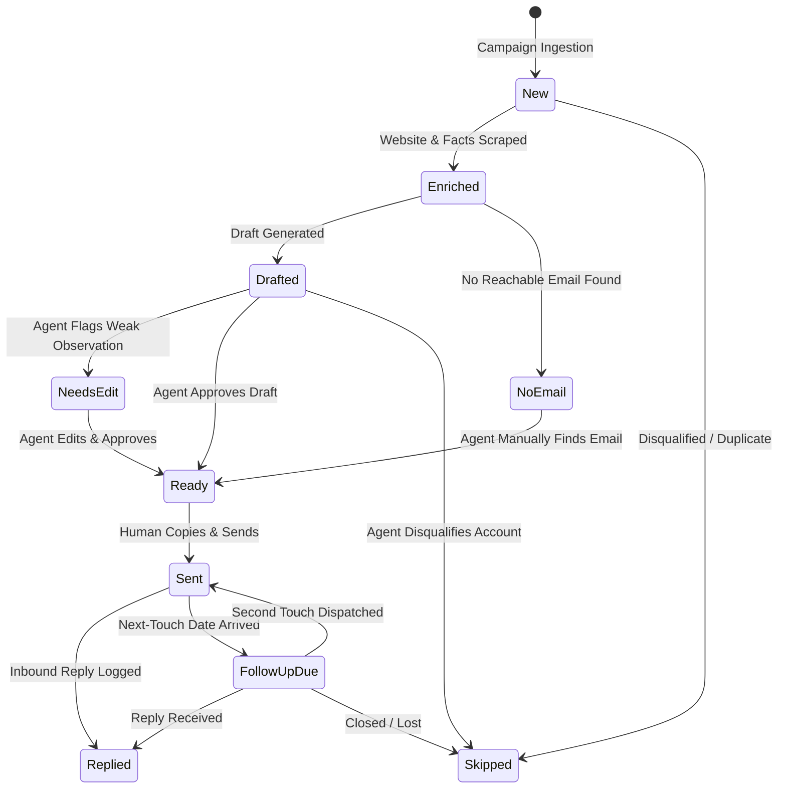

# Agent Workspace and Follow-Up

## 1. Intent & Business Value
Personalized outreach operations collapse when generated drafts are exported to messy spreadsheets or dumped into email outboxes where conversation state is lost. This epic delivers a focused, lightweight agent workspace where an operator reviews research, refines drafts, triggers manual sends, and manages follow-up obligations in a single structured queue.

## 2. Source Specifications

### Full Status Model Lifecycle
| Status | Definition & System Meaning | Transition Trigger |
|--------|----------------------------|--------------------|
| `New` | Business discovered from local search; enrichment has not yet run. | Initial campaign ingestion |
| `Enriched` | Public website parsed; facts, CTAs, and contact emails captured. | Scraper & fact engine complete |
| `Drafted` | Personalized email draft (subject + body) generated from facts. | LLM draft generation complete |
| `Needs edit` | Agent flagged draft for weak observations, awkward phrasing, or poor offer alignment. | Agent manual review flag |
| `No email` | No valid `mailto:` or contact page email could be extracted. | Harvester yields empty address list |
| `Skipped` | Account disqualified as out-of-ICP, competitor, or duplicate. | Agent manual triage / soft filter |
| `Ready` | Draft reviewed and approved by human agent; pending dispatch. | Agent approves draft |
| `Sent` | Agent copied or dispatched draft via mail client; sent timestamp saved. | Agent clicks "Mark Sent" |
| `Replied` | Recipient business replied to outreach (positive or negative). | Agent logs inbound reply |
| `Follow-up due`| Next-touch follow-up date has been reached or is overdue. | System date matches next-touch date |

### Single-Operator Follow-Up & Due Today View
- **Follow-Up Schema**: Each account contains a nullable `nextTouchDate` (`YYYY-MM-DD`) and a string `followUpNote`.
- **Due Today Filter**: A dedicated view / dashboard widget showing all records where `nextTouchDate <= current_date` and status is not `Replied`, `Skipped`, or `No email`.
- **Deliberate Simplicity**: v1 deliberately avoids multi-touch auto-sequences, drip campaigns, or robotic follow-up sends. The human agent retains complete control of second touches.

### Pilot Operate Logging Fields (Days 22–60)
To support pilot measurement, each record tracks:
- `sentAt`: Timestamp when marked sent.
- `bounce`: Boolean indicating whether message bounced.
- `repliedAt`: Timestamp of first response.
- `meetingBooked`: Boolean indicating whether a discovery call or appointment was secured.
- `disqualifyReason`: Enum or short note (e.g., wrong service, permanent closure, hostile response).

## 3. Scope Boundaries
- **In Scope (v1)**: 10-status state machine, multi-criteria queue filters, daily due-today view, pilot outcome metrics logging, copy/mailto actions.
- **Explicit Non-Goals (v2+)**:
  - Automated follow-up drip sequences or automated email scheduling.
  - Multi-user team routing, collision detection, or SDR lead assignment.
  - Two-way CRM synchronization (HubSpot, Salesforce, Pipedrive).
  - IMAP/Google Workspace API background sync (agent manually notes replies).

## 4. State Transition Architecture

## 5. Stories

- [Full status model](full-status-model-2026-09-12.md) (`full-status-model-2026-09-12`): Database schema, status enum transitions, and queue state management.
- [Due today view](due-today-view-2026-09-12.md) (`due-today-view-2026-09-12`): Filtered queue and navigation widget prioritizing accounts requiring next-touch action today.
- [Pilot logging fields](pilot-logging-fields-2026-09-12.md) (`pilot-logging-fields-2026-09-12`): Tracking fields for send timestamp, bounce, reply timestamp, meeting booked, and disqualification reasons.

## 6. Milestone Definition of Done
- [ ] Queue table displays all 10 proposal statuses with visual badge differentiation following shadcn patterns.
- [ ] Status transitions obey business rules (e.g., cannot move to `Sent` without passing through `Ready` or human override).
- [ ] "Due Today" tab accurately surfaces records whose `nextTouchDate` is on or before the current day.
- [ ] Agent can update follow-up notes and dates inline without losing queue pagination or scroll state.
- [ ] Marking an account as `Sent` automatically captures the current ISO timestamp.
- [ ] Exportable CSV / query view allows exporting pilot logging fields (`sentAt`, `bounce`, `repliedAt`, `meetingBooked`, `disqualifyReason`) for weekly reviews.

## 7. Dependencies & Sequencing
- **Prerequisites**: [epic-v1-product-scope](epic-v1-product-scope-2026-09-12.md), [epic-solution](epic-solution-2026-09-12.md).
- **Unblocks**: [epic-90-day-pilot-plan](epic-90-day-pilot-plan-2026-09-12.md), [epic-risks-and-mitigations](epic-risks-and-mitigations-2026-09-12.md).
