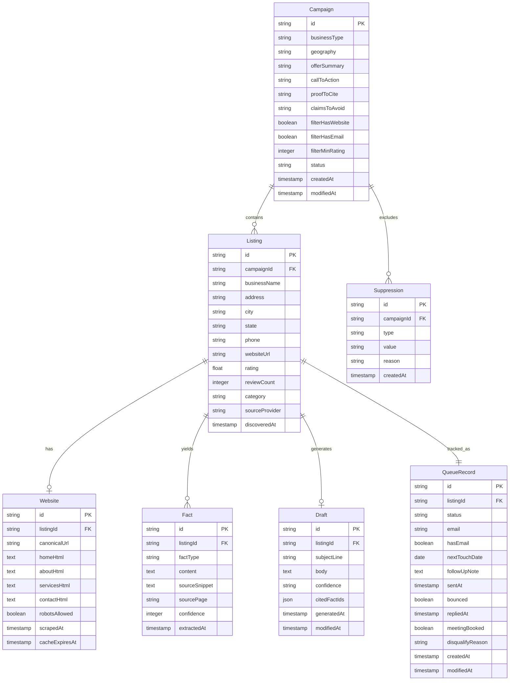
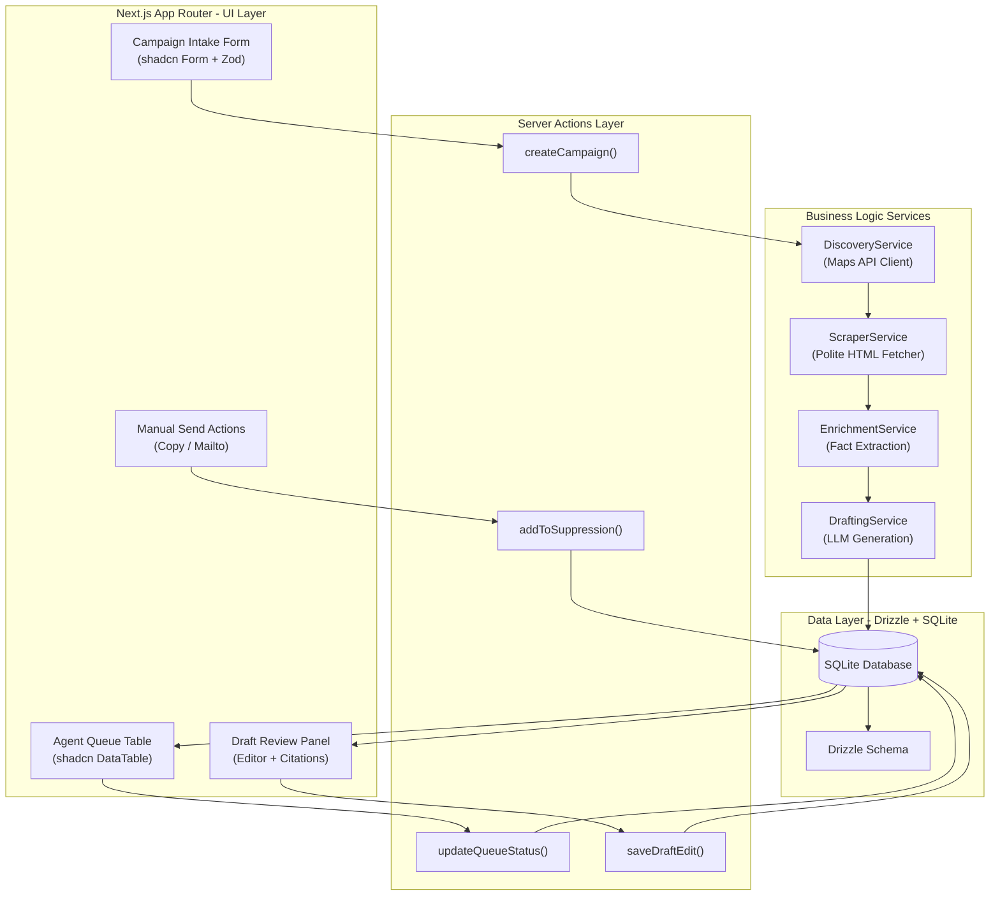
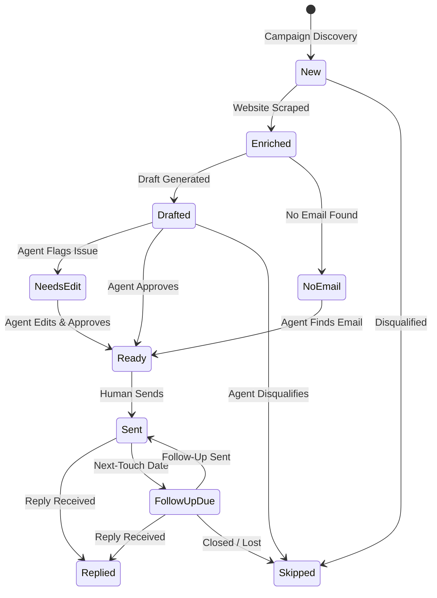
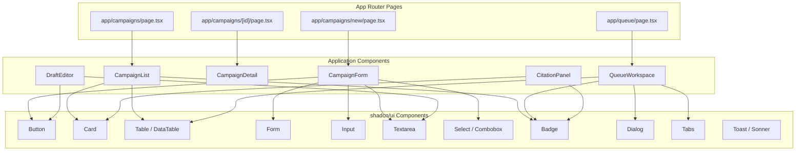

# Application Architecture

## 1. Intent & Business Value

This epic establishes the complete technical foundation for LocalDraft before any implementation code is written. It documents framework selection rationale, project structure conventions, database schema design, UI component inventory, and service interface contracts. By completing this architecture phase first, the team avoids costly mid-project technology pivots and ensures all engineers share a common mental model of the system.

**Key Outcomes:**
- Zero ambiguity on technology choices during implementation
- Type-safe contracts between all system layers
- Clear module boundaries preventing spaghetti dependencies
- Production-ready infrastructure path from day one

## 2. Source Specifications

### A. Technology Stack Selection

| Layer | Technology | Version | Rationale |
|-------|------------|---------|-----------|
| **Framework** | Next.js App Router | 16.x | Largest ecosystem, best hiring pool, native React Server Components, excellent shadcn/ui integration |
| **UI Library** | shadcn/ui | Latest | Copy-paste component ownership, zero runtime overhead, RSC-compatible by default, full design control |
| **Styling** | Tailwind CSS | v4 | Utility-first, CSS variables for theming, excellent DX with shadcn/ui |
| **Primitives** | Radix UI | Latest | Accessible (WAI-ARIA), unstyled, composable — powers shadcn/ui |
| **Database** | SQLite | 3.x | Zero-config local dev, single-file portability, sufficient for pilot scale |
| **ORM** | Drizzle ORM | Latest | Type-safe schema, excellent SQLite support, simple migrations with drizzle-kit |
| **SQLite Driver** | better-sqlite3 | Latest | Synchronous, high-performance local development |
| **Production DB Path** | Turso / libSQL | — | Easy migration path when ready for hosted deployment |
| **Language** | TypeScript | 5.x | Strict mode, full type safety across all layers |
| **Package Manager** | pnpm | 9.x | Fast, efficient disk usage, strict dependency resolution |

### B. Framework Selection Rationale

**Next.js 16 App Router** was selected over alternatives:

| Framework | Considered For | Decision |
|-----------|----------------|----------|
| Next.js 16 App Router | Default choice | **Selected** — largest ecosystem, Vercel-native, RSC stability |
| React Router v7 (Remix) | Form-heavy CRUD apps | Rejected — smaller ecosystem, less shadcn/ui integration |
| SvelteKit | Performance, small bundles | Rejected — smaller talent pool, requires Svelte expertise |

**shadcn/ui** was selected over alternatives:

| Library | Considered For | Decision |
|---------|----------------|----------|
| shadcn/ui | Full code ownership | **Selected** — RSC-compatible, zero runtime, full customization |
| Material UI | Rapid prototyping | Rejected — Emotion runtime, hydration complexity with App Router |
| Chakra UI | Accessibility | Rejected — runtime overhead, less RSC-friendly |

### C. Database & ORM Selection Rationale

**SQLite + Drizzle ORM** was selected for the pilot phase:

| Aspect | Choice | Rationale |
|--------|--------|-----------|
| Database | SQLite | Zero infrastructure, single-file, sufficient for single-operator pilot |
| ORM | Drizzle | Type-safe, schema-as-code, excellent SQLite support |
| Driver | better-sqlite3 | Synchronous queries, fast local dev |
| Migration Path | Turso / libSQL | Drop-in replacement when scaling beyond local |

**Explicit Non-Goals:**
- PostgreSQL or MySQL setup during pilot (unnecessary infrastructure)
- Prisma ORM (heavier, less SQLite-native)

## 3. Scope Boundaries

### In Scope (v1 Architecture)
- Technology stack documentation with selection rationale
- Project directory structure conventions
- Drizzle schema design for all core entities
- shadcn/ui component inventory mapped to UI requirements
- Server action and API route contracts
- TypeScript interfaces for pipeline services (discovery, scraping, drafting)
- Mermaid architecture diagrams

### Explicit Non-Goals (v2+)
- Multi-tenant database isolation
- Microservices or serverless function decomposition
- CI/CD pipeline configuration
- Infrastructure-as-code (Terraform, Pulumi)
- Monitoring and observability stack

## 4. Architecture & Flow

### A. Project Directory Structure

```
localdraft/
├── app/                          # Next.js App Router
│   ├── (auth)/                   # Auth-required route group
│   │   ├── campaigns/            # Campaign management pages
│   │   │   ├── [id]/             # Single campaign view
│   │   │   │   ├── page.tsx
│   │   │   │   └── settings/
│   │   │   ├── new/
│   │   │   │   └── page.tsx
│   │   │   └── page.tsx          # Campaign list
│   │   ├── queue/                # Agent workspace queue
│   │   │   └── page.tsx
│   │   └── layout.tsx            # Auth layout wrapper
│   ├── api/                      # API routes (if needed)
│   ├── globals.css               # Tailwind base styles
│   ├── layout.tsx                # Root layout
│   └── page.tsx                  # Landing / dashboard
├── components/
│   ├── ui/                       # shadcn/ui components (auto-generated)
│   │   ├── button.tsx
│   │   ├── card.tsx
│   │   ├── table.tsx
│   │   └── ...
│   ├── campaigns/                # Campaign-specific components
│   │   ├── campaign-form.tsx
│   │   ├── campaign-card.tsx
│   │   └── intake-fields.tsx
│   ├── queue/                    # Queue workspace components
│   │   ├── queue-table.tsx
│   │   ├── draft-panel.tsx
│   │   ├── citation-panel.tsx
│   │   └── status-badge.tsx
│   └── shared/                   # Shared application components
│       ├── page-header.tsx
│       └── empty-state.tsx
├── lib/
│   ├── db/                       # Database layer
│   │   ├── index.ts              # Drizzle client export
│   │   ├── schema.ts             # Drizzle schema definitions
│   │   └── migrations/           # Generated migrations
│   ├── actions/                  # Server actions
│   │   ├── campaigns.ts          # Campaign CRUD actions
│   │   ├── queue.ts              # Queue status mutations
│   │   └── suppression.ts        # Suppression list actions
│   ├── services/                 # Business logic services
│   │   ├── discovery/            # Maps/Places API discovery
│   │   │   ├── index.ts
│   │   │   └── types.ts
│   │   ├── scraper/              # Website scraping
│   │   │   ├── index.ts
│   │   │   ├── fetcher.ts
│   │   │   └── types.ts
│   │   ├── enrichment/           # Fact extraction
│   │   │   ├── index.ts
│   │   │   └── types.ts
│   │   └── drafting/             # LLM draft generation
│   │       ├── index.ts
│   │       ├── prompts.ts
│   │       └── types.ts
│   ├── utils/                    # Shared utilities
│   │   └── cn.ts                 # Tailwind class merger
│   └── constants/                # Application constants
│       ├── statuses.ts           # Queue status enum
│       └── categories.ts         # Business category presets
├── drizzle.config.ts             # Drizzle Kit configuration
├── tailwind.config.ts            # Tailwind configuration
├── components.json               # shadcn/ui configuration
├── next.config.ts                # Next.js configuration
├── tsconfig.json                 # TypeScript configuration
└── package.json
```

### B. Core Data Model (Drizzle Schema)



### C. Application Flow Architecture



### D. Queue Status State Machine



### E. Component Architecture



## 5. Stories

- [Stack selection rationale](stack-selection-rationale-2026-09-15.md) (`stack-selection-rationale-2026-09-15`): Document framework, UI, and database technology choices with decision rationale.
- [Project structure conventions](project-structure-conventions-2026-09-15.md) (`project-structure-conventions-2026-09-15`): Define directory layout, module boundaries, and import conventions.
- [Database schema design](database-schema-design-2026-09-15.md) (`database-schema-design-2026-09-15`): Design Drizzle schema for Campaign, Listing, Website, Fact, Draft, QueueRecord, and Suppression entities.
- [UI component inventory](ui-component-inventory-2026-09-15.md) (`ui-component-inventory-2026-09-15`): Map shadcn/ui components to UI requirements and document customization needs.
- [API route design](api-route-design-2026-09-15.md) (`api-route-design-2026-09-15`): Define server action signatures and API route contracts with TypeScript types.
- [Pipeline service interfaces](pipeline-service-interfaces-2026-09-15.md) (`pipeline-service-interfaces-2026-09-15`): TypeScript interfaces for DiscoveryService, ScraperService, EnrichmentService, and DraftingService.
- [Project dependency manifest](done/project-dependency-manifest-2026-09-16.md) (`project-dependency-manifest-2026-09-16`): Derive the dependency set from the board and author the root `package.json` (no installs).

## 6. Milestone Definition of Done

- [ ] Technology stack selection document is finalized with rationale for each choice.
- [ ] Project directory structure is documented with clear module boundary rules.
- [ ] Drizzle schema is designed for all core entities with relationship constraints.
- [ ] Required shadcn/ui components are inventoried and mapped to UI mockups.
- [ ] Server action and API route contracts are defined with TypeScript signatures.
- [ ] Pipeline service interfaces are documented with input/output types.
- [ ] All architecture diagrams (ER, flow, state machine, component) are complete.
- [ ] No implementation code is written — this epic is design-only.

## 7. Dependencies & Sequencing

- **Prerequisites**: [epic-purpose](epic-purpose-2026-09-12.md), [epic-solution](epic-solution-2026-09-12.md), [epic-v1-product-scope](epic-v1-product-scope-2026-09-12.md).
- **Unblocks**: All implementation epics — [epic-campaign-intake-fields](epic-campaign-intake-fields-2026-09-12.md), [epic-data-and-enrichment](epic-data-and-enrichment-2026-09-12.md), [epic-agent-workspace](epic-agent-workspace-2026-09-12.md), [epic-email-draft-standard](epic-email-draft-standard-2026-09-12.md).
