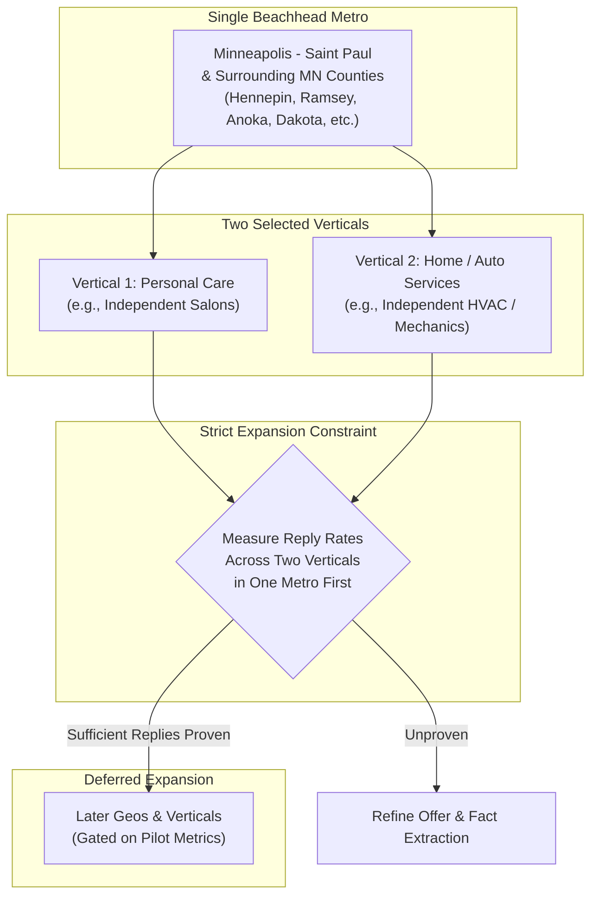

# Beachhead and Go-to-Market

## 1. Intent & Business Value
Attempting to launch cold outreach across multiple national markets simultaneously dilutes focus and makes it impossible to distinguish between bad copy, broken targeting, or regional differences. This epic establishes LocalDraft's beachhead strategy: anchoring all initial testing in a single familiar metropolitan region (Minneapolis–Saint Paul and surrounding Minnesota counties) across two well-defined local service verticals before expanding geography.

## 2. Source Specifications

### A. Rationale for a Single Beachhead Metro
1. **Local Ground Truth**: Maps listing coverage, business names, and category quirks can be verified with direct geographic intuition rather than relying solely on dashboard abstractions.
2. **Repeating Technical Patterns**: Website builder architectures (e.g., standard salon templates, roofing/siding contractors on common CMSs) repeat heavily within a regional market, allowing scraping heuristics to harden quickly.
3. **Local Conversational Voice**: Inbound reply handling occurs during local business hours using natural, locally authentic terminology that resonates with nearby shop owners.

### B. First Verticals to Test (Selection Framework)
The proposal designates three high-potential service clusters:
1. **Personal Care**: Independent hair salons, barber shops, day spas, massage practices.
2. **Automotive Services**: Independent auto repair mechanics, body shops, tire specialists.
3. **Residential Home Services**: Remodelers, concrete/driveway installers, HVAC technicians, landscape contractors.
- **Operating Rule**: Select and run the exact same core pipeline across **two verticals** within the beachhead metro before attempting to add other states or cities. Breadth without reply data is vanity inventory.

### C. Go-to-Market Playbook by Buyer Path
- **Internal Tool Pathway**: Use drafts exclusively on the operator's own client acquisition pipeline for 30–60 days; measure real meetings booked per 100 sent.
- **Done-For-You (DFY) Pathway**: Package and sell a discrete service offering ("50 researched drafts in one city and category batch") to local agency clients.
- **Software / SaaS Pathway**: Defer software packaging until at least three external operators explicitly offer to pay for direct access to sit in the queue.

## 3. Scope Boundaries
- **In Scope (v1)**: Twin Cities / surrounding MN counties geographic definition, selection criteria for 2 launch verticals, GTM playbook documentation.
- **Explicit Non-Goals (v2+)**:
  - Multi-state or nationwide discovery crawls.
  - Multi-region timezone or multilingual email generation.

## 4. Market Focusing Architecture

## 5. Stories

- [Lock beachhead metro](lock-beachhead-metro-2026-09-12.md) (`lock-beachhead-metro-2026-09-12`): Document boundary definitions for the Minneapolis–Saint Paul metro and configure query bounding boxes.
- [Select two first verticals](select-two-first-verticals-2026-09-12.md) (`select-two-first-verticals-2026-09-12`): Formalize selection of two specific service categories and configure discovery query strings.
- [GTM playbook by buyer path](gtm-playbook-by-buyer-path-2026-09-12.md) (`gtm-playbook-by-buyer-path-2026-09-12`): Playbook detailing operational triggers for transitioning between internal, DFY, and software models.

## 6. Milestone Definition of Done
- [ ] Beachhead geographic parameters (metro counties and zip clusters) are formally recorded in campaign presets.
- [ ] Two specific service verticals are selected and documented with tailored search keywords.
- [ ] Discovery engine is configured with a strict volume cap scoped strictly to the beachhead boundaries.
- [ ] Product policy enforces zero geographic expansion until the 90-day pilot KPI review is complete.

## 7. Dependencies & Sequencing
- **Prerequisites**: [epic-who-this-serves](epic-who-this-serves-2026-09-12.md), [epic-purpose](epic-purpose-2026-09-12.md).
- **Unblocks**: [epic-90-day-pilot-plan](epic-90-day-pilot-plan-2026-09-12.md), [epic-immediate-next-steps](epic-immediate-next-steps-2026-09-12.md).
