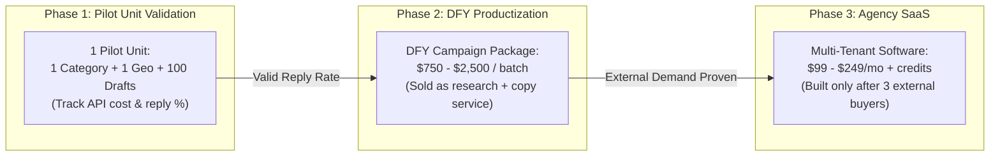

# Business Model Options

## 1. Intent & Business Value
Committing prematurely to a software pricing structure (such as per-seat subscriptions or credit packs) before confirming cold reply benchmarks creates wasteful product friction. This epic establishes the economic models under consideration, formalizes the concept of a standardized "pilot unit," and defers SaaS billing until reply rates and draft quality have been validated in production.

## 2. Source Specifications

### Business Model Options Comparison
| Commercial Model | Pricing Sketch | When It Fits Best | Pilot Action |
|------------------|----------------|-------------------|--------------|
| **Internal Cost Center** | Time + raw API costs only. | You are the sole operator generating internal pipeline. | **Active Pilot Default** |
| **Done-For-You (DFY) Campaign** | $750–$2,500 per city/category batch. | Clients want qualified prospect lists and ready drafts, not new software. | Documented as secondary pilot option. |
| **Seat + Usage Credits (SaaS)** | $99–$249/user/mo + usage. | External agencies demand their own multi-seat queue accounts. | **Explicitly Deferred** until 3 external buyers commit. |
| **Revenue Share / Close Fee** | Contingent fee on closed deals. | Later stage when quality and closing attribution are airtight. | **Strictly Avoid in v1** (too early; impossible to attribute cleanly). |

### The Core Pilot Unit Definition
> **"Commit to a concrete pilot unit: one service category, one bounded geography, N drafted accounts, human-approved and sent, with measured reply rates."**

- **Pilot Unit Batch Size ($N$)**: 75–150 drafted businesses per campaign run.
- **Unit Economic Measurement**: Calculate total API + LLM cost per generated draft (target: <$0.30/draft) alongside operator review time (target: <4 min/draft).

## 3. Scope Boundaries
- **In Scope (v1)**: Pilot unit economic definition, tracking unit cost per campaign batch, pricing sketch documentation for DFY packages.
- **Explicit Non-Goals (v2+)**:
  - Integrating Stripe, LemonSqueezy, or automated billing webhooks.
  - Credit consumption metering or subscription entitlement enforcement.
  - Revenue-share tracking contracts.

## 4. Economic Evolution Model

## 5. Stories

- [Define pilot unit](define-pilot-unit-2026-09-12.md) (`define-pilot-unit-2026-09-12`): Quantify the standardized pilot batch ($N=75-150$), cost per account, and evaluation criteria.
- [Defer SaaS pricing](defer-saas-pricing-2026-09-12.md) (`defer-saas-pricing-2026-09-12`): Architectural decision deferring billing engines and multi-tenant subscriptions until pilot metrics exist.
- [DFY package sketch note](dfy-package-sketch-note-2026-09-12.md) (`dfy-package-sketch-note-2026-09-12`): Packaging document outlining deliverables and pricing bands for Done-For-You agency batches.

## 6. Milestone Definition of Done
- [ ] Pilot unit economics model tracks compute, search API, and LLM token costs per campaign batch.
- [ ] DFY package specification defines exact deliverable formats (CSV / queue export of 50–100 reviewed drafts).
- [ ] Product roadmap explicitly gates SaaS subscription engineering behind the Day 90 review gate.

## 7. Dependencies & Sequencing
- **Prerequisites**: [epic-who-this-serves](epic-who-this-serves-2026-09-12.md), [epic-costs-and-dependencies](epic-costs-and-dependencies-2026-09-12.md).
- **Unblocks**: [epic-90-day-pilot-plan](epic-90-day-pilot-plan-2026-09-12.md), [epic-recommended-decision](epic-recommended-decision-2026-09-12.md).
