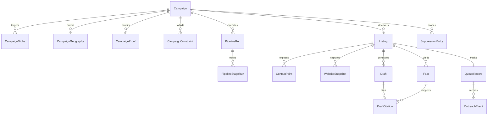
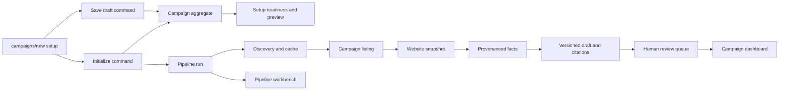

# Campaign Data Model

## 1. Intent & Business Value

LocalDraft already has a working `/campaigns/new` setup surface and detailed domain epics, but no single persistence contract connects campaign intake, discovery, enrichment, drafting, review, and outreach. This epic defines that contract before implementation so Save as Draft and Initialize Campaign Pipeline can persist one coherent aggregate without copying presentation-only labels into the database.

The model must preserve evidence provenance, support idempotent pipeline retries, and make thin or unverifiable records explicit. It also separates campaign lifecycle, pipeline execution progress, and per-listing queue state so each status has one meaning.

## 2. Source Specifications

### A. Canonical Sources and Precedence

1. [`app/(auth)/campaigns/new/page.tsx`](../../app/(auth)/campaigns/new/page.tsx) defines the fields and actions currently exposed to the operator.
2. [`epic-campaign-intake-fields-2026-09-12`](epic-campaign-intake-fields-2026-09-12.md) defines required fields, optional discovery filters, and excluded firmographics.
3. [`epic-data-and-enrichment-2026-09-12`](epic-data-and-enrichment-2026-09-12.md) defines listing capture, public-page extraction, provenance, caching, and no-invention rules.
4. [`epic-application-architecture-2026-09-15`](epic-application-architecture-2026-09-15.md) fixes the pilot stack at SQLite, Drizzle ORM, and `better-sqlite3`.
5. [`epic-agent-workspace-2026-09-12`](epic-agent-workspace-2026-09-12.md) and [`full-status-model-2026-09-12`](full-status-model-2026-09-12.md) define operator queue states.
6. [`epic-compliance-and-risk-2026-09-12`](epic-compliance-and-risk-2026-09-12.md) defines storage, suppression, and sensitive-data boundaries.

When UI mock copy conflicts with the no-invention policy, the no-invention and data-boundary policies win.

### B. Campaign Aggregate

`Campaign` is the aggregate root. Drafts may be incomplete; initialization requires all required fields and valid discovery settings.

| Concept | Canonical representation | Rule |
|---|---|---|
| Identity | `id`, optional human-readable `code`, `name` | Stable IDs are generated by the application, never from mutable labels. |
| Lifecycle | `draft`, `active`, `paused`, `archived` | Lifecycle is not pipeline stage or queue status. |
| Target niches | Ordered `CampaignNiche` rows | At least one is required to initialize; normalized labels are unique per campaign. |
| Geographies | Ordered `CampaignGeography` rows | At least one is required to initialize; preserve operator label and normalized lookup value. |
| Offer | `offerSummary` | Required to initialize; maps from the route's value proposition. |
| CTA | `callToAction` | Required to initialize. |
| Voice | `voiceProfile` | One of `helpful-direct`, `peer-collegial`, `concise-technical`, `audit-led`, `conversational`; nullable in a draft. |
| Proof supplied by operator | `CampaignProof` rows | Optional, explicitly operator-authored, and distinct from extracted website facts. |
| Negative constraints | `CampaignConstraint` rows | Optional for draft save; normalized duplicate text is rejected. |
| Discovery filters | `requireWebsite`, `requireEmail`, `minimumRating`, `minimumReviewCount` | Soft filters except `requireWebsite` when strict research mode is selected. |
| Research settings | `extractProofPoints`, `fallbackAction` | `fallbackAction` v1 value is `flag-unverified`; it never authorizes invention. |
| Audit fields | `createdAt`, `updatedAt`, `initializedAt` | Timestamps are stored in UTC. |

Transient chip inputs, `autosavedAt` display text, NAICS verification badges, readiness chips, discovery estimates, confidence rings, region captions, and surface-specific pipeline labels are not persisted as campaign source-of-truth fields.

### C. Discovery, Enrichment, and Evidence Entities

| Entity | Responsibility and constraints |
|---|---|
| `DiscoveryCacheEntry` | Provider/query result cache keyed by provider plus normalized query fingerprint. Stores fetched/expiry timestamps and raw provider payload with a 30-day default TTL. |
| `Listing` | Campaign-scoped business candidate with provider identity, legal/trade name, normalized address, public phone, website, categories, rating, review count, and public hours. Unique on campaign plus provider plus provider listing ID. Missing source fields remain null. |
| `ContactPoint` | Public business email, phone, or contact-form URL with source and verification metadata. Queue state references a preferred contact instead of owning discovered email data. |
| `WebsiteSnapshot` | Immutable fetch result for one canonical URL/page kind, including status, robots decision, content hash, fetched time, expiry, and allowed public HTML/text. |
| `Fact` | Extracted service, CTA, contact path, site gap, About quote, business identity, or review theme with source URL, source snippet, snapshot reference, confidence, and extraction time. |
| `Draft` | Versioned subject/body output with confidence and review state. |
| `DraftCitation` | Join from a draft version to the exact facts it cites; no JSON-only foreign-key list. |

Review themes require public review material and at least 10 reviews. Owner names may be stored only when explicitly printed on an allowed public page. Employee count and revenue are excluded from the v1 schema. Payment data, protected records, portal content, and consumer PII beyond public business contact paths must not be stored.

### D. Execution, Queue, and Outreach Entities

`PipelineRun` records one initialization or explicit rerun for a campaign. `PipelineStageRun` records the canonical stage key, ordinal, execution status, attempt count, timestamps, and error summary. The six canonical keys are:

1. `discovery`
2. `website-matching`
3. `public-scrape`
4. `fact-extraction`
5. `draft-generation`
6. `human-review`

Surface-specific labels remain read-model mappings. Execution status is `pending`, `running`, `succeeded`, `failed`, or `skipped`.

`QueueRecord` is one-to-one with a campaign listing and uses normalized values: `new`, `enriched`, `drafted`, `needs-edit`, `no-email`, `skipped`, `ready`, `sent`, `replied`, `follow-up-due`. It stores manual-research and outreach workflow state, while facts and discovered contacts remain in their source entities.

`OutreachEvent` stores append-only send, bounce, reply, meeting, follow-up, and disqualification events. `SuppressionEntry` supports `global` or `campaign` scope and normalized `email`, `domain`, or `business-identity` match types.

### E. Thin Records and Confidence

- A listing with only business name and city is `needsManualResearch = true`.
- A draft generated without sufficient citable facts is `low` confidence and cannot become `ready` without explicit human resolution.
- A missing website may skip scrape/extraction stages, but does not silently manufacture facts.
- Retry and rerun operations create or update execution records idempotently; they do not duplicate listings, snapshots with the same content hash, facts from the same source evidence, or draft citations.
- Confidence is structured (`high`, `medium`, `low`, `unknown`) and is not a substitute for provenance.

### F. Commands and Read Models

| Contract | Source fields | Derived output |
|---|---|---|
| Save campaign draft | Any syntactically valid subset of campaign setup fields | Campaign remains `draft`; no pipeline run is created. |
| Initialize campaign | Complete campaign aggregate plus optimistic version | Atomic validation, lifecycle transition to `active`, and one pending pipeline run. |
| Setup readiness | Campaign aggregate | Required-field completeness plus prohibition, geography, and website-gate indicators. |
| Discovery preview | Targeting and filters | Estimated yield, confidence, and region caption; preview is recomputable. |
| Pipeline workbench | Run, stage, listing, queue, fact, and draft data | Surface labels, stage tone, warnings, and actions. |
| Campaign dashboard | Campaign plus aggregate query results | Portfolio status, funnel counts, telemetry, and audit alerts. |

Commands use stable IDs and optimistic concurrency. Derived labels and counters are never accepted back as authoritative command fields.

## 3. Scope Boundaries

- **In Scope (v1)**: SQLite/Drizzle schema design, Zod command contracts, campaign drafts, initialization, listing identity, provider cache, website snapshots, fact provenance, pipeline runs, queue state, draft citations, public business contacts, outreach events, suppression, migrations, and model-level tests.
- **Explicit Non-Goals (v2+)**:
  - Employees, revenue, paid firmographic append, social profile crawling, or consumer-list ingestion.
  - Multi-tenant organization/account isolation.
  - Automated email delivery or autonomous campaign blasts.
  - Password-protected, paywalled, portal, payment, patient, or student data.
  - Persisting UI colors, prose labels, confidence-ring presentation, or mock-only counters as source-of-truth columns.
  - Hosted production database migration; Turso/libSQL remains a future path.

## 4. Architecture & Flow

## 5. Stories

- [Canonical campaign aggregate contract](canonical-campaign-aggregate-contract-2026-09-19.md) (`canonical-campaign-aggregate-contract-2026-09-19`): Align setup fields, validation, defaults, and command semantics.
- [Campaign persistence schema and migrations](campaign-persistence-schema-and-migrations-2026-09-19.md) (`campaign-persistence-schema-and-migrations-2026-09-19`): Implement the SQLite/Drizzle relational foundation.
- [Listing identity and discovery cache model](listing-identity-and-discovery-cache-model-2026-09-19.md) (`listing-identity-and-discovery-cache-model-2026-09-19`): Define provider identity, normalized listings, deduplication, and cache TTL.
- [Website snapshot and fact provenance model](website-snapshot-and-fact-provenance-model-2026-09-19.md) (`website-snapshot-and-fact-provenance-model-2026-09-19`): Store compliant snapshots and evidence-backed facts.
- [Campaign pipeline lifecycle model](campaign-pipeline-lifecycle-model-2026-09-19.md) (`campaign-pipeline-lifecycle-model-2026-09-19`): Separate campaign lifecycle, run stages, and queue states.
- [Draft review outreach and suppression model](draft-review-outreach-and-suppression-model-2026-09-19.md) (`draft-review-outreach-and-suppression-model-2026-09-19`): Model draft citations, human review, contact outcomes, and suppression.
- [Campaign actions and read model contracts](campaign-actions-and-read-model-contracts-2026-09-19.md) (`campaign-actions-and-read-model-contracts-2026-09-19`): Define save/initialize commands and derived UI query contracts.
- [Campaign data model verification](campaign-data-model-verification-2026-09-19.md) (`campaign-data-model-verification-2026-09-19`): Prove migrations, constraints, transitions, provenance, and route coverage.

## 6. Milestone Definition of Done

- [ ] Every editable value on `/campaigns/new` is mapped to a canonical persisted field, an explicitly transient input, or a derived read-model value.
- [ ] Campaign lifecycle, pipeline execution status, and per-listing queue status are separate enums with tested transition rules.
- [ ] Campaign, listing, cache, snapshot, fact, contact, draft, citation, queue, outreach, and suppression relationships have explicit keys, nullability, indexes, and delete behavior.
- [ ] Save Draft accepts incomplete campaigns; Initialize rejects missing required targeting, offer, CTA, or invalid settings and atomically creates one pipeline run.
- [ ] Listing discovery and pipeline retries are idempotent and cannot duplicate provider listings or evidence.
- [ ] Every draft citation resolves to retained source evidence; review themes abstain below the 10-review threshold.
- [ ] Thin records and low-confidence drafts are queryable and cannot silently become review-ready.
- [ ] V1 schema and contracts contain no employee count, revenue, sensitive portal data, or presentation-only fields.
- [ ] Migrations and model/contract tests pass on a clean SQLite database and on supported upgrade fixtures.

## 7. Dependencies & Sequencing

- **Prerequisites**: [`epic-campaign-intake-fields-2026-09-12`](epic-campaign-intake-fields-2026-09-12.md), [`epic-data-and-enrichment-2026-09-12`](epic-data-and-enrichment-2026-09-12.md), [`epic-application-architecture-2026-09-15`](epic-application-architecture-2026-09-15.md), [`epic-compliance-and-risk-2026-09-12`](epic-compliance-and-risk-2026-09-12.md).
- **Sequence**: Canonical aggregate → persistence foundation → listing/cache and website/facts → lifecycle and draft/outreach → commands/read models → verification.
- **Unblocks**: Persistent Campaign Setup, discovery/enrichment services, Campaign Pipeline data wiring, Agent Workspace queue, and Campaigns Admin Dashboard telemetry.
