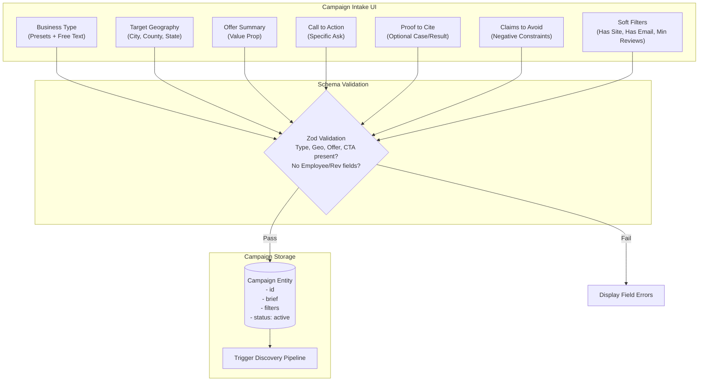

# Campaign Intake Fields

## 1. Intent & Business Value
A campaign in LocalDraft is the primary unit of work that unites market discovery with tailored messaging. This epic implements the campaign intake data contract, form UI, and validation schema described in Proposal Appendix Section 18. It ensures the operator supplies all required targeting and copy guidance up front, while explicitly blocking scope creep from v2 enterprise filters.

## 2. Source Specifications

### Intake Fields Master Specification
| Field Name | Requirement | Type / Control | Purpose & Behavior |
|------------|-------------|----------------|---------------------|
| **Business type** | **Required** | Combobox / Presets + Text | Specific service niche (e.g., "hair salon", "HVAC", "driveway paving"). Provides suggestions but accepts any local service. |
| **Geography** | **Required** | Text / Multi-select | State, county, municipality, or comma-separated list of cities (e.g., "Hennepin County, MN", "Anoka, Blaine, Coon Rapids"). |
| **Offer summary** | **Required** | Textarea | Clear 1–2 sentence description of the product, service, or value proposition being pitched for this campaign. |
| **Call to action (CTA)** | **Required** | Text / Select | Specific ask proposed to the recipient (e.g., "reply with a preferred time", "review a 1-page mock", "15-minute introductory call"). |
| **Proof you may cite** | Optional | Textarea | True, verifiable credentials, customer results, or case studies that the generator may reference if relevant. |
| **Words / claims to avoid** | Optional | Textarea / Chips | Explicit negative keywords, forbidden guarantees, or sensitive phrases the AI must never generate. |
| **Has website** | Optional Filter | Checkbox (Default: True) | Soft filter in v1 to prioritize businesses with public web pages for richer fact extraction. |
| **Has email found** | Optional Filter | Checkbox | Soft filter in v1 allowing the queue to show only reachable contacts or include all discovered listings. |
| **Min rating / review count** | Optional Filter | Numeric Inputs | Filters out listings with zero reviews or poor reputation scores when listing data provides it. |
| **Employees / revenue** | **Excluded (No)** | **None** | **Explicitly omitted in v1.** Reserved for v2+ paid firmographic data append. |

## 3. Scope Boundaries
- **In Scope (v1)**: Campaign creation form, draft persistence, client-side and server-side validation schemas, chip presets for common local verticals.
- **Explicit Non-Goals (v2+)**:
  - Headcount or revenue range sliders.
  - Multi-tiered campaign branching or sequence triggers.
  - Automated budget calculators or billing credit gates.

## 4. Intake Schema & Validation Flow

## 5. Stories

- [Required intake fields form](required-intake-fields-form-2026-09-12.md) (`required-intake-fields-form-2026-09-12`): Form fields and strict validation for business type, geography, offer summary, and CTA.
- [Optional intake fields](optional-intake-fields-2026-09-12.md) (`optional-intake-fields-2026-09-12`): Inputs for proof points, forbidden claims, and soft discovery filters (website, email, review count).
- [Exclude employees revenue until v2](exclude-employees-revenue-v2-2026-09-12.md) (`exclude-employees-revenue-v2-2026-09-12`): Architectural barrier ensuring no firmographic fields or dependencies enter the v1 form.

## 6. Milestone Definition of Done
- [ ] Campaign creation form renders with responsive layout using shadcn UI components.
- [ ] Submitting without business type, target geography, offer summary, or CTA triggers inline validation errors.
- [ ] Preset buttons allow one-click population of common test verticals (Salons, HVAC, Auto Repair).
- [ ] "Claims to avoid" text is successfully bound into the prompt payload received by the draft generator.
- [ ] Codebase audit verifies zero schema definitions, input elements, or database columns for employee count or annual revenue.

## 7. Dependencies & Sequencing
- **Prerequisites**: [epic-purpose](epic-purpose-2026-09-12.md), [epic-v1-product-scope](epic-v1-product-scope-2026-09-12.md).
- **Unblocks**: [epic-data-and-enrichment](epic-data-and-enrichment-2026-09-12.md), [epic-email-draft-standard](epic-email-draft-standard-2026-09-12.md).
