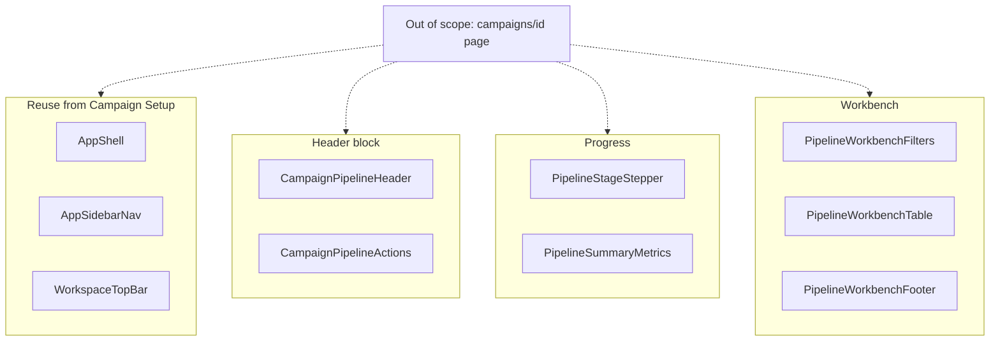

# Campaign Pipeline

## 1. Intent & Business Value

Operators need a run-state surface after Campaign Setup so they can watch a live six-stage pipeline, triage listings that need attention, and jump to drafts that are ready for human review. This epic delivers the **presentational components** from the Stitch screen **LocalDraft - Campaign Pipeline** (`projects/13798460973041177032/screens/81796119faa94a379c970ac48a6add3d` in project `agent-lead workspace` / `projects/13798460973041177032`) as isolated, shadcn-composed widgets under `components/campaigns/`.

The outcome is a reusable component kit that matches the Stitch visual contract. A later page-assembly story can compose them into `app/(auth)/campaigns/[id]/page.tsx`. This epic does **not** replace the domain pipeline contracts in [`pipeline-stage-data-contracts-2026-09-12`](pipeline-stage-data-contracts-2026-09-12.md) or the queue status model in [`epic-agent-workspace-2026-09-12`](epic-agent-workspace-2026-09-12.md).

App chrome (256px rail, 56px top bar) already exists from [`epic-campaign-setup-2026-09-18`](epic-campaign-setup-2026-09-18.md) and is **reused**, not rebuilt.

## 2. Source Specifications

### A. Stitch screen

| Field | Value |
|---|---|
| Project | `projects/13798460973041177032` (agent-lead workspace) |
| Screen | `projects/13798460973041177032/screens/81796119faa94a379c970ac48a6add3d` |
| Title | LocalDraft - Campaign Pipeline |
| Device | DESKTOP, 2560×2470 |
| Theme | LocalDraft Operator Core — Inter, primary `#0F766E`, canvas `#F8FAFC`, surfaces `#FFFFFF`, borders `#E2E8F0` |

### B. Screen copy and component inventory

Transcribed from the Stitch HTML (not paraphrased). Page chrome (sidebar, top bar) is documented here for reuse context and is **not** implemented in this epic.

**Reused chrome (already shipped)**

- Sidebar brand, nav (`Campaigns` active, `Review Queue` count `14`, `Follow-ups` count `3`, `Settings`), footer `Target Campaign` / `HVAC - Central Texas`, `Alex M. (Operator)` / `Ready` / `Manual Send Mode Only`.
- Top bar breadcrumb `Workspace` / `Review Desk`, search placeholder `Search leads, domains, campaigns... (/) `, pill `Strict Human-in-the-Loop • No Automated Blasts`, stat `38 drafts reviewed this week`, `New Campaign`, avatar.

**Campaign pipeline header** (header block, identity cluster)

- Chip: `CAM-TX-0491` (pinging teal dot).
- Status badge: `Active • Stage 5 of 6 Processing` (sync icon).
- Guard chip: `Manual Dispatch Guard Active`.
- Title: `Central Texas HVAC Outbound (Austin, Round Rock, Cedar Park)`.
- Meta: `Created Today at 09:15 AM by Alex M.` • `Target: Licensed HVAC Contractors` • `Rule: Single Domain Enriched per Business`.

**Campaign pipeline actions** (header block, controls cluster)

- Secondary: `Pause Research` (pause_circle).
- Secondary: `Campaign Settings` (tune).
- Primary: `Jump to Review Queue (14 Ready)` (rate_review).

**Pipeline stage stepper**

- Eyebrow: `Deterministic Workflow`.
- Title: `Six-Stage Pipeline Progress`.
- Legend: `Completed (4)`, `Active (1)`, `Pending (1)`.
- Stages (01–06):
  1. `Campaign Setup` — status `Done` — `Austin, Round Rock, Cedar Park HVAC taxonomy` — metric `Geo Parameters` `100%`
  2. `Discovery` — status `Done` — `128 businesses indexed via Google Maps & Secretary of State` — metric `Discovered` `128 / 128`
  3. `Website Matching` — status `Done` — `121 verified domains resolved (7 flagged for operator review)` — metric `Domain Match` `94.5%`
  4. `Public Scrapes` — status `Done` — `114 sites parsed for team size, awards, license #s (7 incomplete)` — metric `Crawl Yield` `114 / 121`
  5. `Draft Generation` — status `In Progress` — `98 personalized drafts generated; 16 remaining in pipeline` — metric `Synthesis Progress` `88%`
  6. `Human Review` — status `Manual Only` (lock) — `Strict manual operator gate. 0 blast risk. 14 ready right now.` — metric `Ready in Queue` `14 Leads`

These run-state titles are **not** the Setup preview titles on [`pipeline-sequence-rail-2026-09-18`](done/pipeline-sequence-rail-2026-09-18.md) (`Directory & Maps Discovery` … `Manual Dispatch Desk`). Do not reuse that widget.

**Pipeline summary metrics**

1. `Businesses Discovered` `128` — chips `ATX: 78`, `RR: 31`, `CP: 19` (travel_explore).
2. `Websites Matched` `121` `/ 128 targets` — `94.5% resolution rate` / `7 offline` (domain_verification).
3. `Fact Citations` `242` — `Avg. Extracted Payload` `2.1 facts/org` (verified).
4. `Attention Required` `14` — `Missing URLs` `7` / `Low Confidence` `7` (warning).
5. `Drafts Ready` `14` — `Triage Desk Ready` / chip `Manual Send` (mark_email_read).

**Pipeline workbench filters**

- Tabs: `All Pipeline Items` `128`, `Needs Attention` `14`, `Ready for Review` `14`, `Completed` `84`.
- Input placeholder: `Filter company or city...` (filter_list).
- Secondary: `Export CSV` (file_download).

**Pipeline workbench table**

- Columns: `Business Name`, `Metro Location`, `Pipeline Stage`, `Confidence & Citations`, `Operator Next Action`.
- Filled mock rows:
  1. `Lonestar Air & Heating` / `lonestarairtx.com • TDLR #TACLA019822E` / `Austin, TX` / `Stage 6: Ready for Review` / `3 Verified Facts` `Austin Chronicle '23 Best Pick, 24/7 Dispatch` / `Review Draft`
  2. `Round Rock Comfort Pros` / `rrcomfortpros.net • Carrier Authorized` / `Round Rock, TX` / `Stage 6: Ready for Review` / `2 Verified Facts` `14 Techs, Lennox Premier Dealer Status` / `Review Draft`
  3. `Apex Cool Mechanical` / `Registered entity: APEX COOL LLC` / `Austin, TX` / `Stage 3: Missing Website` / `Warning: Primary domain unreachable / DNS error` / `Add Website URL` (attention row)
  4. `Barton Springs HVAC` / `bartonspringshvac.com • South Lamar Blvd` / `Austin, TX` / `Stage 4: Low Confidence` / `Amber: Commercial service hours conflict` / `Verify Source`
  5. `Hill Country Climate Solutions` / `hillcountryclimate.com • Bell Blvd` / `Cedar Park, TX` / `Stage 5: Generating Draft` / `Research Complete` `Awaiting AI synthesis queue slot #3` / `View Live Research`

**Pipeline workbench footer**

- Count: `Displaying 5 of 128 targets in execution pipeline`.
- Retry: `Automatic Retry Interval: 30s`.
- Pager: `Previous` (disabled), `1 of 26`, `Next`.

### C. Visual tokens (Operator Core, applied to these components)

- Primary action: `#0F766E`, hover `#115E59`, height 32px compact / 36px standard, radius 6px.
- Secondary action: white, `1px solid #E2E8F0`, text `#0F172A`, hover `#F8FAFC` / border `#CBD5E1`.
- Inputs: white fill, `1px solid #CBD5E1`, 32–36px height, focus ring `1px solid #0F766E` + `2px rgba(15, 118, 110, 0.15)`.
- Chips: 20px height, `label-sm` 11px semibold, 4px radius.
- Cards: white, `1px solid #E2E8F0`, 8px radius, padding 12–16px.
- Verified / done: emerald `#059669` / tint `#ECFDF5`.
- Active / in-progress: primary teal `#0F766E` / selected `#F0FDFA`.
- Pending / manual-only: sky `#0284C7` (Stitch `secondary` on the Human Review metric) or muted `#64748B`.
- Attention: amber `#D97706` / tint `#FFFBEB`; rose `#E11D48` / tint `#FFF1F2` for warning rows and Attention Required.
- Linear stage meters use shadcn `Progress` (this screen specifies bars, not a confidence ring).

### D. Component → file map

| Component | File |
|---|---|
| Campaign pipeline header | `components/campaigns/campaign-pipeline-header.tsx` |
| Campaign pipeline actions | `components/campaigns/campaign-pipeline-actions.tsx` |
| Pipeline stage stepper | `components/campaigns/pipeline-stage-stepper.tsx` |
| Pipeline summary metrics | `components/campaigns/pipeline-summary-metrics.tsx` |
| Pipeline workbench filters | `components/campaigns/pipeline-workbench-filters.tsx` |
| Pipeline workbench table | `components/campaigns/pipeline-workbench-table.tsx` |
| Pipeline workbench footer | `components/campaigns/pipeline-workbench-footer.tsx` |

## 3. Scope Boundaries

- **In Scope (v1)**: Isolated presentational React components matching the Stitch widgets above. Props and mock data for empty, filled, selected, and disabled states. shadcn/ui primitives. Visual alignment to Operator Core tokens. CLI-add `progress` and `table` when those stories are claimed.
- **Explicit Non-Goals (v2+)**:
  - Campaign Pipeline page or route (`app/(auth)/campaigns/[id]/page.tsx`).
  - App sidebar / shell / top bar (reuse the Campaign Setup chrome).
  - CSV export, pause/resume research, settings navigation, review-queue routing.
  - Polling, retry timers, discovery / scrape / draft APIs.
  - Zod or server-side validation, database writes.
  - Review Queue screen (`projects/13798460973041177032/screens/edf29e27a2824c4da2952f5bd12988fa`).

## 4. Architecture & Flow

Components receive typed props only. No server actions, no campaign entity writes, no shared page store in this epic. Header may accept an `actions` slot so the two header-block stories compose without a page route.

## 5. Stories

- [Campaign pipeline header](done/campaign-pipeline-header-2026-09-19.md) (`campaign-pipeline-header-2026-09-19`): Campaign id chip, processing badge, guard chip, title, and created/target/rule meta.
- [Campaign pipeline actions](done/campaign-pipeline-actions-2026-09-19.md) (`campaign-pipeline-actions-2026-09-19`): Pause Research, Campaign Settings, Jump to Review Queue.
- [Pipeline stage stepper](done/pipeline-stage-stepper-2026-09-19.md) (`pipeline-stage-stepper-2026-09-19`): Six-stage progress grid with linear meters.
- [Pipeline summary metrics](done/pipeline-summary-metrics-2026-09-19.md) (`pipeline-summary-metrics-2026-09-19`): Five KPI cards (discovered, matched, citations, attention, drafts ready).
- [Pipeline workbench filters](done/pipeline-workbench-filters-2026-09-19.md) (`pipeline-workbench-filters-2026-09-19`): View tabs, company/city filter, Export CSV.
- [Pipeline workbench table](done/pipeline-workbench-table-2026-09-19.md) (`pipeline-workbench-table-2026-09-19`): Listing rows with stage, citations, and next-action buttons.
- [Pipeline workbench footer](done/pipeline-workbench-footer-2026-09-19.md) (`pipeline-workbench-footer-2026-09-19`): Display count, retry interval copy, Previous / Next pager.

### Layout and navigation

Page chrome is reused from Campaign Setup. These cards are **not** created in this epic:

- [Operator app shell](done/operator-app-shell-2026-09-18.md)
- [App sidebar nav](done/app-sidebar-nav-2026-09-18.md)
- [Workspace top bar](done/workspace-top-bar-2026-09-18.md)

A future Campaign Pipeline page-scaffold story (not in this epic) composes the seven widgets into `app/(auth)/campaigns/[id]/page.tsx`.

## 6. Milestone Definition of Done

- [x] All 7 components exist under `components/campaigns/` and render in isolation with mock props.
- [x] Empty, filled, and disabled (or inactive) states are implemented where the Stitch screen implies them.
- [x] Visible copy matches the Stitch strings in section 2 (labels, stage names, button labels, table headers, mock rows).
- [x] Components compose shadcn/ui primitives listed on each story card; `Progress` and `Table` are CLI-added, not hand-rolled.
- [x] Visual tokens match Operator Core (teal primary, chip/card radii, border colors) from the Stitch design system.
- [x] Linear stage meters use `Progress`; do not substitute a confidence ring, and do not reuse `pipeline-sequence-rail`.
- [x] No page route, sidebar, persistence, CSV writer, or API client is introduced by these stories.

## 7. Dependencies & Sequencing

- **Prerequisites**: [`epic-campaign-setup-2026-09-18`](epic-campaign-setup-2026-09-18.md) (shell, nav, top bar, campaign widget folder), [`epic-application-architecture-2026-09-15`](epic-application-architecture-2026-09-15.md) (folder layout, shadcn at `components/ui/`), [`epic-ui-design-system-2026-09-15`](epic-ui-design-system-2026-09-15.md) (Operator Core tokens). Stage meanings should align with [`specify-core-loop-stages-2026-09-12`](specify-core-loop-stages-2026-09-12.md) without implementing pipeline execution.
- **Unblocks**: A future Campaign Pipeline page-assembly story (not in this epic) that composes these widgets into `app/(auth)/campaigns/[id]/page.tsx`, and later Review Queue work from the sibling Stitch screen.
