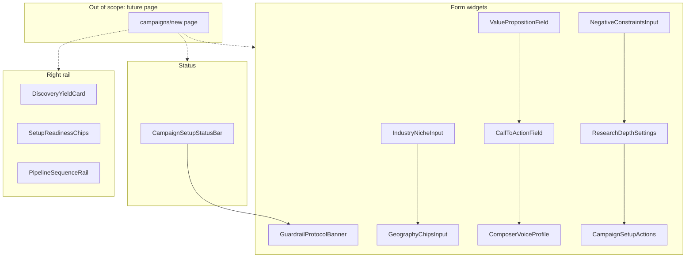

# Campaign Setup

## 1. Intent & Business Value

Operators need a guided Campaign Setup surface so they can define a local search perimeter, offer boundaries, and verification gates before discovery runs. This epic delivers the **presentational components** from the Stitch screen **LocalDraft - Campaign Setup** (`projects/13798460973041177032/screens/dffcadf839ef470db0d105a117c66826` in project `agent-lead workspace` / `projects/13798460973041177032`) as isolated, shadcn-composed widgets under `components/campaigns/`.

The outcome is a reusable component kit that matches the Stitch visual contract. A later page-assembly story can compose them into `app/(auth)/campaigns/new/page.tsx`. This epic does **not** replace the domain intake contract in [`epic-campaign-intake-fields-2026-09-12`](epic-campaign-intake-fields-2026-09-12.md).

## 2. Source Specifications

### A. Stitch screen

| Field | Value |
|---|---|
| Project | `projects/13798460973041177032` (agent-lead workspace) |
| Screen | `projects/13798460973041177032/screens/dffcadf839ef470db0d105a117c66826` |
| Title | LocalDraft - Campaign Setup |
| Device | DESKTOP, 2560×3478 |
| Theme | LocalDraft Operator Core — Inter, primary `#0F766E`, canvas `#F8FAFC`, surfaces `#FFFFFF`, borders `#E2E8F0` |

### B. Screen copy and component inventory

Transcribed from the Stitch HTML (not paraphrased). Page chrome (sidebar, page title/hero, numbered section wrappers) is documented here for context and is **not** implemented in this epic.

**Status bar (top strip)**

- Control: `Target Campaign` select, current value `HVAC - Central Texas`, trailing `unfold_more`.
- Badge: `Lead Engine: Active`.
- Meta: `AUTOSAVED 14:02 UTC`.

**Guardrail banner**

- Eyebrow: `Strict Guardrail Protocol` with token `RULE_01`.
- Body: `Human-in-the-Loop: LocalDraft drafts emails based strictly on verified public websites. No automated emails are ever dispatched. Every single send requires physical operator sign-off.`

**Industry niche input** (section 1: Target Business & Location)

- Label: `Primary Industry / Niche Category`.
- Status: `NAICS verified match`.
- Filled chip: `HVAC Contractors` (storefront icon, dismissible).
- Placeholder: `Type to add secondary niche...`
- Presets row: `Quick Presets:` then `+ Plumbers`, `+ Auto Repair`, `+ Roofing`, `+ Dental Clinics`.

**Geography chips input**

- Label: `Target Geographies`.
- Region caption: `Austin Metropolitan Area`.
- Chips: `Austin, TX`, `Round Rock, TX`, `Cedar Park, TX` (location_on icon, dismissible).
- Add control: `Add city/county`.

**Discovery yield card** (right rail)

- Title: `Estimated Discovery Yield: ~120-140 local businesses`.
- Metric: `Confidence: 94%` (circular ring).

**Value proposition field** (section 2: Proposition & Review Intent)

- Eyebrow: `Editorial Tone`.
- Label: `Specific Value Proposition / Subject of Outreach`.
- Hint: `Max 80 chars recommended`.
- Filled value: `Website conversion review and mobile booking-flow recommendations`.
- Helper: `The research crawler will specifically isolate facts related to this offer (e.g. mobile responsiveness, quote inquiry speed).`

**Call to action field**

- Label: `Primary Call to Action (Soft Ask)`.
- Status: `Zero-friction alignment`.
- Filled value: `Ask whether they would like a short 3-minute video review of their booking flow`.
- Helper: `Low friction outreach yields 3.4x higher reply rates over direct sales calendar links.`

**Composer voice profile**

- Label: `Composer Voice Profile`.
- Options: `Helpful & Direct` (Selected), `Peer-to-Peer Collegial`, `Concise Technical`, `Audit-led Gentle Inquiry`, `Conversational`.

**Negative constraints input** (section 3)

- Section title: `Negative Constraints & Guardrails`.
- Caption: `Crucial safety & brand reputation boundary conditions`.
- Eyebrow: `Strict Prohibition`.
- Prompt: `Specify exact details, buzzwords, or misleading claims that LocalDraft MUST NOT invent or hallucinate under any circumstance:`
- Chip: `Do not claim guaranteed revenue improvements` (block icon, dismissible).

**Research depth settings** (section 4)

- Eyebrow: `Fact Engine`.
- Toggle/row: `Require verified public website before draft generation` with severity `Strict`. Helper: `Discards directories, blank landing pages, or unregistered domains. Only analyzes active storefront sites.`
- Extraction row: `Extract booking capabilities, emergency hours, and founding year`. Helper: `Pulls specific proof points into the lead profile for genuine operator context (e.g. "Family owned since 1994", "24/7 Dispatch").`
- Fallback: `Fallback action for low-confidence crawl: Flag unverified websites for manual operator check`.
- Density caption: `High Verification Density Guardrails actively protect domain deliverability and response rates.`

**Setup readiness chips**

- `Prohibition Filters` → `3 Active`
- `Local Boundary Precision` → `3 Metros`
- `Website Verification Gate` → `Enabled`

**Pipeline sequence rail**

- Header: `Pipeline Sequence` / `6 STAGES`.
- Stages (1–6):
  1. `Directory & Maps Discovery` — `Austin, Round Rock, Cedar Park`
  2. `Public Website Verification` — `Filter domain health & active status`
  3. `Fact Extraction Engine` — `Mobile booking flow & service hours`
  4. `Safety Guardrail Intercept` — `Strip forbidden claims and promises`
  5. `Operator Review Queue` — `Physical human approval required`
  6. `Manual Dispatch Desk` — `One-by-one verification and send`

**Action bar**

- Secondary: `Save as Draft`.
- Primary: `Initialize Campaign Pipeline`.

### C. Visual tokens (Operator Core, applied to these components)

- Primary action: `#0F766E`, hover `#115E59`, height 32px compact / 36px standard, radius 6px.
- Inputs: white fill, `1px solid #CBD5E1`, 32–36px height, focus ring `1px solid #0F766E` + `2px rgba(15, 118, 110, 0.15)`.
- Chips: 20px height, `label-sm` 11px semibold, 4px radius.
- Cards: white, `1px solid #E2E8F0`, 8px radius, padding 12–16px.
- Verified / success: emerald `#059669` / tint `#ECFDF5`.
- Attention: amber `#D97706` / tint `#FFFBEB`.
- Guardrail / prohibition: rose `#E11D48` / tint `#FFF1F2`.

### D. Component → file map

| Component | File |
|---|---|
| Status bar | `components/campaigns/campaign-setup-status-bar.tsx` |
| Guardrail banner | `components/campaigns/guardrail-protocol-banner.tsx` |
| Industry niche input | `components/campaigns/industry-niche-input.tsx` |
| Geography chips input | `components/campaigns/geography-chips-input.tsx` |
| Discovery yield card | `components/campaigns/discovery-yield-card.tsx` |
| Value proposition field | `components/campaigns/value-proposition-field.tsx` |
| Call to action field | `components/campaigns/call-to-action-field.tsx` |
| Composer voice profile | `components/campaigns/composer-voice-profile.tsx` |
| Negative constraints | `components/campaigns/negative-constraints-input.tsx` |
| Research depth settings | `components/campaigns/research-depth-settings.tsx` |
| Setup readiness chips | `components/campaigns/setup-readiness-chips.tsx` |
| Pipeline sequence rail | `components/campaigns/pipeline-sequence-rail.tsx` |
| Action bar | `components/campaigns/campaign-setup-actions.tsx` |

## 3. Scope Boundaries

- **In Scope (v1)**: Isolated presentational React components matching the Stitch widgets above. Props and mock data for empty, filled, selected, and disabled states. shadcn/ui primitives. Visual alignment to Operator Core tokens.
- **Explicit Non-Goals (v2+)**:
  - Campaign Setup page, route, or numbered section wrappers.
  - App sidebar / shell / page hero (`Create Targeted Campaign`, `Guided Setup`).
  - Form submit, autosave persistence, discovery yield APIs, pipeline execution.
  - Zod or server-side validation (owned by [`epic-campaign-intake-fields-2026-09-12`](epic-campaign-intake-fields-2026-09-12.md)).
  - Employee count or revenue fields.

## 4. Architecture & Flow

Components receive typed props only. No server actions, no campaign entity writes, no shared page store in this epic.

## 5. Stories

- [Campaign setup status bar](campaign-setup-status-bar-2026-09-18.md) (`campaign-setup-status-bar-2026-09-18`): Target Campaign select, Lead Engine badge, autosaved timestamp.
- [Guardrail protocol banner](guardrail-protocol-banner-2026-09-18.md) (`guardrail-protocol-banner-2026-09-18`): RULE_01 human-in-the-loop alert.
- [Industry niche input](industry-niche-input-2026-09-18.md) (`industry-niche-input-2026-09-18`): Niche chips, NAICS match, quick presets.
- [Geography chips input](geography-chips-input-2026-09-18.md) (`geography-chips-input-2026-09-18`): Metro chips and add city/county control.
- [Discovery yield card](discovery-yield-card-2026-09-18.md) (`discovery-yield-card-2026-09-18`): Estimated listing range and confidence ring.
- [Value proposition field](value-proposition-field-2026-09-18.md) (`value-proposition-field-2026-09-18`): Offer textarea, 80-char hint, crawler helper.
- [Call to action field](call-to-action-field-2026-09-18.md) (`call-to-action-field-2026-09-18`): Soft-ask textarea and friction helper.
- [Composer voice profile](composer-voice-profile-2026-09-18.md) (`composer-voice-profile-2026-09-18`): Single-select voice chips.
- [Negative constraints input](negative-constraints-input-2026-09-18.md) (`negative-constraints-input-2026-09-18`): Prohibition chips for claims the model must not invent.
- [Research depth settings](research-depth-settings-2026-09-18.md) (`research-depth-settings-2026-09-18`): Website gate, extraction options, low-confidence fallback.
- [Setup readiness chips](setup-readiness-chips-2026-09-18.md) (`setup-readiness-chips-2026-09-18`): Prohibition / boundary / website-gate status chips.
- [Pipeline sequence rail](pipeline-sequence-rail-2026-09-18.md) (`pipeline-sequence-rail-2026-09-18`): Six-stage pipeline list.
- [Campaign setup actions](campaign-setup-actions-2026-09-18.md) (`campaign-setup-actions-2026-09-18`): Save as Draft and Initialize Campaign Pipeline buttons.

### Layout and navigation

Page chrome mapped from the same Stitch screen. Section 3 still records shell, sidebar, page, and section wrappers as v1 non-goals; these cards are tracked here so the screen has a complete card trail and are not counted by section 6.

- [Operator app shell](done/operator-app-shell-2026-09-18.md) (`operator-app-shell-2026-09-18`): Fixed 256px rail and 56px header ports around the main canvas.
- [App sidebar nav](done/app-sidebar-nav-2026-09-18.md) (`app-sidebar-nav-2026-09-18`): Brand block, Campaigns / Review Queue / Follow-ups / Settings, footer slots.
- [Workspace top bar](done/workspace-top-bar-2026-09-18.md) (`workspace-top-bar-2026-09-18`): Breadcrumb, search, human-in-the-loop pill, review stat, New Campaign, avatar.
- [Workspace page header](done/workspace-page-header-2026-09-18.md) (`workspace-page-header-2026-09-18`): Spec strip, `Create Targeted Campaign` hero, `Guided Setup` badge.
- [Form section shell](done/form-section-shell-2026-09-18.md) (`form-section-shell-2026-09-18`): Numbered panel wrapper with eyebrow and guardrail tone.
- [Campaign setup page scaffold](done/campaign-setup-page-scaffold-2026-09-18.md) (`campaign-setup-page-scaffold-2026-09-18`): Auth layout, `/campaigns/new` route, and the 12 / 8 / 4 grid ports.

The scaffold leaves four ports as `Pending story` placeholders until [research depth settings](research-depth-settings-2026-09-18.md), [campaign setup actions](campaign-setup-actions-2026-09-18.md), [setup readiness chips](setup-readiness-chips-2026-09-18.md), and [pipeline sequence rail](pipeline-sequence-rail-2026-09-18.md) are built.

## 6. Milestone Definition of Done

- [ ] All 13 components exist under `components/campaigns/` and render in isolation with mock props.
- [ ] Empty, filled, and disabled (or inactive) states are implemented where the Stitch screen implies them.
- [ ] Visible copy matches the Stitch strings in section 2 (labels, helpers, stage names, button labels).
- [ ] Components compose shadcn/ui primitives listed on each story card; no one-off button/input primitives.
- [ ] Visual tokens match Operator Core (teal primary, chip/card radii, border colors) from the Stitch design system.
- [ ] No page route, sidebar, persistence, or API client is introduced by these stories.

## 7. Dependencies & Sequencing

- **Prerequisites**: [`epic-application-architecture-2026-09-15`](epic-application-architecture-2026-09-15.md) (folder layout, shadcn at `components/ui/`), [`epic-ui-design-system-2026-09-15`](epic-ui-design-system-2026-09-15.md) (Operator Core tokens), [`epic-campaign-intake-fields-2026-09-12`](epic-campaign-intake-fields-2026-09-12.md) (field meanings; props should align with type / geo / offer / CTA / claims-to-avoid without implementing validation).
- **Unblocks**: A future Campaign Setup page-assembly story (not in this epic) that composes these widgets into `app/(auth)/campaigns/new/page.tsx`.
