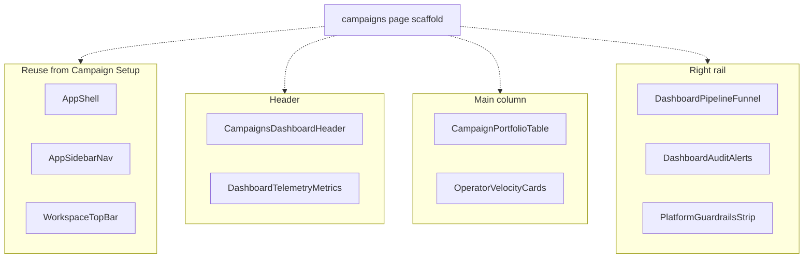

# Campaigns Admin Dashboard

## 1. Intent & Business Value

Operators need a multi-campaign telemetry surface after Campaign Setup and Campaign Pipeline so they can compare portfolio health, operator triage throughput, citation audit integrity, and strictly non-automated dispatch proof across metros. This epic delivers the **presentational components** from the Stitch screen **LocalDraft - Campaigns Admin Dashboard** (`projects/13798460973041177032/screens/e569b1bad7964515ae9b8da0edd42ce4` in project `agent-lead workspace` / `projects/13798460973041177032`) as isolated, shadcn-composed widgets under `components/campaigns/`, then a page-scaffold story that composes them into `app/(auth)/campaigns/page.tsx`.

The outcome is a reusable component kit that matches the Stitch visual contract, plus a mock-driven Campaigns landing page (the sidebar already points at `/campaigns`). This epic does **not** replace the domain pipeline contracts in [`pipeline-stage-data-contracts-2026-09-12`](pipeline-stage-data-contracts-2026-09-12.md) or the queue status model in [`epic-agent-workspace-2026-09-12`](epic-agent-workspace-2026-09-12.md).

App chrome (256px rail, 56px top bar) already exists from [`epic-campaign-setup-2026-09-18`](epic-campaign-setup-2026-09-18.md) and is **reused**, not rebuilt.

Review Queue is claimed on [`epic-review-queue-2026-09-20`](epic-review-queue-2026-09-20.md) and is not implemented in this epic.

## 2. Source Specifications

### A. Stitch screen

Catalog row from [stitch-to-shadcn/references/projects.md](../../.cursor/skills/stitch-to-shadcn/references/projects.md). Do not invent IDs.

| Field | Value |
|---|---|
| Project | `projects/13798460973041177032` (agent-lead workspace) |
| Screen | `projects/13798460973041177032/screens/e569b1bad7964515ae9b8da0edd42ce4` |
| Title | LocalDraft - Campaigns Admin Dashboard |
| Device | DESKTOP, 2560×2738 |
| Theme | LocalDraft Operator Core — Inter, primary `#0F766E`, canvas `#F8FAFC`, surfaces `#FFFFFF`, borders `#E2E8F0` |

### B. Screen copy and component inventory

Transcribed from the Stitch HTML (not paraphrased). Page chrome (sidebar, top bar) is documented here for reuse context and is **not** implemented in the widget stories.

**Reused chrome (already shipped)**

- Sidebar brand, nav (`Campaigns` active, `Review Queue` count `14`, `Follow-ups` count `3`, `Settings`), footer `Target Campaign` / `HVAC - Central Texas`, `Alex M. (Operator)` / `Ready` / `Manual Send Mode Only`.
- Top bar breadcrumb `Workspace` / `Review Desk`, search placeholder `Search leads, domains, campaigns... (/) `, pill `Strict Human-in-the-Loop • No Automated Blasts`, stat `38 drafts reviewed this week`, `New Campaign`, avatar.
- Do **not** add a second `New Campaign` control in the dashboard header.

**Campaigns dashboard header** (title cluster + metro filter)

- Title: `Campaigns Admin Dashboard`.
- Eyebrow: `Operator Core Live Telemetry`.
- Description: `Global administrative view of active multi-metro pipelines, operator triage throughput, citation audit health, and strictly non-automated dispatch metrics.`
- Guard chip: `100% Manual Gate Enforced • 6 Active Pipelines • 0 Blast Automations Permitted` (shield).
- Metro filter (exclusive): `All Metros`, `Central TX`, `North Dallas`, `Chicagoland`.

**Dashboard telemetry metrics** (five KPI cards)

`1,428` is **not** a sixth KPI. It is funnel stage 2 (`Maps & Registry Discovery`).

1. `Active Pipelines` (hub) — hero `6` — chips `2 Paused` / `1 Archived`.
2. `Live Domain Valid` (verified) — hero `94.2%` — suffix `1,345 live`.
3. `Avg Triage Time` (timer) — hero `42s` — delta `-6s goal` — meta `312 approved this wk`.
4. `Citation Integrity` (policy) — hero `99.4%` — `0 halluc.` / `8 flagged for review`.
5. `Owner Reply Rate` (forum) — hero `26.8%` — delta `+4.2%` — caption `High intent conversations`.

**Campaign portfolio table**

- Section title: `Campaign Portfolio & Health`.
- Count chip: `6 Monitored`.
- Columns: `Campaign & Metro`, `Pipeline Stage`, `Targets`, `Desk Queue`, `Operator`, `Integrity`, `Actions`.
- Filled mock rows:
  1. `Central Texas HVAC Outbound` / `Austin, Round Rock, Cedar Park` — `Stage 5/6 Draft Assembly` — `128 targets` `121 verified (94.5%)` — `14 ready` `84 sent` — `Alex M.` — `98%` — `Triage`
  2. `DFW Commercial Roofing & Restoration` / `Dallas, Fort Worth, Plano` — `Stage 4/6 Public Scrapes` — `340 targets` `318 verified (93.5%)` — `42 in scrape` — `Sarah K.` — `96%` — `Triage`
  3. `Greater Chicago Mechanical & Boiler` / `Chicago, Evanston, Naperville` — `Stage 6/6 Human Review` — `215 targets` `208 verified (96.7%)` — `32 ready` `140 sent` — `Marcus T.` — `100%` — `Triage`
  4. `Denver Metro High-End Auto Detail` / `Denver, Boulder, Aurora` — `Stage 2/6 Discovery` — `184 targets` `172 live sites` — `Indexing maps...` — `Elena R.` — `94%` — `Triage`
  5. `Phoenix Valley Emergency Plumbing` / `Phoenix, Scottsdale, Mesa` — `Paused: Capacity Guard` (pause_circle) — `290 targets` `275 verified` — `45 held` — `Unassigned` — `Check` — `Resume`
  6. `Atlanta Metro Orthodontic & Pediatric Clinics` / `Buckhead, Alpharetta, Midtown` — `Follow-up Cycle` (check_circle) — `271 targets` `261 verified` — `58 (27.6%) Replies` — `Sarah K.` — `100%` — `Audit`
- Each row has a trailing overflow control (`more_vert`). Do not invent a dropdown menu primitive unless implementation finds a real menu in the HTML.

These columns and campaign names are **not** the listing workbench on [`pipeline-workbench-table-2026-09-19`](pipeline-workbench-table-2026-09-19.md). Do not reuse that widget.

**Operator velocity cards**

- Section title: `Lead Operator Velocity & Precision`.
- Caption: `Realtime dispatch audit (Past 7 days)`.
- Filled mock cards:
  1. `Alex M.` / `Austin HVAC, Chicago Mech` — rank `#1 Velocity` — `142 Reviewed` — `38s Avg Speed` — `28.4% Reply Rate` — `0 Citation Flags` — `100% Native Sent`
  2. `Sarah K.` / `DFW Roofing, Atlanta Ortho` — rank `High Volume` — `118 Reviewed` — `46s Avg Speed` — `24.1% Reply Rate` — `1 Flag Resolved` — `100% Native Sent`
  3. `Marcus T.` / `Chicago Mechanical Lead` — rank `Top Conv.` — `94 Reviewed` — `41s Avg Speed` — `29.0% Reply Rate` — `0 Citation Flags` — `100% Native Sent`

**Dashboard pipeline funnel**

- Title: `6-Stage Pipeline Funnel`.
- Helper: `Live business count across the strict 6-stage ingestion and ground truth enrichment funnel.`
- Stages (1–6):
  1. `Setup & Perimeter Spec` — `Geographic radius & criteria` — `6 Specs`
  2. `Maps & Registry Discovery` — `Secretary of State & Place APIs` — `1,428 Targets`
  3. `Domain & SSL Matching` — `Live web validation & MX` — `1,345 (94.2%)`
  4. `Public Fact Extraction` — `Owner names, years in biz, reviews` — `3,120 Facts`
  5. `Grounded Draft Assembly` — `Variable citation synthesis` — `118 in Draft`
  6. `Human Review & Native Send` — `Desk operator manual gate` — `91 Queue`

These titles are **not** the Setup preview titles on [`pipeline-sequence-rail-2026-09-18`](done/pipeline-sequence-rail-2026-09-18.md) and **not** the Pipeline run-state titles on [`pipeline-stage-stepper-2026-09-19`](pipeline-stage-stepper-2026-09-19.md). Do not reuse those widgets.

**Dashboard audit alerts**

- Heading: `Stage Bottlenecks & Audit Alerts`.
- Attention: `14 Missing Storefront Domains: Targets in Denver & Phoenix require operator manual URL resolution before citation scrape.`
- Guardrail: `3 Guardrail Intercepts: Unverifiable revenue claim detected in drafted snippet; held back for citation re-verification.`

**Platform guardrails strip**

- Header: `Platform Guardrails` with chip `100% Manual`.
- Stats: `Forbidden Clichés Auto-Stripped` `23 intercepted` • `Unverified Claims Blocked` `4 blocked` • `Background SMTP Daemons` `0 (Permanently Disabled)`.
- Footer: `Zero automated blasts. Every message is individually dispatched via operator native mail clients.` (verified_user).

### C. Visual tokens (Operator Core, applied to these components)

- Primary action: `#0F766E`, hover `#115E59`, height 32px compact / 36px standard, radius 6px.
- Secondary action: white, `1px solid #E2E8F0`, text `#0F172A`, hover `#F8FAFC` / border `#CBD5E1`.
- Selected metro chip: `#F0FDFA` + 2px inset `#0F766E` (or filled teal `#0F766E` / white, matching exclusive ToggleGroup).
- Chips: 20px height, `label-sm` 11px semibold, 4px radius.
- Cards: white, `1px solid #E2E8F0`, 8px radius, padding 12–16px.
- Verified / integrity 100%: emerald `#059669` / tint `#ECFDF5`.
- Active / in-progress / draft assembly: primary teal `#0F766E` / selected `#F0FDFA`.
- Discovery / scrape in-progress: sky `#0284C7`.
- Paused / capacity guard / missing domains: amber `#D97706` / tint `#FFFBEB`.
- Guardrail intercepts / SMTP zero-proof: rose `#E11D48` / tint `#FFF1F2` for the intercept alert; the SMTP `0` value stays emerald or muted, never implying an active daemon.
- Reply-rate positive delta: emerald `#047857`. Triage-time improvement (`-6s goal`): emerald.

### D. Component → file map

| Component | File |
|---|---|
| Campaigns dashboard header | `components/campaigns/campaigns-dashboard-header.tsx` |
| Dashboard telemetry metrics | `components/campaigns/dashboard-telemetry-metrics.tsx` |
| Campaign portfolio table | `components/campaigns/campaign-portfolio-table.tsx` |
| Operator velocity cards | `components/campaigns/operator-velocity-cards.tsx` |
| Dashboard pipeline funnel | `components/campaigns/dashboard-pipeline-funnel.tsx` |
| Dashboard audit alerts | `components/campaigns/dashboard-audit-alerts.tsx` |
| Platform guardrails strip | `components/campaigns/platform-guardrails-strip.tsx` |
| Campaigns dashboard page | `app/(auth)/campaigns/page.tsx` |

## 3. Scope Boundaries

- **In Scope (v1)**: Isolated presentational React components matching the Stitch widgets above. Props and mock data for empty, filled, selected, and disabled states. shadcn/ui primitives. Visual alignment to Operator Core tokens. CLI-add `table` when the portfolio-table story is claimed if it is still missing from `components/ui/`. Mock-driven page assembly at `app/(auth)/campaigns/page.tsx`.
- **Explicit Non-Goals (v2+)**:
  - App sidebar / shell / top bar (reuse the Campaign Setup chrome).
  - Campaign fetch, persistence, APIs, polling, or CSV export.
  - Pause/resume research, overflow menus that write campaign state, SMTP, or blast automation.
  - Zod or server-side validation, database writes.
  - Review Queue screen (`projects/13798460973041177032/screens/edf29e27a2824c4da2952f5bd12988fa`) — claimed by [`epic-review-queue-2026-09-20`](epic-review-queue-2026-09-20.md); do not implement it here.
  - Product landing page or Campaign & Review Manager screens.

## 4. Architecture & Flow

Widget stories receive typed props only. No server actions, no campaign entity writes, no shared page store until the scaffold story, which uses a **local mock object** in the page file.

Do not import [`pipeline-summary-metrics`](done/pipeline-summary-metrics-2026-09-19.md), [`pipeline-workbench-table`](done/pipeline-workbench-table-2026-09-19.md), [`pipeline-stage-stepper`](done/pipeline-stage-stepper-2026-09-19.md), or [`pipeline-sequence-rail`](done/pipeline-sequence-rail-2026-09-18.md). [`PageHeader`](done/workspace-page-header-2026-09-18.md) does not cover metro chips plus the telemetry eyebrow.

## 5. Stories

- [Campaigns dashboard header](done/campaigns-dashboard-header-2026-09-19.md) (`campaigns-dashboard-header-2026-09-19`): Title, telemetry eyebrow, description, manual-gate chip, metro ToggleGroup.
- [Dashboard telemetry metrics](done/dashboard-telemetry-metrics-2026-09-19.md) (`dashboard-telemetry-metrics-2026-09-19`): Five KPI cards (pipelines, domain valid, triage time, citation integrity, reply rate).
- [Campaign portfolio table](done/campaign-portfolio-table-2026-09-19.md) (`campaign-portfolio-table-2026-09-19`): Six monitored campaigns with stage, targets, desk queue, operator, integrity, and actions.
- [Operator velocity cards](done/operator-velocity-cards-2026-09-19.md) (`operator-velocity-cards-2026-09-19`): Three-operator 7-day dispatch audit.
- [Dashboard pipeline funnel](done/dashboard-pipeline-funnel-2026-09-19.md) (`dashboard-pipeline-funnel-2026-09-19`): Cross-campaign six-stage counts. New widget.
- [Dashboard audit alerts](done/dashboard-audit-alerts-2026-09-19.md) (`dashboard-audit-alerts-2026-09-19`): Missing-domain and guardrail intercept alerts.
- [Platform guardrails strip](done/platform-guardrails-strip-2026-09-19.md) (`platform-guardrails-strip-2026-09-19`): Manual-gate stats and zero-blast footer.
- [Campaigns dashboard page scaffold](done/campaigns-dashboard-page-scaffold-2026-09-19.md) (`campaigns-dashboard-page-scaffold-2026-09-19`): Compose the seven widgets into `app/(auth)/campaigns/page.tsx`.

### Layout and navigation

Page chrome is reused from Campaign Setup. These cards are **not** created in this epic:

- [Operator app shell](done/operator-app-shell-2026-09-18.md)
- [App sidebar nav](done/app-sidebar-nav-2026-09-18.md)
- [Workspace top bar](done/workspace-top-bar-2026-09-18.md)

## 6. Milestone Definition of Done

- [x] All 7 components exist under `components/campaigns/` and render in isolation with mock props.
- [x] Empty, filled, and disabled (or inactive) states are implemented where the Stitch screen implies them.
- [x] Visible copy matches the Stitch strings in section 2 (labels, KPI names, table headers, mock rows, funnel stages, alert copy, guardrail stats).
- [x] Components compose shadcn/ui primitives listed on each story card; `Table` is CLI-added if missing, not hand-rolled.
- [x] Visual tokens match Operator Core (teal primary, chip/card radii, border colors) from the Stitch design system.
- [x] Funnel, KPI row, and portfolio table are new widgets; they do not import pipeline-summary-metrics, pipeline-workbench-table, pipeline-stage-stepper, or pipeline-sequence-rail.
- [x] `app/(auth)/campaigns/page.tsx` composes the widgets with a local mock; no sidebar rebuild, persistence, or API client is introduced.

## 7. Dependencies & Sequencing

- **Prerequisites**: [`epic-campaign-setup-2026-09-18`](epic-campaign-setup-2026-09-18.md) (shell, nav, top bar, campaign widget folder, `/campaigns/new`), [`epic-application-architecture-2026-09-15`](epic-application-architecture-2026-09-15.md) (folder layout, shadcn at `components/ui/`), [`epic-ui-design-system-2026-09-15`](epic-ui-design-system-2026-09-15.md) (Operator Core tokens). Campaign Pipeline widgets in [`epic-campaign-pipeline-2026-09-19`](epic-campaign-pipeline-2026-09-19.md) may land in parallel; this epic must not import them.
- **Unblocks**: Operators can open `/campaigns` as the Campaigns landing page. Review Queue UI is a separate epic ([`epic-review-queue-2026-09-20`](epic-review-queue-2026-09-20.md)).
