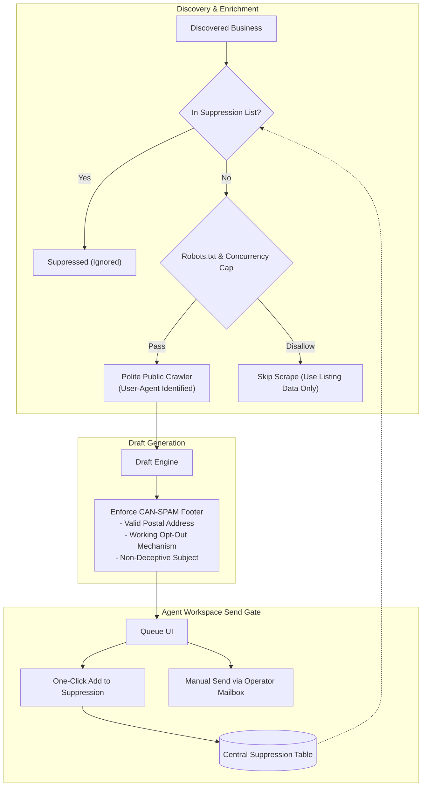

# Compliance and Risk

## 1. Intent & Business Value
Cold email outreach to commercial businesses carries legal, technical, and reputational risk if conducted recklessly. This epic codifies LocalDraft's legal and ethical boundaries: operating strictly under United States B2B CAN-SPAM standards, using human-in-the-loop sending, honoring search and web crawler etiquette, and enforcing suppression lists from day one. It safeguards operator domains from spam blocklists and ensures all data collection remains strictly in public view.

## 2. Source Specifications

### A. CAN-SPAM Regulatory Baseline (US B2B Cold Outreach)
1. **Accurate From-Line**: Senders must use authentic, identifiable email headers and sender identities belonging to the operator; no deceptive domain aliases or spoofed routing relays.
2. **Physical Postal Address**: The email signature template must automatically include a valid, physical postal address belonging to the operator.
3. **Unambiguous Opt-Out**: Every email must include an explicit, functional opt-out mechanism (e.g., *"Reply with 'stop' if you prefer I not reach out again"*).
4. **Honest Subject Lines**: Subject lines must accurately describe the contents or reason for outreach and must never mislead the recipient.
5. **Human Mailbox Identity**: Sends are dispatched from the human operator's authenticated mailbox (Gmail/Outlook/Google Workspace), not an anonymous bulk mailing daemon.

### B. Search Engine & Directory API ToS
- Prefer licensed Google Maps / Places API providers.
- Cache query results aggressively to avoid redundant calls and adhere to usage guidelines.
- Strictly forbid republishing Google Maps data as a competing public directory.

### C. Responsible Web Crawling Standards
- **Public Surface Only**: Fetch only publicly accessible HTML pages (`/`, `/about`, `/services`, `/contact`).
- **Robots.txt Adherence**: Fetcher must check and obey `robots.txt` disallow rules.
- **Modest Concurrency**: Rate-limit requests to a maximum of 2 concurrent connections per domain with polite request backoff.
- **Crawler Identity**: Include a descriptive `User-Agent` string clearly identifying the crawler.
- **Zero Login Walls**: Immediately skip and never attempt to bypass password logins, CAPTCHAs, or paywalls.

### D. Data Boundaries & Privacy
- **Strictly Excluded**: Never scrape, process, or store credit card numbers, payment gateways, HIPAA patient records, student information, or private personal data.
- **B2B Contact Path Only**: Collect only publicly advertised commercial contact emails and business phone numbers.
- **Prohibited Sources**: Zero purchased consumer email lists; zero scraping of personal social media profiles or direct messages (DMs).

### E. Day-One Suppression & Legal Review Gate
- **Suppression List**: An active, centralized do-not-contact table matching on email addresses, domain names, and business titles. Any suppressed entry is completely excluded from discovery, drafting, and queue display.
- **Legal Review Gate**: A mandatory formal legal checkpoint before any paid third-party customer or client is granted access to the system.

## 3. Scope Boundaries
- **In Scope (v1)**: CAN-SPAM signature enforcement, crawler polite throttling, robots.txt parser, internal suppression table, legal review checklist.
- **Explicit Non-Goals (v2+)**:
  - European GDPR / ePrivacy consumer consent opt-in engines (v1 is US B2B only).
  - Automated proxy rotation networks or CAPTCHA-solving tools.
  - Multi-jurisdictional automated legal compliance engines.

## 4. Compliance & Suppression Architecture

## 5. Stories

- [CAN-SPAM send checklist](can-spam-send-checklist-2026-09-12.md) (`can-spam-send-checklist-2026-09-12`): In-app verification requiring postal address, honest subjects, and reply-stop opt-out copy.
- [Crawler constraints](crawler-constraints-2026-09-12.md) (`crawler-constraints-2026-09-12`): Web crawler respecting robots.txt, concurrency limits, and public-only boundaries.
- [Suppression list day one](suppression-list-day-one-2026-09-12.md) (`suppression-list-day-one-2026-09-12`): Centralized suppression store preventing repeat outreach to opted-out domains or contacts.
- [Legal review gate](legal-review-gate-2026-09-12.md) (`legal-review-gate-2026-09-12`): Procedural gate requiring legal verification before external client use.
- [Data boundaries policy](data-boundaries-policy-2026-09-12.md) (`data-boundaries-policy-2026-09-12`): Software checks and data policies excluding sensitive PII, payment info, and consumer data.

## 6. Milestone Definition of Done
- [ ] Every generated draft automatically appends the configured physical postal address and opt-out sentence.
- [ ] Crawler demonstrably obeys `robots.txt` disallow directives in automated unit tests.
- [ ] Adding an email or domain to the suppression list immediately excludes it from current queue views and future discovery queries.
- [ ] Rate limiter caps HTTP requests to 2 req/sec per domain during web extraction.
- [ ] Data layer enforces zero storage of consumer PII or sensitive personal records.
- [ ] Legal review checklist document is signed off before onboarding pilot clients.

## 7. Dependencies & Sequencing
- **Prerequisites**: [epic-purpose](epic-purpose-2026-09-12.md).
- **Unblocks**: [epic-data-and-enrichment](epic-data-and-enrichment-2026-09-12.md), [epic-email-draft-standard](epic-email-draft-standard-2026-09-12.md), [epic-90-day-pilot-plan](epic-90-day-pilot-plan-2026-09-12.md).
