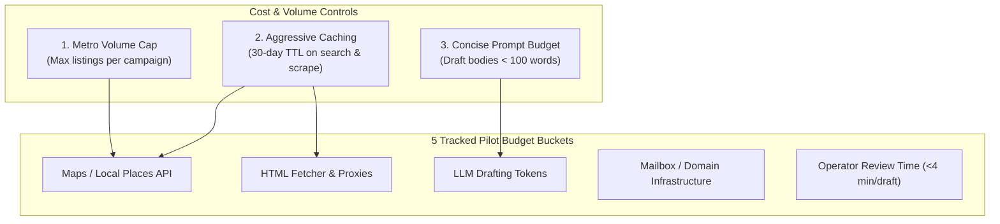

# Costs and Dependencies

## 1. Intent & Business Value
A major failure mode for AI-enabled outreach tools is premature over-spending on expensive enterprise data subscriptions, unmonitored API crawling loops, and heavy engineering overhead. This epic establishes the order-of-magnitude budget buckets, dependency guardrails, and architectural volume caps necessary to keep the 90-day pilot lean and cost-effective.

## 2. Source Specifications

### The Five Pilot Budget Buckets
1. **Local Results / Maps API Usage**: Query costs from licensed Google Maps / Places providers. Controlled via local caching and strict query result pagination.
2. **Fetch / Scraping Infrastructure**: Modest cloud compute or proxy resources for polite public HTML crawling with aggressive domain-level cache TTLs.
3. **Language Model API Consumption**: LLM token costs for generating short (<100 word) personalized drafts. Incurred on-demand per discovered business; token footprint is small.
4. **Mailbox & Domain Reputation**: Authenticated sending mailboxes (Google Workspace / Microsoft 365) with proper SPF, DKIM, and DMARC configurations to maintain deliverability.
5. **Operator Review Time (The Scarce Resource)**: The human operator's time required to review, verify citations, edit drafts, and handle inbound replies. The target is <4 minutes of editing per approved draft.

### Strict Budget Exclusions
- **No Paid Firmographics Append**: Keep paid B2B data providers (ZoomInfo, Apollo, Clearbit) off the pilot balance sheet entirely. Add them only if campaigns conclusively fail because the wrong size of company is reached, never as a speculative early upgrade.
- **One-Metro Volume Cap**: Discovery jobs are strictly bounded to the target beachhead metro to prevent runaway API billing spikes.

## 3. Scope Boundaries
- **In Scope (v1)**: Pilot cost tracking spreadsheet, API quota alarms, caching layers to minimize provider calls, volume bounding per campaign.
- **Explicit Non-Goals (v2+)**:
  - High-frequency national crawls requiring large proxy mesh infrastructure.
  - Multi-thousand-dollar B2B enterprise data subscriptions.

## 4. Cost Control Architecture

## 5. Stories

- [Pilot budget buckets](pilot-budget-buckets-2026-09-12.md) (`pilot-budget-buckets-2026-09-12`): Expense tracking structure allocating costs across the five core operational buckets.
- [Exclude firmographic append from budget](exclude-firmographic-append-budget-2026-09-12.md) (`exclude-firmographic-append-budget-2026-09-12`): Budgetary guardrail preventing allocation of funds to third-party firmographic providers during the pilot.
- [One-metro volume cap](one-metro-volume-cap-2026-09-12.md) (`one-metro-volume-cap-2026-09-12`): Hard system configuration capping the maximum number of discovered listings per campaign run.

## 6. Milestone Definition of Done
- [ ] Financial tracking ledger records monthly operational expenses across all 5 budget buckets.
- [ ] Discovery provider client implements rate-limiting and maximum listing caps per query.
- [ ] Caching layer eliminates redundant web requests when re-evaluating the same business.
- [ ] Pilot budget confirms zero expenditures on third-party employee or revenue data append services.

## 7. Dependencies & Sequencing
- **Prerequisites**: [epic-v1-product-scope](epic-v1-product-scope-2026-09-12.md), [epic-beachhead-gtm](epic-beachhead-gtm-2026-09-12.md).
- **Unblocks**: [epic-90-day-pilot-plan](epic-90-day-pilot-plan-2026-09-12.md), [epic-risks-and-mitigations](epic-risks-and-mitigations-2026-09-12.md).
