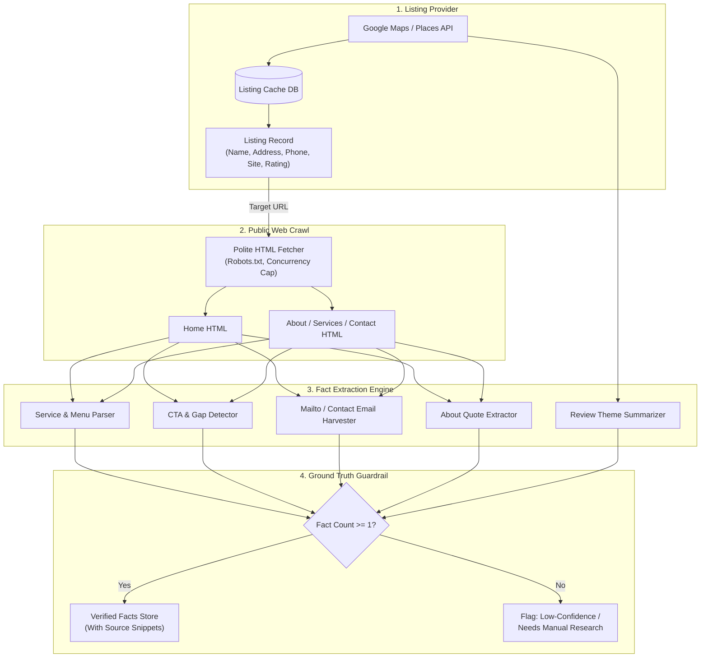

# Data and Enrichment

## 1. Intent & Business Value
Effective cold outreach to local service businesses fails when messages are generic or based solely on directory listings. This epic establishes the discovery layer, scraping infrastructure, and fact-extraction schemas required to harvest real, verified observations from public listings and websites. It prevents AI hallucination by establishing strict ground-truth rules: if a fact isn't on the page, it cannot appear in the email.

## 2. Source Specifications

### A. Discovery Layer & Ingestion Strategy
- **Primary Source**: Google Maps and local search API integrations (e.g., licensed Places / Local Results providers).
- **Ingestion Policy**: API-first architecture with aggressive disk caching to avoid redundant queries and cost spikes. Raw scraping of search engines is strictly a last resort subject to rate limits and ToS review.
- **Listing Data Captured**:
  - Legal or trade business name.
  - Formatted postal address and localized municipality.
  - Public business telephone number.
  - Canonical website URL (when listed).
  - Primary category and secondary classification tags.
  - Average star rating and total public review count.
  - Public operating hours (if exposed in listing).

### B. Public Review Themes
- **Rules**: Extract a brief review-theme summary only when public reviews are available and sufficient (minimum threshold: >= 10 reviews).
- **Usable Themes**: Concrete operational aspects such as wait times, quote responsiveness, pricing transparency, or scheduling ease.
- **Strict Prohibition**: Never fabricate, extrapolate, or invent customer sentiment or fake review quotes.

### C. Website Fact Extraction Schema
When a listing has a website, fetch the homepage and candidate sub-pages (`/about`, `/services`, `/contact`). Extract:
1. **Business Identity**: Visible header business name, tagline, or brand slogan.
2. **Services / Menu**: Concrete bullet points or lists of actual services provided.
3. **Calls to Action (CTAs)**: Detected conversion mechanisms:
   - Online booking slot / scheduling portal.
   - "Call now" phone CTA.
   - "Get a Quote" / "Request Estimate" form.
   - E-commerce shop / customer portal.
4. **Contact Channels**: Mailto email addresses, web forms, office phone numbers.
5. **Quotable About Snippet**: At most one genuine, un-embellished sentence from the About page (e.g., founding year, family-owned tenure).
6. **Observable Gaps & Deficiencies**: Objective site limitations that form a valid reason for outreach:
   - Absence of online booking / reliance on a generic contact form.
   - Missing HTTPS / SSL certificate.
   - Broken contact links or missing service area pages.
   - Absence of mobile-responsive viewport signals.

### D. Strict Anti-Hallucination ("No-Invention") Policy
- Generator and data pipeline **must not** assume or hallucinate:
  - Employee headcount (e.g., "noticed your team of 10").
  - Annual revenue or sales volume.
  - Owner or executive names unless explicitly printed on the website.
- **Thin Record Handling**: If the only verifiable facts for a business are its name and city, the pipeline must tag the account as `needs-manual-research` and mark the generated draft as `low-confidence`.

## 3. Scope Boundaries
- **In Scope (v1)**: Public HTML pages only, robots.txt compliance, modest concurrency (max 2 requests/sec per domain), User-Agent disclosure, 30-day cached fetches.
- **Explicit Non-Goals (v2+)**:
  - Scraping password-protected, behind-login, or paywalled pages.
  - B2B firmographic data enrichment (LinkedIn, ZoomInfo, Apollo).
  - Social media profile crawling (Facebook, Instagram, LinkedIn DMs).
  - Consumer PII gathering or background checks.

## 4. Architecture & Extraction Schema

## 5. Stories

- [Listing capture model](listing-capture-model-2026-09-12.md) (`listing-capture-model-2026-09-12`): Persistent data model for normalized listing fields and hours.
- [Website fact extraction schema](website-fact-extraction-schema-2026-09-12.md) (`website-fact-extraction-schema-2026-09-12`): Parsers extracting services, CTAs, gaps, About quotes, and contact paths.
- [Review-theme summary rules](review-theme-summary-rules-2026-09-12.md) (`review-theme-summary-rules-2026-09-12`): Review threshold logic and safe synthesis of recurring customer review themes.
- [Thin-record no-invention policy](thin-record-no-invention-policy-2026-09-12.md) (`thin-record-no-invention-policy-2026-09-12`): Guardrail enforcing conservative copy and `needs-manual-research` flags on sparse records.
- [Discovery source policy](discovery-source-policy-2026-09-12.md) (`discovery-source-policy-2026-09-12`): Provider adapter abstraction, cache TTL layer, and rate-limiting rules.

## 6. Milestone Definition of Done
- [ ] Listing ingestion model stores all proposal fields without truncating addresses or losing phone numbers.
- [ ] Scraping engine respects `robots.txt`, identifies itself via descriptive User-Agent, and honors concurrency caps.
- [ ] Fact extractor successfully outputs structured facts (services, gaps, CTAs) with linked raw HTML text snippets for verification.
- [ ] Review summarizer cleanly abstains from generating review themes when total reviews are under threshold.
- [ ] Zero false headcount, revenue, or leadership names are generated in downstream test datasets.
- [ ] Records with thin information (name + city only) are systematically categorized into low-confidence triage.

## 7. Dependencies & Sequencing
- **Prerequisites**: [epic-v1-product-scope](epic-v1-product-scope-2026-09-12.md), [epic-compliance-and-risk](epic-compliance-and-risk-2026-09-12.md).
- **Unblocks**: [epic-email-draft-standard](epic-email-draft-standard-2026-09-12.md), [epic-agent-workspace](epic-agent-workspace-2026-09-12.md).
