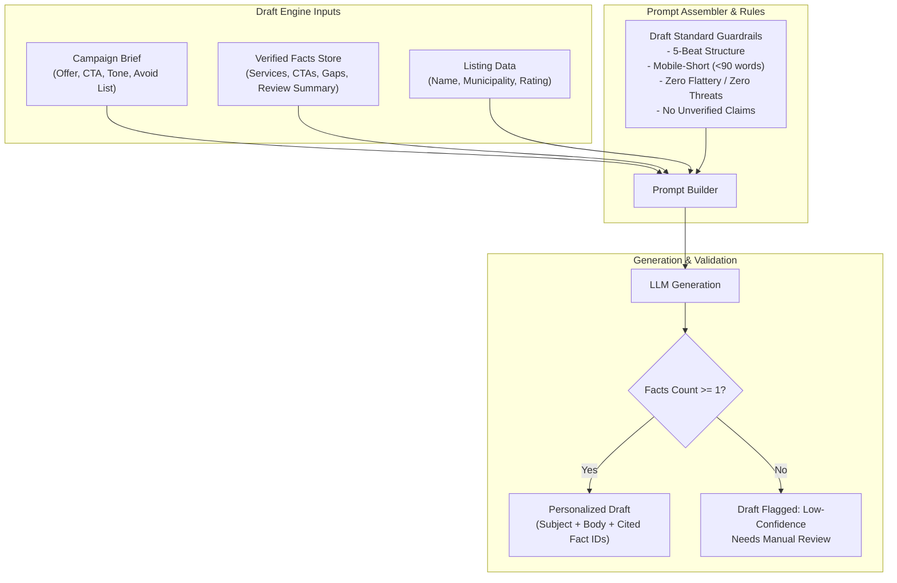

# Email Draft Standard

## 1. Intent & Business Value
Local service business owners receive numerous generic cold emails daily and discard them immediately. This epic formalizes the editorial standard, structural rules, and prompt engineering constraints for LocalDraft's AI generation engine. It ensures that every generated draft is concise enough to read on a mobile device and so specifically grounded in the shop's public digital footprint that it could not be sent to their competitor down the street without making no sense.

## 2. Source Specifications

### Required Email Structure (5-Beat Architecture)
Every generated draft must strictly follow this structure:
1. **Subject Line**: Explicitly mentions the specific business name or a concrete local observation (e.g., *"Booking page observation for Anoka Salon"*). Strictly forbids generic, misleading clickbait such as *"Quick question"*, *"Urgent"*, or deceptive partnership titles.
2. **First Beat (Verified Fact)**: The opening sentence directly cites 1–2 verified facts from the listing or website (e.g., mention of an active service, a specific review volume, or a website gap like a missing booking link).
3. **Second Beat (Offer Bridge)**: Connects the verified observation to the campaign's specific value proposition or solution.
4. **Third Beat (Single Clear Ask)**: Proposes a frictionless, low-commitment next step (e.g., a 15-minute call, asking if they'd like a 1-page mock, or replying with a preferred time).
5. **Fourth Beat (Authentic Signature)**: Simple, human plain-text signature owned by the sending agent including mandatory CAN-SPAM physical postal address and opt-out text.

### Strict Quality Bar & Guardrails
- **Low-Confidence Flagging**: If the only verified facts extracted for a business are its name and city, the draft generation engine must flag the result as `low-confidence` and recommend manual research rather than producing vague generalities.
- **No Flattery**: Avoid disingenuous automated flattery (*"I was blown away by your stunning website"*, *"loved your beautiful brand"*).
- **No Threats or Scare Tactics**: Avoid fear-mongering (*"Your competitors will destroy you"*, *"You are bleeding thousands in lost revenue every day"*).
- **No Hallucinated Claims or Offers**: Pricing, discounts, guarantees, or case studies must come exclusively from the campaign brief provided by the human operator. Never invent credentials or fake results.

### Illustrative Golden Pattern (Proposal Benchmark)
> *"Hi — your Anoka listing shows 40+ reviews and the site still sends people to a contact form instead of a booking slot. We build simple booking pages for independent salons in the north metro. If you want, I can send a one-page mock using your current service list."*

*Note: While the observation must always remain true to the recipient's site, the offer and CTA are swapped based on the active campaign brief.*

## 3. Scope Boundaries
- **In Scope (v1)**: Prompt templates enforcing the 5-beat structure, golden test fixtures, confidence scoring heuristic, prompt parameterization by campaign brief.
- **Explicit Non-Goals (v2+)**:
  - Automated multi-step sequence writing (touch 1, touch 2, touch 3).
  - Autonomous multi-armed bandit A/B testing on live recipients.
  - Tone imitation from scraped personal social media posts.

## 4. Prompt Synthesis Architecture

## 5. Stories

- [Required email structure](required-email-structure-2026-09-12.md) (`required-email-structure-2026-09-12`): Prompt template enforcing the 5-beat structure (subject, verified fact, offer bridge, single ask, agent signature).
- [Low-confidence draft marking](low-confidence-draft-marking-2026-09-12.md) (`low-confidence-draft-marking-2026-09-12`): Heuristic scoring drafts lacking deep facts and applying visual warnings in the queue.
- [Draft quality bar](draft-quality-bar-2026-09-12.md) (`draft-quality-bar-2026-09-12`): Negative constraint rules blocking flattery, threats, and ungrounded claims.
- [Example-pattern rubric tests](example-pattern-rubric-tests-2026-09-12.md) (`example-pattern-rubric-tests-2026-09-12`): Automated test suite running golden fixtures against the proposal's benchmark standard.

## 6. Milestone Definition of Done
- [ ] 100% of generated drafts in test evaluation pass the 5-beat structural check (subject, fact, offer, ask, signature).
- [ ] Word count of generated email bodies stays under 100 words to ensure mobile readability.
- [ ] Drafts generated for businesses with only name/city metadata are automatically assigned `confidence: "low"` and tagged `Needs edit`.
- [ ] Evaluation harness validates that zero forbidden phrases (flattery or threats) appear across a benchmark run of 50 sample businesses.
- [ ] Output includes metadata mapping each sentence to the corresponding raw extracted fact ID for UI citation pairing.

## 7. Dependencies & Sequencing
- **Prerequisites**: [epic-data-and-enrichment](epic-data-and-enrichment-2026-09-12.md), [epic-purpose](epic-purpose-2026-09-12.md).
- **Unblocks**: [epic-v1-product-scope](epic-v1-product-scope-2026-09-12.md), [epic-agent-workspace](epic-agent-workspace-2026-09-12.md).
