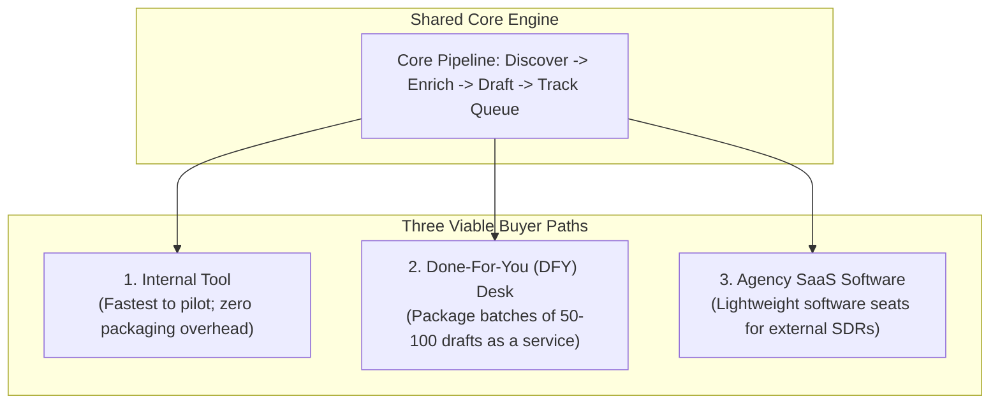

# Executive Summary

## 1. Intent & Business Value
Local service businesses are easy to find online through Maps and local directories, but exceptionally difficult to write to effectively. Generic mass emails produce low response rates and burn sender reputations. Effective cold outreach requires specific, authentic observations drawn directly from that business's public web presence—such as a missing online scheduling page, a dated service list, or a cluster of public reviews regarding wait times. This epic establishes the executive charter and operational boundaries for LocalDraft: a campaign-driven research and personalized drafting workflow designed to prove commercial viability over a 90-day pilot.

## 2. Source Specifications

### The v1 Product Promise
> **"Find + enrich + draft emails; human reviews and sends."**

### Core Operating Tenets
1. **Human-in-the-Loop Sending**: Version 1 strictly does not auto-send email. Senders review, edit, and dispatch messages directly from their own authenticated email client (Gmail/Outlook).
2. **Zero Paid Firmographics**: Excludes expensive firmographic databases, headcount lookups, and annual revenue filters. These additions are costly, legally fraught, and unnecessary to validate whether personalized local drafts drive conversation replies.
3. **Flexible Commercial Pathways**: The underlying core pipeline (discovery → scraping → drafting → tracking) is intentionally architected to support any of three commercial distribution models without re-engineering:
   - **Internal Tool**: Used internally by the operator to generate sales appointments for existing service offerings.
   - **Done-For-You (DFY) Desk**: Operated as a high-touch agency service delivering researched batches of 50–150 qualified drafts on behalf of paying clients.
   - **Software for Agencies (SaaS)**: Packaged as a multi-user web application licensed to other marketing and sales agencies.

## 3. Scope Boundaries
- **In Scope (v1)**: Delivering the unified core research and drafting workflow, keeping the commercial model open while executing an internal / DFY pilot in one target metro.
- **Explicit Non-Goals (v2+)**:
  - Building multi-tenant SaaS billing, Stripe checkout, or team seat licensing before product-market fit is proven.
  - Autonomous SDR bots or auto-sending background jobs.

## 4. Operational Alignment

## 5. Stories

- [Freeze v1 promise](freeze-v1-promise-2026-09-12.md) (`freeze-v1-promise-2026-09-12`): Architectural freeze of the v1 promise: find, enrich, draft, human-send.
- [Record commercial-path openness](record-commercial-path-openness-2026-09-12.md) (`record-commercial-path-openness-2026-09-12`): Strategic guidance preserving core pipeline flexibility across internal, DFY, and SaaS options.

## 6. Milestone Definition of Done
- [ ] Core system design and documentation confirm adherence to the v1 promise without auto-sending mechanisms.
- [ ] Pipeline architecture cleanly isolates the core research and drafting engine from any specific billing or account-packaging assumptions.
- [ ] All stakeholders agree that commercial pricing and packaging decisions are deferred until 90-day pilot response data is collected.

## 7. Dependencies & Sequencing
- **Prerequisites**: None (foundational charter).
- **Unblocks**: [epic-purpose](epic-purpose-2026-09-12.md), [epic-problem](epic-problem-2026-09-12.md), [epic-who-this-serves](epic-who-this-serves-2026-09-12.md), [epic-business-model](epic-business-model-2026-09-12.md).
