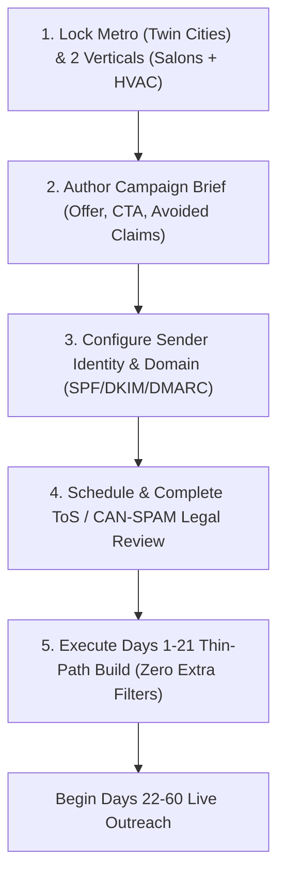

# Immediate Next Steps

## 1. Intent & Business Value
Planning without immediate tactical execution breeds stagnation. This epic captures the concrete operational and technical checklist required to initiate the LocalDraft pilot immediately upon proposal ratification. It defines the initial vertical selections, the first campaign brief, mailbox configuration, and legal review gates required before writing application code.

## 2. Source Specifications

### The Five Immediate Actions (Proposal Section 17)
1. **Choose Two Categories & One Geography**: Formally select the two target local service verticals (e.g., independent hair salons and HVAC repair) and define the geographic boundary (e.g., Hennepin & Ramsey Counties, MN).
2. **Write First Campaign Brief**: Draft the initial campaign messaging brief:
   - Specific offer value proposition (what is being offered this week).
   - Clear, frictionless call-to-action (CTA).
   - Explicit negative constraints (claims, pricing guarantees, or claims the AI must never invent).
3. **Confirm Sending Mailbox Identity**: Determine whether outreach will originate from the operator's personal Google Workspace / Microsoft 365 mailbox or a dedicated secondary domain with warm-up reputation.
4. **Conduct Brief ToS & CAN-SPAM Review**: Complete a targeted legal and ToS compliance check before any external third party is contacted with drafts.
5. **Build the Thin Path & Refuse Extra Filters**: Execute the 21-day thin-path build plan (campaign form, Maps discovery, public scraper, LLM generator, agent queue) while strictly refusing extraneous filter requests until live pilot metrics exist.

## 3. Scope Boundaries
- **In Scope (v1)**: Immediate execution checklists, campaign brief templates, sending mailbox configuration, legal check sign-off.
- **Explicit Non-Goals (v2+)**:
  - Premature automated warmup sequences or complex domain rotation meshes.

## 4. Execution Sequence Flow

## 5. Stories

- [Choose categories and geography](choose-categories-and-geography-2026-09-12.md) (`choose-categories-and-geography-2026-09-12`): Record final vertical and county selections for the initial pilot campaigns.
- [Write first campaign brief](write-first-campaign-brief-2026-09-12.md) (`write-first-campaign-brief-2026-09-12`): Draft and store the master campaign brief document for Campaign 1.
- [Confirm send identity](confirm-send-identity-2026-09-12.md) (`confirm-send-identity-2026-09-12`): Configure authenticated operator email identity and physical postal signature.
- [Schedule ToS CAN-SPAM review](schedule-tos-can-spam-review-2026-09-12.md) (`schedule-tos-can-spam-review-2026-09-12`): Complete legal review checkpoint covering public web crawling and cold B2B outreach.
- [Build thin path only](build-thin-path-only-2026-09-12.md) (`build-thin-path-only-2026-09-12`): Scope freeze policy enforcing delivery of the core thin path without distraction.

## 6. Milestone Definition of Done
- [ ] Initial geography (Twin Cities) and two categories (e.g. Salons, HVAC) are written into configuration files.
- [ ] Master brief for Campaign 1 is approved with offer, CTA, and negative constraints.
- [ ] Sending mailbox has authenticated SPF, DKIM, and DMARC records and valid physical signature.
- [ ] CAN-SPAM checklist signed off by counsel or designated risk owner.
- [ ] Scope freeze confirmed: zero non-v1 stories in Doing during the Days 1–21 build.

## 7. Dependencies & Sequencing
- **Prerequisites**: [epic-recommended-decision](epic-recommended-decision-2026-09-12.md).
- **Unblocks**: [epic-v1-product-scope](epic-v1-product-scope-2026-09-12.md), [epic-90-day-pilot-plan](epic-90-day-pilot-plan-2026-09-12.md).
