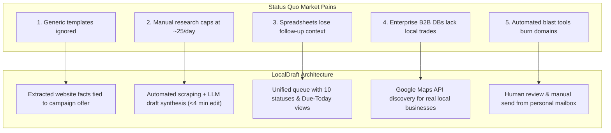

# Problem

## 1. Intent & Business Value
Selling software, marketing, or professional services to local service businesses (contractors, mechanics, salons, clinics) is notoriously inefficient. While local listings are abundant, commercial outreach fails because operators either rely on generic blast templates that recipients ignore or spend unsustainable hours manually researching individual websites. This epic formalizes the core market pain points into concrete technical and operational problem statements that LocalDraft is explicitly built to solve.

## 2. Source Specifications

### The Five Core Pain Points
1. **Generic Templates Fail**: Senders rely on one-size-fits-all cold templates that ignore what the business actually displays online, yielding single-digit open rates and near-zero positive replies.
2. **Manual Research Does Not Scale**: An operator manually opening a shop's website, reading reviews, and writing a custom three-sentence intro can only process 15–30 accounts per day before burning out.
3. **Disorganized Follow-Up**: Using ad-hoc spreadsheets results in lost conversation context, missed next-touch dates, duplicate sends, and untracked replies.
4. **Mismatched B2B Databases**: Traditional data providers (ZoomInfo, Apollo, LinkedIn Sales Navigator) are engineered for white-collar enterprise offices with employee rosters, not a 3-chair barbershop or a 2-truck paving crew, and they charge thousands in enterprise subscription fees.
5. **Auto-Blast Compliance Risk**: Automated bulk cold email tools burn sender domain reputations, trigger spam filters, and alienate local communities through tone-deaf spam.

### The Product Gap Statement
> **"The gap in local B2B outreach is not 'more names.' The gap is researched, specific first drafts combined with a structured place to work the list."**

## 3. Scope Boundaries
- **In Scope (v1)**: Establishing quantitative benchmarks for the pain points (e.g. tracking baseline research time, reply rates, and follow-up reliability) during the 90-day pilot.
- **Explicit Non-Goals (v2+)**:
  - Competing with massive national B2B directory databases.
  - Solving generic consumer lead generation.

## 4. Problem to Solution Mapping

## 5. Stories

- [Codify pain hypotheses](codify-pain-hypotheses-2026-09-12.md) (`codify-pain-hypotheses-2026-09-12`): Metrics and evaluation rubrics measuring operator time saved and reply rate improvements against baseline manual workflows.
- [Define product gap statement](define-product-gap-statement-2026-09-12.md) (`define-product-gap-statement-2026-09-12`): Foundational positioning document aligning product UI copy, empty states, and pilot objectives around verified first drafts.

## 6. Milestone Definition of Done
- [ ] Product documentation and agent onboarding materials explicitly articulate the 5 pain points and the gap statement.
- [ ] Pilot metrics framework includes baseline comparison tracking (operator time per approved draft targeting under 4 minutes).
- [ ] Feature evaluation criteria reject any backlog proposals that encourage generic blasting or neglect fact-based personalization.

## 7. Dependencies & Sequencing
- **Prerequisites**: [epic-executive-summary](epic-executive-summary-2026-09-12.md).
- **Unblocks**: [epic-purpose](epic-purpose-2026-09-12.md), [epic-solution](epic-solution-2026-09-12.md), [epic-risks-and-mitigations](epic-risks-and-mitigations-2026-09-12.md).
