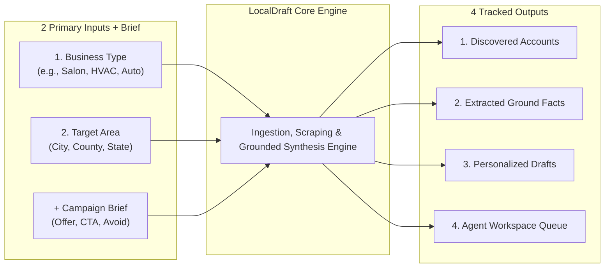

# Purpose

## 1. Intent & Business Value
The core mission of LocalDraft is to create a repeatable, scalable operating system that transforms two simple inputs—business vertical and target search geography—into a structured, tracked queue of highly personalized email drafts for local service companies. It eliminates the manual drudgery of opening dozens of browser tabs while protecting senders from the deliverability penalties of generic cold-email blasts.

## 2. Source Specifications

### System Inputs Contract
1. **Business Type**: Targeted service category (e.g., hair salon, auto mechanic, residential remodeling, driveway paving, HVAC contractor, dental practice, landscaping service, etc.).
2. **Search Area**: Specific geographic bounding (state, county, city, or curated list of municipalities).
3. **Campaign Brief**: Operational guidance containing:
   - Specific offer being pitched this week.
   - Desired conversational tone (e.g., collegial, direct, consultative).
   - Explicit negative constraints (claims, pricing, or promises the AI must never invent).

### System Outputs Contract
1. **Discovered Accounts**: Normalized business records combining public directory listing data with website addresses.
2. **Extracted Ground Facts**: Scraped, objective observations from public pages that can appear in an email without sounding synthetic.
3. **Personalized Drafts**: Exactly one draft per business pairing verified observations to the active campaign offer, formatted for rapid human review.
4. **Agent Workspace**: A single lightweight operational queue to review, refine, dispatch, and track follow-up dates.

### Explicit Non-Goals for v1
- **No Fully Automated Sending**: Zero background auto-sending or hands-off email blasting.
- **No Paid Firmographics**: Zero filtering or data dependency on employee headcount, annual revenue, or corporate parentage.
- **No Guaranteed Email on File**: Acceptance of the reality that many local service businesses have no public email listed; system provides a `no-email` soft filter rather than halting.

## 3. Scope Boundaries
- **In Scope (v1)**: High-speed ingestion of two inputs, deterministic generation of 4 primary outputs, clear non-goal guardrails.
- **Explicit Non-Goals (v2+)**:
  - Complex boolean logic across national geographic clusters.
  - Integration with B2B data providers (ZoomInfo, Apollo, Dun & Bradstreet).
  - Autonomous multi-touch sequences without operator intervention.

## 4. Input-to-Output Architecture

## 5. Stories

- [Campaign inputs contract](campaign-inputs-contract-2026-09-12.md) (`campaign-inputs-contract-2026-09-12`): Specification, data schema, and input validation for business type, geography, and campaign brief.
- [Campaign outputs contract](campaign-outputs-contract-2026-09-12.md) (`campaign-outputs-contract-2026-09-12`): Output schema mapping discovered businesses, extracted facts, generated drafts, and workspace records.
- [Lock explicit v1 non-goals](lock-v1-non-goals-2026-09-12.md) (`lock-v1-non-goals-2026-09-12`): Technical constraints enforcing the exclusion of automated sending, firmographics, and guaranteed email requirements.

## 6. Milestone Definition of Done
- [ ] System successfully accepts `businessType`, `searchArea`, and `campaignBrief` payloads and returns fully populated output records.
- [ ] System gracefully handles missing emails without failing campaign runs.
- [ ] All codebase schemas and documentation conform to the explicit v1 non-goals (zero references to automated blasting or paid firmographic fields).
- [ ] Output contract ensures every generated draft links to at least one verified fact in the output payload.

## 7. Dependencies & Sequencing
- **Prerequisites**: [epic-executive-summary](epic-executive-summary-2026-09-12.md).
- **Unblocks**: [epic-solution](epic-solution-2026-09-12.md), [epic-v1-product-scope](epic-v1-product-scope-2026-09-12.md).
