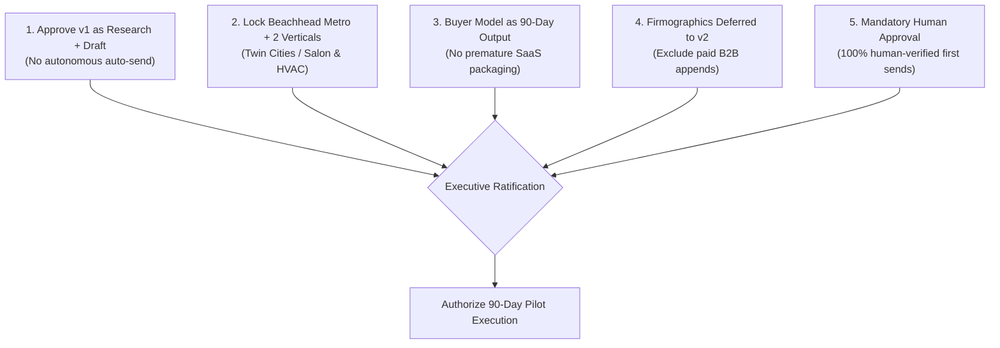

# Recommended Decision

## 1. Intent & Business Value
Project success requires unwavering executive alignment on scope, risk tolerance, and evaluation gates. This epic serves as the formal decision gate and sign-off record for LocalDraft. It locks the five core strategic recommendations from the proposal, preventing premature feature bloat and ensuring all work remains anchored in human-approved research and drafting.

## 2. Source Specifications

### The Five Mandatory Executive Decisions
1. **Approve LocalDraft as Research & Draft System**: Formally ratify LocalDraft as a human-in-the-loop research, enrichment, and drafting engine—explicitly rejecting any buildout of unattended auto-sending or robot SDR capabilities.
2. **Lock Beachhead Metro & Two Service Categories**: Restrict the 90-day pilot strictly to Minneapolis–Saint Paul and surrounding Minnesota counties across two distinct service verticals (e.g., salons and HVAC contractors) before any geographic expansion.
3. **Paying Customer as 90-Day Output, Not Prerequisite**: Treat the identity of the long-term commercial buyer (internal desk vs. agency DFY vs. software SaaS) as an outcome to be decided at Day 90 based on empirical reply data, not as a precondition to building the core pipeline.
4. **Firmographics Deferred to v2**: Keep employee headcount, annual revenue filters, and paid B2B data appends firmly on the v2 backlog until live campaign failures conclusively prove that company size was the true targeting bottleneck.
5. **Human Approval on Every First Send**: Mandate that every single initial outreach email must be reviewed, verified, and dispatched by a human agent for the entire duration of the 90-day pilot.

## 3. Scope Boundaries
- **In Scope (v1)**: Formal sign-off tracking of the 5 decisions, review checklists, strategic decision memos.
- **Explicit Non-Goals (v2+)**:
  - Re-opening debates on auto-sending or firmographic purchases prior to Day 90 review.

## 4. Decision Framework

## 5. Stories

- [Decision checklist approval](decision-checklist-approval-2026-09-12.md) (`decision-checklist-approval-2026-09-12`): Formal ratification tracker and sign-off document recording agreement across all five core recommendations.

## 6. Milestone Definition of Done
- [ ] Formal ratification recorded with timestamp for all 5 decisions.
- [ ] Engineering backlog reflects strict adherence to human-approved sending and deferred firmographics.
- [ ] Pilot charter document linked and accessible from repository documentation.

## 7. Dependencies & Sequencing
- **Prerequisites**: [epic-executive-summary](epic-executive-summary-2026-09-12.md), [epic-90-day-pilot-plan](epic-90-day-pilot-plan-2026-09-12.md).
- **Unblocks**: [epic-immediate-next-steps](epic-immediate-next-steps-2026-09-12.md).
