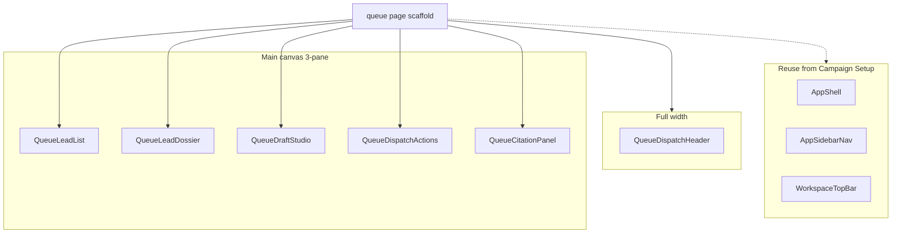

# Review Queue

## 1. Intent & Business Value

Operators need a human-in-the-loop dispatch desk after Campaign Setup, Campaign Pipeline, and Campaigns Admin so they can triage a campaign queue, edit a grounded draft, verify public citations, and copy the message into a native mail client without implying automated send. This epic delivers the **presentational components** from the Stitch screen **LocalDraft - Review Queue** (`projects/13798460973041177032/screens/edf29e27a2824c4da2952f5bd12988fa` in project `agent-lead workspace` / `projects/13798460973041177032`) as isolated, shadcn-composed widgets under `components/queue/`, then a page-scaffold story that composes them into `app/(auth)/queue/page.tsx`.

The outcome is a reusable Review Queue kit that matches the Stitch visual contract, plus a mock-driven `/queue` route (the sidebar already points at `/queue`). This epic does **not** replace the domain queue status machine in [`epic-agent-workspace-2026-09-12`](epic-agent-workspace-2026-09-12.md) or the draft-generation work in [`personalized-draft-citation-panel-2026-09-12`](personalized-draft-citation-panel-2026-09-12.md).

App chrome (256px rail, 56px top bar) already exists from [`epic-campaign-setup-2026-09-18`](epic-campaign-setup-2026-09-18.md) and is **reused**, not rebuilt.

Stitch MCP HTML was unavailable in the card-authoring environment. Screen copy in section 2 is transcribed from the cataloged Stitch screenshot for this screen id (1280×1033 JPEG from `get_screen` `screenshot.downloadUrl`), not invented. Truncated labels are noted; do not expand them into new product copy.

## 2. Source Specifications

### A. Stitch screen

Catalog row from [stitch-to-shadcn/references/projects.md](../../.cursor/skills/stitch-to-shadcn/references/projects.md). Do not invent IDs.

| Field | Value |
|---|---|
| Project | `projects/13798460973041177032` (agent-lead workspace) |
| Screen | `projects/13798460973041177032/screens/edf29e27a2824c4da2952f5bd12988fa` |
| Title | LocalDraft - Review Queue |
| Device | DESKTOP, 2560×2066 |
| Theme | LocalDraft Operator Core — Inter, primary `#0F766E`, canvas `#F8FAFC`, surfaces `#FFFFFF`, borders `#E2E8F0` |

### B. Screen copy and component inventory

Transcribed from the Stitch screenshot (not paraphrased). Page chrome (sidebar, top bar) is documented here for reuse context and is **not** implemented in the widget stories.

The screen is a **3-pane dispatch workbench** inside the main canvas: queue list (narrow left), draft studio (flexible center), citations + constraints (right). There is **no** separate middle “research dossier” column. Listing identity lives at the top of the draft pane.

**Reused chrome (already shipped)**

- Sidebar brand `LocalDraft` / `OPERATOR CORE`, version `v2.4`, nav with **Review Queue** active and count `14`, `Campaigns`, `Follow-ups` count `3`, `Settings`, footer `TARGET CAMPAIGN` / `HVAC - Central Texas`, `Alex M. (Operator)` / `Ready` / `Manual Send Mode Only`.
- Top bar breadcrumb `Workspace` / `Review Desk`, search placeholder `Search leads, domains, campaigns...`, pill `Strict Human-in-the-Loop • No Automated Blasts`, stat `38 drafts reviewed this week`, `New Campaign`.
- Do **not** rebuild the shell. Do **not** add a second `New Campaign` in the queue body.

**Queue dispatch header** (full width above the three panes)

- Title: `Queue Dispatch Terminal`.
- Status chip: `Live Review` (pinging teal).
- Meta: `Austin Metro • HVAC Sector • Tier-1 Lead Batch`.
- Policy chips: `Zero-Automation Policy` • `100% Citation Grounding`.
- Shortcuts row: `Shortcuts:` then `J/K Navigate`, `Copy & Mail`, `Filter Rules`.

This header is composed on the scaffold story as `components/queue/queue-dispatch-header.tsx` (Badge + Button; no extra widget card). Presentational only.

**Queue lead list** (left pane)

- Pane title: `Queue` with count `98`.
- Pending chip: `14 PENDING`.
- Filter placeholder: `Filter queue by business or cit` (truncated; treat as `Filter queue by business or city` only if the control is a city/business search — do not invent a second placeholder).
- View chips (ToggleGroup, not extra Tabs unless HTML proves a tablist): `All (98)`, `Needs Review (14)`. A third chip is truncated `R…`; use `Ready` to match the row badge `Ready`. Do **not** add `Missing website`, `Sent`, or `Follow-up due` as extra chips unless they appear on the screen.
- Compact lead rows (~44px), `#01`–`#07`. Selected row (`#01`) uses `#F0FDFA` + 2px inset `#0F766E`.
- Filled mock rows (names expanded only where the screenshot truncation matches known campaign listings; otherwise keep visible stem):
  1. `Lonestar Air & Heating` — badge `Needs Review` — `HVAC` • `South Austin` • `lonestarair-tx.com` — `2 Verified Facts` — `#01` (selected)
  2. `Round Rock Comfort Pros` — `Needs Review` — `HVAC` • `Round Rock` • domain stem `comfortpros…` — `2 Verified Facts` — `#02`
  3. `Cedar Park HVAC Sp.` — `Ready` — `HVAC` • `Cedar Park` • domain stem `cedarparkhv…` — `3 Verified Facts` — `#03`
  4. `Apex Cool Mechanical` — `Missing Website` — `HVAC` • `Austin` • `Google Maps Only` — `0 Website Facts` — `#04`
  5. `Barton Springs HVAC` — `Low Confidence` — `HVAC` • `Austin` • domain stem `bartonspringsh…` — `1 Candidate Fact` — `#05`
  6. `Hill Country Climate Solutions` — `Needs Review` — `HVAC` • `Cedar Park` • domain stem `hcclimatesolut…` — `2 Verified Facts` — `#06`
  7. `Capital City Heat` — `Sent (Yesterday)` — `HVAC` • `Austin` • domain stem `capitalcityheat…` — `Dispatched Manual` — `#07`

These rows are **not** the pipeline workbench table. Domain `lonestarair-tx.com` is the Review Queue string (do not “correct” it to the pipeline `lonestarairtx.com`).

**Queue lead dossier** (draft-pane identity cluster — not a third column)

Stitch has no independent research column. This widget is the **listing identity** at the top of the center pane:

- Title pattern: `Draft for Marcus Vance`.
- Subtitle: `Owner, Lonestar Air & Heating`.
- Meta: `Saved 12s ago` • `Session #488-TX`.
- To label: `To:` value `marcus@lonestarair-tx.com`.
- Mailto chip: `Verified public mailto`.
- Length chip: `118 words • Phone-readable (<150w)`.

Empty: no selected lead (hide identity / show a vacant To). Disabled: read-only identity, no edit affordance.

**Queue draft studio** (center pane composer)

- Subject label: `SUBJECT LINE` with counter `53 chars`.
- Subject value: `Quick question regarding online booking at Lones` (truncated in screenshot; keep this stem, do not invent a completed company name in the subject unless HTML is recovered).
- Body eyebrow: `EMAIL BODY (MANUAL EDIT MODE)`.
- Helper link: `Plain text format`.
- Toolbar chips: `Token preview active` • `Plain Text Preview`.
- Body (verbatim):

```
Hi Marcus,

Noticed that Lonestar Air has been serving South Austin since 2011 and that you offer same-day emergency AC dispatch.

While checking your site on mobile, I saw that your 'Book Emergency Service' button links directly to a desktop PDF form rather than an instant mobile scheduler, which might be costing you calls during high-heat times.

I recorded a quick 3-minute video showing two simple tweaks to make mobile booking one-click for Austin
```

(Last paragraph is truncated in the screenshot; stop at the visible stem. Do not invent the rest of the sentence.)

- Anchored entities row: `Anchored Entities:` then tokens `#longevity-2011`, `#247-emergency-dispatch`, `#mobile-pdf-glitch` (JetBrains Mono `code-sm` chips, not a new primitive).
- Secondary control: `Re-generate Hook`.

**Queue citation panel** (right rail)

- Title: `Verified Public Citations`.
- Status chip: `Audit Clean`.
- Subhead: `2 of 2 Grounded Facts Confirmed`.
- Helper: `Only verified public facts are referenced. Inferred personal claims and synthetic social history are strictly barred.`
- Fact 1:
  - Eyebrow: `Verified Fact: Emergency Services` • `Parsed 2h ago`
  - Claim: `Offers 24/7 same-day emergency dispatch across Travis County`
  - Source URL: `lonestarair-tx.com/services/emergency`
  - Excerpt: `Our certified technicians provide same-day 24/7 emergency AC repair throughout South Austin and Travis County.`
  - Actions: `Open Source Page` • `Flag`
- Fact 2:
  - Eyebrow: `Verified Fact: Operational Longevity` • `Verified DNS/About`
  - Claim: `Family-owned and locally operated in South Austin since 2011`
  - Source URL: `lonestarair-tx.com/about-us`
  - Excerpt: `Founded in 2011, Lonestar Air is a family-owned HVAC contractor dedicated to Austin homes.`
  - Actions: `Open Source Page` • `Flag`
- Negative constraints card (same rail, same story file):
  - Title: `Negative Constraints Check` • chip `PASSED`
  - `No revenue promises found` / `0 detected`
  - `No simulated past acquaintance` / `Clean audit`
  - `No misleading emergency urgency claim` / `Verified`
  - Actions: `Add Custom Fact` • `Flag Citation Error`

This panel is **not** the LLM generation card [`personalized-draft-citation-panel-2026-09-12`](personalized-draft-citation-panel-2026-09-12.md).

**Queue dispatch actions** (center pane footer)

- Secondary: `Mark as Ready`.
- Primary: `Copy Draft & Open Mail Client`.
- Footer: `Strictly Manual: LocalDraft never sends emails on your behalf. All dispatches occur via your native mail client.`
- No `Send`, `Send all`, or blast control exists on the screen. Do not add one.

### C. Visual tokens (Operator Core, applied to these components)

- Primary action: `#0F766E`, hover `#115E59`, height 32px compact / 36px standard, radius 6px.
- Secondary action: white, `1px solid #E2E8F0`, text `#0F172A`, hover `#F8FAFC` / border `#CBD5E1`.
- Selected queue row: `#F0FDFA` + 2px inset `#0F766E`. Hover `#F8FAFC`. Compact row 44px.
- Chips: 20px height, `label-sm` 11px semibold, 4px radius.
- Cards / panes: white, `1px solid #E2E8F0`, 8px radius, padding 12–16px.
- `Needs Review` / live review: teal `#0F766E` / tint `#F0FDFA`.
- `Ready` / `Audit Clean` / `PASSED` / verified mailto / verified facts: emerald `#047857` / tint `#ECFDF5` / border `#A7F3D0`.
- `Missing Website` / `0 Website Facts`: rose `#E11D48` / tint `#FFF1F2`.
- `Low Confidence` / `1 Candidate Fact`: amber `#D97706` / tint `#FFFBEB`.
- `Sent (Yesterday)` / dispatched: muted `#64748B` / `#F1F5F9`.
- Merge / entity tokens: JetBrains Mono, `#F1F5F9` fill, `1px solid #E2E8F0`, `#0F766E` text, 4px radius.
- Source links: `#0284C7`.
- Manual footer: teal text on a light teal tint, not a rose guardrail (the screen is confirming the manual gate, not blocking).

### D. Component → file map

| Component | File |
|---|---|
| Queue dispatch header | `components/queue/queue-dispatch-header.tsx` (scaffold story) |
| Queue lead list | `components/queue/queue-lead-list.tsx` |
| Queue lead dossier | `components/queue/queue-lead-dossier.tsx` |
| Queue draft studio | `components/queue/queue-draft-studio.tsx` |
| Queue citation panel | `components/queue/queue-citation-panel.tsx` |
| Queue dispatch actions | `components/queue/queue-dispatch-actions.tsx` |
| Review queue page | `app/(auth)/queue/page.tsx` |

## 3. Scope Boundaries

- **In Scope (v1)**: Isolated presentational React components matching the Stitch widgets above. Props and mock data for empty, filled, selected, and disabled states. shadcn/ui primitives (`ToggleGroup` for queue views; CLI-add `scroll-area` only if a pane overflows in implementation). Visual alignment to Operator Core tokens. Mock-driven page assembly at `app/(auth)/queue/page.tsx`. Pathname-driven sidebar `activeItemId` (`review-queue` on `/queue`).
- **Explicit Non-Goals (v2+)**:
  - App sidebar / shell / top bar (reuse the Campaign Setup chrome).
  - Queue persistence, `lib/actions/queue.ts`, status-machine writes, or [`full-status-model-2026-09-12`](full-status-model-2026-09-12.md).
  - SMTP, mailto network send, clipboard implementation beyond an `onCopy` / `onOpenMail` callback, or any Send-all control.
  - LLM regenerate (the `Re-generate Hook` control is a callback only).
  - Follow-ups route `/follow-ups`.
  - Product landing page or Campaign & Review Manager screens.
  - Importing Campaign Pipeline or Campaigns Admin widgets.

## 4. Architecture & Flow



Widget stories receive typed props only. No server actions, no queue entity writes, no shared page store until the scaffold story, which uses a **local mock object** in the page file.

Do not import [`pipeline-workbench-table`](done/pipeline-workbench-table-2026-09-19.md), [`pipeline-workbench-filters`](done/pipeline-workbench-filters-2026-09-19.md), [`campaign-portfolio-table`](done/campaign-portfolio-table-2026-09-19.md), or [`campaign-pipeline-actions`](done/campaign-pipeline-actions-2026-09-19.md). Do not wire `onJumpToQueue`.

Prefer CSS grid for the three panes. Do not CLI-add `resizable` unless HTML shows drag handles (the screenshot does not).

## 5. Stories

- [Review queue lead list](review-queue-lead-list-2026-09-20.md) (`review-queue-lead-list-2026-09-20`): Filter, view chips, seven compact lead rows, selected state.
- [Review queue lead dossier](review-queue-lead-dossier-2026-09-20.md) (`review-queue-lead-dossier-2026-09-20`): Draft-pane identity cluster (recipient, owner, To, mailto, word count).
- [Review queue draft studio](review-queue-draft-studio-2026-09-20.md) (`review-queue-draft-studio-2026-09-20`): Subject, body, token preview, anchored entity chips, re-generate hook.
- [Review queue citation panel](review-queue-citation-panel-2026-09-20.md) (`review-queue-citation-panel-2026-09-20`): Two grounded facts plus negative-constraints check.
- [Review queue dispatch actions](review-queue-dispatch-actions-2026-09-20.md) (`review-queue-dispatch-actions-2026-09-20`): Mark as Ready, Copy Draft & Open Mail Client, strictly manual footer.
- [Review queue page scaffold](review-queue-page-scaffold-2026-09-20.md) (`review-queue-page-scaffold-2026-09-20`): Compose header + 3-pane layout into `app/(auth)/queue/page.tsx`; set nav active from pathname.

### Layout and navigation

Page chrome is reused from Campaign Setup. These cards are **not** created in this epic:

- [Operator app shell](done/operator-app-shell-2026-09-18.md)
- [App sidebar nav](done/app-sidebar-nav-2026-09-18.md)
- [Workspace top bar](done/workspace-top-bar-2026-09-18.md)

## 6. Milestone Definition of Done

- [ ] All five queue widgets exist under `components/queue/` and render in isolation with mock props. The dispatch header exists as `queue-dispatch-header.tsx` from the scaffold story.
- [ ] Empty, filled, selected, and disabled (or inactive) states are implemented where the Stitch screen implies them.
- [ ] Visible copy matches the Stitch strings in section 2 (terminal title, queue rows, draft identity, subject/body stem, citation claims, dispatch labels, manual footer).
- [ ] Components compose shadcn/ui primitives listed on each story card; queue views use `ToggleGroup`, not a hand-rolled tab strip. `Tabs` / `scroll-area` are CLI-added only if named on a claimed story.
- [ ] Visual tokens match Operator Core (teal primary, selected-row inset, chip/card radii, emerald/amber/rose status) from the design system, not Material `namedColors`.
- [ ] Queue widgets do not import pipeline-workbench-table, pipeline-workbench-filters, campaign-portfolio-table, or campaign-pipeline-actions.
- [ ] `app/(auth)/queue/page.tsx` composes the widgets with a local mock; `/queue` shows Review Queue nav as active; no persistence, SMTP, or API client is introduced.

## 7. Dependencies & Sequencing

- **Prerequisites**: [`epic-campaign-setup-2026-09-18`](epic-campaign-setup-2026-09-18.md) (shell, nav, top bar), [`epic-application-architecture-2026-09-15`](epic-application-architecture-2026-09-15.md) (folder layout, shadcn at `components/ui/`), [`epic-ui-design-system-2026-09-15`](epic-ui-design-system-2026-09-15.md) (Operator Core tokens). Campaign Pipeline and Campaigns Admin widgets may already exist; this epic must not import them.
- **Unblocks**: Operators can open `/queue` as the Review Queue landing page. Domain wiring remains [`epic-agent-workspace-2026-09-12`](epic-agent-workspace-2026-09-12.md) / [`full-status-model-2026-09-12`](full-status-model-2026-09-12.md). Product-scope cards [`agent-queue-filters-2026-09-12`](agent-queue-filters-2026-09-12.md), [`manual-send-path-2026-09-12`](manual-send-path-2026-09-12.md), and [`personalized-draft-citation-panel-2026-09-12`](personalized-draft-citation-panel-2026-09-12.md) stay as later behavior/LLM work and are not closed by this epic.
