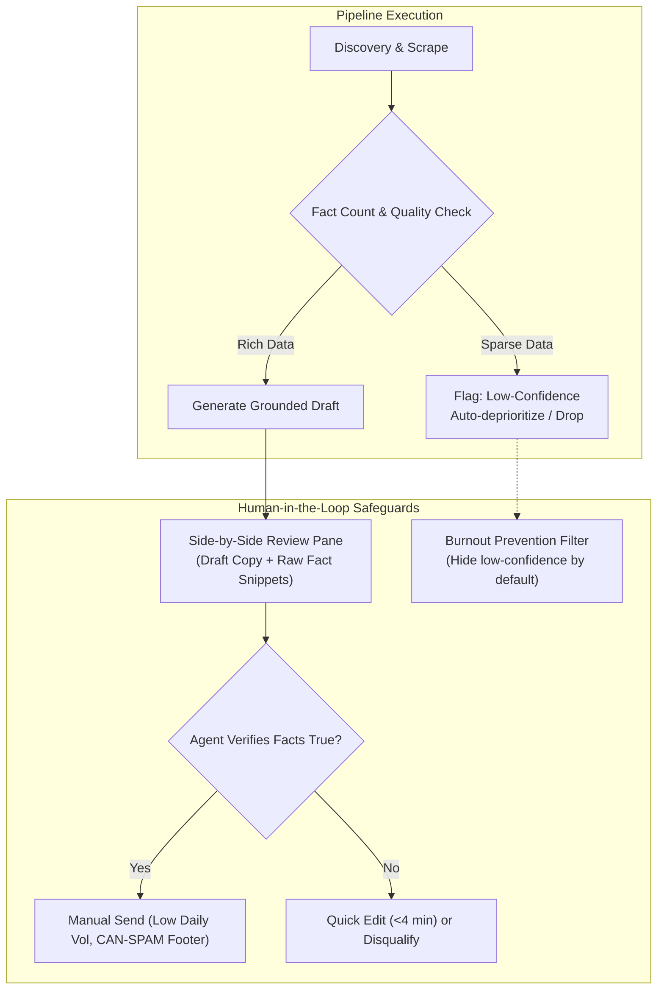

# Risks and Mitigations

## 1. Intent & Business Value
Any cold outreach and automated enrichment system faces distinct technical, legal, and operational vulnerabilities. Left unmanaged, these vulnerabilities lead to IP bans, spam penalties, AI hallucinations, or operator fatigue. This epic operationalizes the Proposal's Risk Matrix into active software safeguards, queue triage rules, and evaluation procedures that mitigate failure modes before they compromise the pilot.

## 2. Source Specifications

### Comprehensive Risk & Mitigation Matrix
| Primary Risk | Potential Impact | Built-in Technical & Operational Mitigation |
|--------------|------------------|---------------------------------------------|
| **Maps / Search ToS or API Cost Shock** | Provider API suspension or unexpected billing spikes. | API-first architecture, disk caching of results, hard volume caps per campaign in one metro. |
| **Thin Websites & Missing Emails** | High proportion of listings yield no usable email address. | Provide `has-email` soft filter in the queue; skip cleanly without crashing; treat phone as a later channel. |
| **Model Invents Facts (Hallucination)** | Embarrassing outreach with fake claims destroying trust. | Display citation panel with raw text snippets; mark sparse accounts as `low-confidence`; require human approval for every send. |
| **Deliverability & Spam Complaints** | Domain blocklisting and burned sender reputation. | Send from authentic operator mailboxes at low daily volumes (<50/day) with strict CAN-SPAM footers and clear opt-out language. |
| **No Clear Paying Buyer** | Engineering software features without commercial demand. | Pilot initially as an internal or done-for-you (DFY) service to measure true reply value before packaging multi-tenant SaaS. |
| **Offer is Weak (Not the Tool)** | False conclusion that LocalDraft failed when the pitch was poor. | Require a comprehensive campaign brief up front; evaluate offer iterations separately from scraping/drafting quality. |
| **Operator Burnout on Review** | Human agent spends excessive time rewriting low-quality drafts. | Compute queue quality scores; automatically drop or deprioritize low-confidence rows so the agent only reviews viable drafts. |

## 3. Scope Boundaries
- **In Scope (v1)**: Living risk register tracking, automated low-confidence filtering, citation pane side-by-side verification, separate tagging for offer experiments vs. tool errors.
- **Explicit Non-Goals (v2+)**:
  - Complex probabilistic machine-learning spam classifiers.
  - Multi-tenant compliance auditing engines.

## 4. Risk Mitigation Architecture

## 5. Stories

- [Living risk register](living-risk-register-2026-09-12.md) (`living-risk-register-2026-09-12`): Maintain and review the active risk log throughout the 90-day pilot.
- [Drop low-confidence burnout rule](drop-low-confidence-burnout-rule-2026-09-12.md) (`drop-low-confidence-burnout-rule-2026-09-12`): Queue filtering rule that hides or auto-skips low-confidence drafts to preserve human operator energy.
- [Offer vs tool measurement](offer-vs-tool-measurement-2026-09-12.md) (`offer-vs-tool-measurement-2026-09-12`): Protocol for separating messaging/offer test variables from technical pipeline bugs during pilot post-mortems.

## 6. Milestone Definition of Done
- [ ] Risk register is reviewed and updated weekly alongside pilot campaign reviews.
- [ ] Queue UI allows toggling "Hide low-confidence drafts" with a single click to protect operator focus.
- [ ] Citation panel displays the exact source sentence for every cited claim in the review interface.
- [ ] Weekly logging separates zero-reply incidents into "offer failure" vs. "enrichment failure" categories.

## 7. Dependencies & Sequencing
- **Prerequisites**: [epic-problem](epic-problem-2026-09-12.md), [epic-compliance-and-risk](epic-compliance-and-risk-2026-09-12.md).
- **Unblocks**: [epic-90-day-pilot-plan](epic-90-day-pilot-plan-2026-09-12.md), [epic-recommended-decision](epic-recommended-decision-2026-09-12.md).
