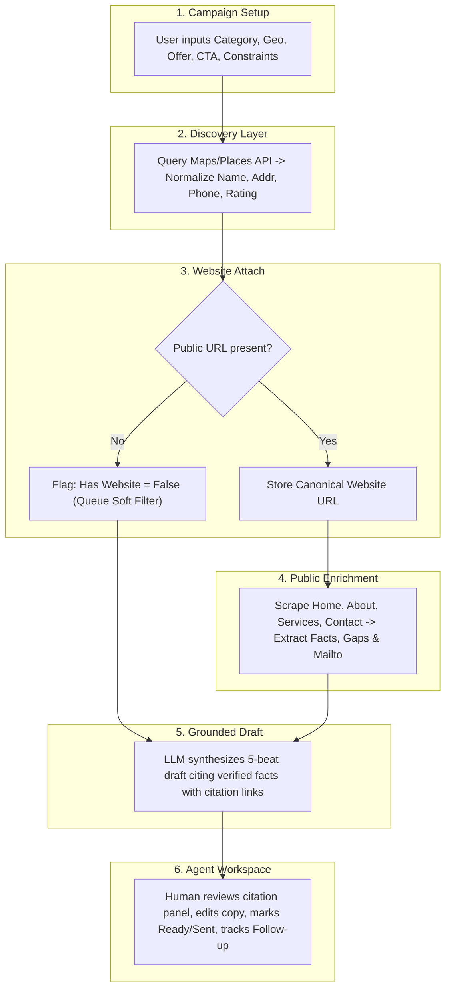

# Solution

## 1. Intent & Business Value
LocalDraft is intentionally engineered as a human-in-the-loop intelligence pipeline, not an autonomous robotic sales development representative (SDR). Fully automated outbound systems alienate local shop owners and risk severe domain reputation penalties. This epic establishes the architectural backbone and stage contracts of the six-part core loop that systematically transforms raw market searches into researched, human-approved email drafts.

## 2. Source Specifications

### The Six-Stage Core Loop
1. **Campaign Setup**: The operator inputs business niche/type, geographic boundaries, and the specific campaign offer brief (including call-to-action and negative constraints).
2. **Discovery**: The system queries Google Maps / licensed local search providers to return active matching businesses with geographic, contact, and category metadata.
3. **Website Attach**: For every discovered listing, the system extracts and validates canonical public website URLs, flagging records lacking websites.
4. **Enrichment**: A polite crawler scrapes public pages (`/`, `/about`, `/services`, `/contact`) to extract concrete, usable facts: service lists, booking/quote CTAs, review-count themes, site gaps, and visible contact emails.
5. **Draft Generation**: An AI drafting engine produces one phone-readable email per business that bridges 1–2 verified facts directly to the campaign offer without hallucinating unverified claims.
6. **Agent Queue**: Discovered businesses and generated drafts populate a unified queue where the human operator reviews, edits, manually dispatches via personal mailbox, and tracks reply/follow-up states.

## 3. Scope Boundaries
- **In Scope (v1)**: 6 sequential stages, deterministic data handoffs, idempotency on re-enrichment or re-drafting, agent manual dispatch gate.
- **Explicit Non-Goals (v2+)**:
  - Bypassing the human agent to trigger autonomous email sending.
  - Multi-step branching nurture trees or auto-drips.
  - Multi-tenant enterprise role-based access control.

## 4. Pipeline Stage Architecture

## 5. Stories

- [Specify core loop stages](specify-core-loop-stages-2026-09-12.md) (`specify-core-loop-stages-2026-09-12`): Architectural document and pipeline orchestrator wiring the six discrete stages.
- [Pipeline stage data contracts](pipeline-stage-data-contracts-2026-09-12.md) (`pipeline-stage-data-contracts-2026-09-12`): Strongly typed TypeScript interfaces (DTOs) and transition assertions between each pipeline stage.

## 6. Milestone Definition of Done
- [ ] End-to-end integration test runs all 6 pipeline stages from campaign creation through agent queue display.
- [ ] Pipeline data contracts strictly validate stage inputs and outputs, halting downstream steps on fatal fetch errors while logging warnings for soft errors (e.g. missing website).
- [ ] Re-running enrichment or drafting for an existing campaign business updates existing records idempotently without duplicating accounts.
- [ ] Pipeline strictly requires human action in Stage 6 before any email can transition to `Sent`.

## 7. Dependencies & Sequencing
- **Prerequisites**: [epic-purpose](epic-purpose-2026-09-12.md).
- **Unblocks**: [epic-v1-product-scope](epic-v1-product-scope-2026-09-12.md), [epic-data-and-enrichment](epic-data-and-enrichment-2026-09-12.md), [epic-agent-workspace](epic-agent-workspace-2026-09-12.md).
