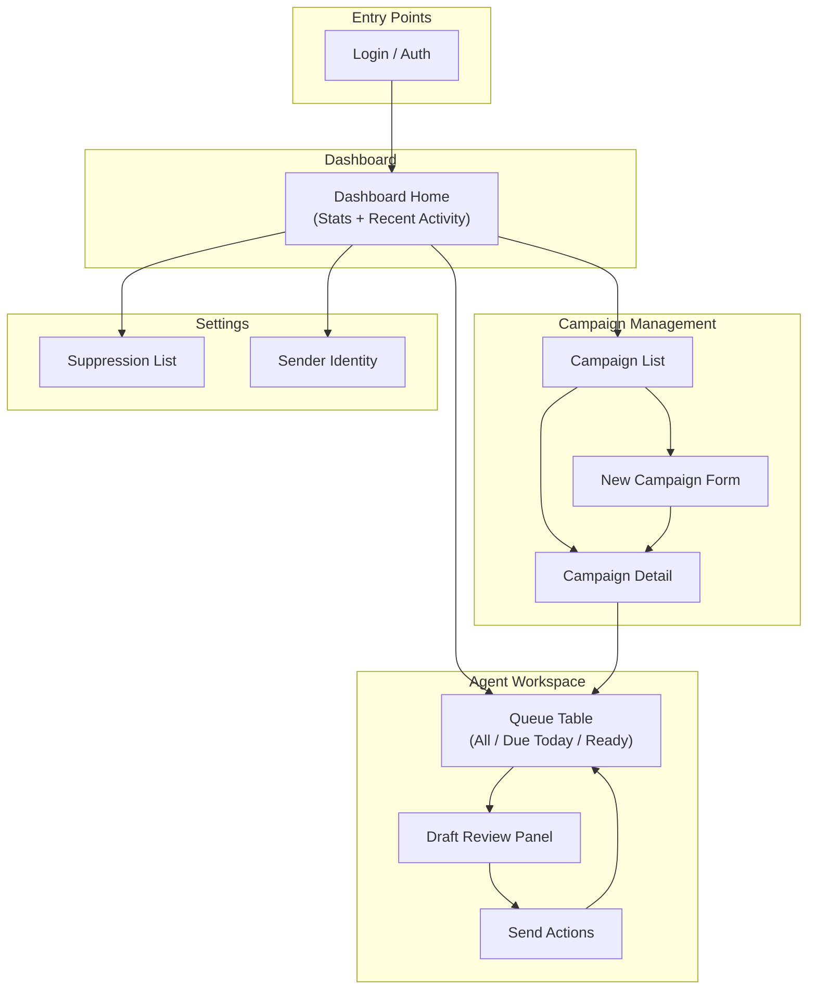
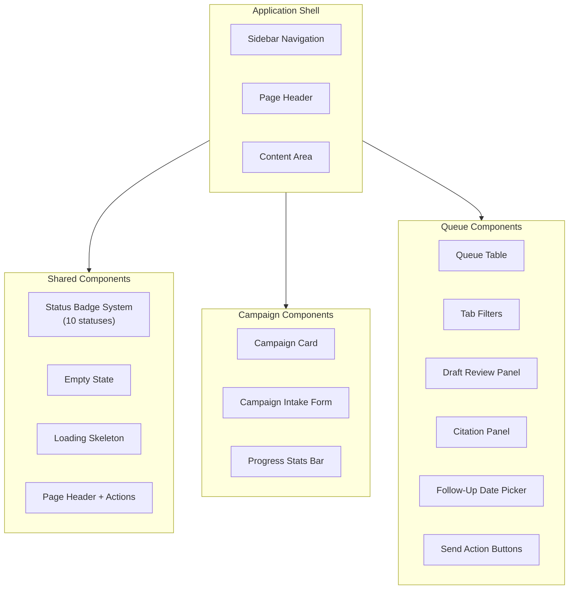

# UI Design System

## 1. Intent & Business Value

This epic defines the complete UI/UX design specifications for LocalDraft before any implementation code is written. It breaks down the interface into discrete screens, components, and interaction patterns — each with wireframes, user flows, and shadcn/ui component mappings. By completing design specifications first, the team avoids mid-build UI pivots and ensures a cohesive, professional operator experience from day one.

**Key Outcomes:**

- Complete screen-by-screen wireframes and layout specifications
- Consistent component patterns mapped to shadcn/ui primitives
- Documented interaction states (loading, empty, error, success)
- Visual hierarchy and information architecture for single-operator workflow
- No implementation code — design artifacts only

## 2. Source Specifications

### A. Primary Screen Inventory

LocalDraft requires 4 primary UI areas based on the v1 product scope:

ScreenPurposeKey Components**Dashboard**At-a-glance campaign health and queue metricsStat cards, activity feed, quick actions**Campaign Management**Create, view, and manage campaignsList view, creation form, detail view**Agent Workspace (Queue**)Review drafts, approve, send, track follow-upsFilterable table, draft panel, citation viewer**Settings**Suppression list, sender identity, preferencesForms, tables, configuration panels

### B. User Flow Map



### C. Component Hierarchy



### D. Status Badge Color System

StatusColorIconMeaning`New`GrayCircleDiscovered, not yet enriched`Enriched`BlueDatabaseWebsite scraped, facts extracted`Drafted`PurpleFileTextDraft generated, awaiting review`Needs Edit`OrangeAlertTriangleAgent flagged for revision`No Email`YellowMailXNo contact email found`Skipped`MutedXCircleDisqualified or out-of-ICP`Ready`GreenCheckCircleApproved, pending send`Sent`TealSendDispatched via mail client`Replied`EmeraldMessageCircleInbound response received`Follow-up Due`RedClockNext-touch date reached

## 3. Scope Boundaries

### In Scope (v1 Design)

- Wireframes and layout specifications for all 4 primary screens
- Component design mapped to shadcn/ui primitives
- Interaction states (hover, focus, loading, empty, error, success)
- Responsive breakpoints (desktop-first, tablet, mobile considerations)
- Accessibility annotations (focus order, ARIA labels, color contrast)
- Design tokens (spacing, typography, color palette via Tailwind)

### Explicit Non-Goals (v2+)

- High-fidelity mockups in Figma (wireframes and specs are sufficient)
- Animation and micro-interaction timing curves
- Multi-tenant branding or white-label theming
- Mobile-native app designs
- Marketing site or public landing pages

## 4. Screen Specifications

### A. Dashboard Overview

```
┌─────────────────────────────────────────────────────────────┐
│  LocalDraft                    [+ New Campaign]  [Settings] │
├─────────┬───────────────────────────────────────────────────┤
│         │                                                   │
│  ◉ Dash │  Dashboard                                        │
│  ◎ Camp │  ─────────────────────────────────────────────── │
│  ◎ Queue│  ┌─────────┐ ┌─────────┐ ┌─────────┐ ┌─────────┐ │
│  ◎ Sett │  │ Active  │ │ Ready   │ │ Due     │ │ Sent    │ │
│         │  │ Camps   │ │ to Send │ │ Today   │ │ Week    │ │
│         │  │   3     │ │   24    │ │   7     │ │   45    │ │
│         │  └─────────┘ └─────────┘ └─────────┘ └─────────┘ │
│         │                                                   │
│         │  Recent Activity                                  │
│         │  ─────────────────────────────────────────────── │
│         │  • Acme Salon moved to Ready          2 min ago  │
│         │  • Campaign "HVAC Q4" created         1 hour ago │
│         │  • 12 new listings discovered         3 hours ago│
│         │                                                   │
└─────────┴───────────────────────────────────────────────────┘
```

### B. Campaign List

```
┌─────────────────────────────────────────────────────────────┐
│  Campaigns                              [+ New Campaign]    │
├─────────────────────────────────────────────────────────────┤
│  Filter: [All ▼]  Sort: [Newest ▼]                         │
├─────────────────────────────────────────────────────────────┤
│  ┌─────────────────────────────────────────────────────┐   │
│  │ 🏠 HVAC Contractors - Twin Cities     [Active]      │   │
│  │ Hennepin, Ramsey Counties                           │   │
│  │ 156 listings  •  89 drafted  •  34 sent             │   │
│  │ Created Sep 10, 2026                    [View →]    │   │
│  └─────────────────────────────────────────────────────┘   │
│  ┌─────────────────────────────────────────────────────┐   │
│  │ 💇 Hair Salons - Anoka                 [Active]      │   │
│  │ Anoka, Blaine, Coon Rapids                          │   │
│  │ 78 listings  •  45 drafted  •  12 sent              │   │
│  │ Created Sep 8, 2026                     [View →]    │   │
│  └─────────────────────────────────────────────────────┘   │
└─────────────────────────────────────────────────────────────┘
```

### C. Campaign Creation Form

```
┌─────────────────────────────────────────────────────────────┐
│  ← Back to Campaigns                                        │
│                                                             │
│  New Campaign                                               │
├─────────────────────────────────────────────────────────────┤
│                                                             │
│  TARGETING                                                  │
│  ─────────────────────────────────────────────────────────  │
│  Business Type *                                            │
│  ┌─────────────────────────────────────────────────────┐   │
│  │ Hair Salon                                      [▼] │   │
│  └─────────────────────────────────────────────────────┘   │
│  Presets: [Salon] [HVAC] [Auto Repair] [Dental]            │
│                                                             │
│  Target Geography *                                         │
│  ┌─────────────────────────────────────────────────────┐   │
│  │ Hennepin County, MN                                 │   │
│  └─────────────────────────────────────────────────────┘   │
│                                                             │
│  MESSAGING                                                  │
│  ─────────────────────────────────────────────────────────  │
│  Offer Summary *                                            │
│  ┌─────────────────────────────────────────────────────┐   │
│  │ We build simple online booking pages for            │   │
│  │ independent salons in the north metro.              │   │
│  └─────────────────────────────────────────────────────┘   │
│                                                             │
│  Call to Action *                                           │
│  ┌─────────────────────────────────────────────────────┐   │
│  │ Reply with a preferred time for a 15-min call   [▼] │   │
│  └─────────────────────────────────────────────────────┘   │
│                                                             │
│  Proof You May Cite (optional)                              │
│  ┌─────────────────────────────────────────────────────┐   │
│  │ 40+ booking pages built for MN salons since 2024    │   │
│  └─────────────────────────────────────────────────────┘   │
│                                                             │
│  Claims to Avoid (optional)                                 │
│  ┌─────────────────────────────────────────────────────┐   │
│  │ [guaranteed] [free] [unlimited]              [+ Add]│   │
│  └─────────────────────────────────────────────────────┘   │
│                                                             │
│  FILTERS                                                    │
│  ─────────────────────────────────────────────────────────  │
│  ☑ Has Website    ☐ Has Email Found    Min Rating: [3.5]   │
│                                                             │
│                          [Cancel]  [Create Campaign]        │
└─────────────────────────────────────────────────────────────┘
```

### D. Agent Queue Workspace

```
┌─────────────────────────────────────────────────────────────┐
│  Agent Queue                           Campaign: [All ▼]    │
├─────────────────────────────────────────────────────────────┤
│  [All (156)] [Due Today (7)] [Ready (24)] [Needs Edit (3)] │
├─────────────────────────────────────────────────────────────┤
│  Business          City      Status    Email     Actions   │
│  ─────────────────────────────────────────────────────────  │
│  Anoka Style Salon  Anoka    [Ready]   ✓ Found   [Review]  │
│  Blaine Cuts        Blaine   [Drafted] ✓ Found   [Review]  │
│  Coon Rapids Hair   C.Rapids [No Email] ✗ None   [Skip]    │
│  Diamond Salon      Anoka    [Sent]    ✓ Found   [Log Reply]│
│  Elite Styles       Blaine   [Due!]    ✓ Found   [Follow Up]│
│  ...                                                        │
├─────────────────────────────────────────────────────────────┤
│  Showing 1-25 of 156                    [← Prev] [Next →]  │
└─────────────────────────────────────────────────────────────┘
```

### E. Draft Review Panel (Slide-over Sheet)

```
┌─────────────────────────────────────────────────────────────┐
│  ← Back                              Anoka Style Salon      │
├────────────────────────────────┬────────────────────────────┤
│                                │                            │
│  DRAFT                         │  CITED FACTS               │
│  ──────────────────────────    │  ────────────────────────  │
│                                │                            │
│  Subject:                      │  Services (from /services) │
│  ┌────────────────────────┐   │  ┌──────────────────────┐  │
│  │ Booking page observa-  │   │  │ "Haircuts, Color,    │  │
│  │ tion for Anoka Style   │   │  │  Balayage, Extensions"│  │
│  └────────────────────────┘   │  └──────────────────────┘  │
│                                │                            │
│  Body:                         │  Gap Detected (from /)     │
│  ┌────────────────────────┐   │  ┌──────────────────────┐  │
│  │ Hi — your Anoka        │   │  │ No online booking    │  │
│  │ listing shows 40+      │   │  │ link found; contact  │  │
│  │ reviews and the site   │   │  │ form only            │  │
│  │ still sends people to  │   │  └──────────────────────┘  │
│  │ a contact form instead │   │                            │
│  │ of a booking slot.     │   │  Reviews (from Maps)       │
│  │                        │   │  ┌──────────────────────┐  │
│  │ We build simple        │   │  │ 4.8 ★ (47 reviews)   │  │
│  │ booking pages for      │   │  │ Theme: "friendly     │  │
│  │ independent salons in  │   │  │ staff, quick service"│  │
│  │ the north metro.       │   │  └──────────────────────┘  │
│  │                        │   │                            │
│  │ If you want, I can     │   │  Confidence: [HIGH ✓]      │
│  │ send a one-page mock   │   │                            │
│  │ using your current     │   │                            │
│  │ service list.          │   │                            │
│  └────────────────────────┘   │                            │
│                                │                            │
│  85 words                      │                            │
│                                │                            │
├────────────────────────────────┴────────────────────────────┤
│  [Skip]  [Needs Edit]  [Approve]    [Copy] [Open in Mail]  │
└─────────────────────────────────────────────────────────────┘
```

## 5. Stories

- [Shell and navigation design](ui-shell-navigation-2026-09-15.md) (`ui-shell-navigation-2026-09-15`): Application shell, sidebar navigation, responsive layout, page header component.
- [Dashboard overview design](ui-dashboard-overview-2026-09-15.md) (`ui-dashboard-overview-2026-09-15`): Stat cards, activity feed, quick actions, empty state for new users.
- [Campaign list design](ui-campaign-list-2026-09-15.md) (`ui-campaign-list-2026-09-15`): Campaign cards, status badges, filter/sort controls, empty state.
- [Campaign form design](ui-campaign-form-2026-09-15.md) (`ui-campaign-form-2026-09-15`): Multi-section intake form, validation states, preset buttons, field groupings.
- [Campaign detail design](ui-campaign-detail-2026-09-15.md) (`ui-campaign-detail-2026-09-15`): Progress stats, listings table, status breakdown, campaign actions.
- [Agent queue workspace design](ui-agent-queue-workspace-2026-09-15.md) (`ui-agent-queue-workspace-2026-09-15`): Tab navigation, queue table, inline actions, pagination, bulk operations.
- [Draft review panel design](ui-draft-review-panel-2026-09-15.md) (`ui-draft-review-panel-2026-09-15`): Split view layout, draft editor, action buttons, confidence indicator.
- [Citation panel design](ui-citation-panel-2026-09-15.md) (`ui-citation-panel-2026-09-15`): Fact cards, source snippets, grouped by type, visual linking to draft.
- [Status badge system design](ui-status-badge-system-2026-09-15.md) (`ui-status-badge-system-2026-09-15`): Color/icon mapping for 10 statuses, badge variants, tooltip definitions.
- [Follow-up tracking UI design](ui-follow-up-tracking-2026-09-15.md) (`ui-follow-up-tracking-2026-09-15`): Date picker, note input, Due Today highlighting, inline edit.
- [Manual send actions design](ui-manual-send-actions-2026-09-15.md) (`ui-manual-send-actions-2026-09-15`): Copy buttons, mailto trigger, Mark Sent confirmation, success toasts.
- [Empty and loading states design](ui-empty-loading-states-2026-09-15.md) (`ui-empty-loading-states-2026-09-15`): Empty states with CTAs, loading skeletons, error states with retry.
- [Suppression list UI design](ui-suppression-list-2026-09-15.md) (`ui-suppression-list-2026-09-15`): Suppression table, add/remove forms, import consideration.

## 6. Milestone Definition of Done

- \[ \] All 4 primary screens have complete wireframe specifications.
- \[ \] Component inventory maps every UI element to a shadcn/ui primitive.
- \[ \] Status badge system documents color, icon, and meaning for all 10 statuses.
- \[ \] Interaction states (loading, empty, error, success) are specified for each screen.
- \[ \] User flow diagrams show navigation paths between all screens.
- \[ \] Responsive breakpoint annotations identify mobile/tablet adaptations.
- \[ \] Accessibility notes document focus order and ARIA requirements.
- \[ \] No implementation code is written — this epic produces design artifacts only.

## 7. Dependencies & Sequencing

- **Prerequisites**: [epic-application-architecture](epic-application-architecture-2026-09-15.md), [epic-v1-product-scope](epic-v1-product-scope-2026-09-12.md), [epic-agent-workspace](epic-agent-workspace-2026-09-12.md).
- **Unblocks**: All UI implementation stories in [epic-campaign-intake-fields](epic-campaign-intake-fields-2026-09-12.md), [epic-agent-workspace](epic-agent-workspace-2026-09-12.md), and [epic-v1-product-scope](epic-v1-product-scope-2026-09-12.md).