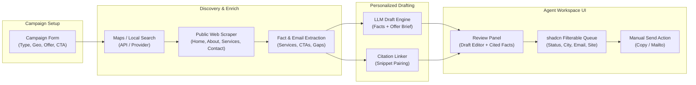

# v1 Product Scope

## 1. Intent & Business Value
This epic establishes the end-to-end minimum viable product (MVP) thin-path capabilities for LocalDraft. The goal is to prove whether personalized, fact-based email drafts generated from public listings and websites generate meaningful response rates for local service companies when reviewed and sent by a human operator, without the overhead of enterprise databases or risky auto-send infrastructure.

## 2. Source Specifications

### Must-Ship Functional Scope
1. **Business Type Prompt**: Input field supporting preset common categories (e.g., hair salon, HVAC, auto mechanic) plus free-text input.
2. **Geography Prompt**: Area targeting by state, county, city, or a short list of cities.
3. **Local Search / Maps Discovery**: Ingestion of name, address, phone, rating, review count, category, and public website URL.
4. **Website Scraper**: Automated crawl of public homepage and essential child pages (`/about`, `/services`, `/contact`).
5. **Email-on-Site Harvester**: Extraction of visible `mailto:` and contact page email addresses; flagging records where no email is found.
6. **Campaign Offer Field**: Dedicated brief input (offer, tone, claims to avoid) driving draft personalization and variance.
7. **Personalized Draft with Citation Panel**: Generation of tailored subject and email body paired with a side-by-side citation panel displaying the exact facts used.
8. **Agent Workspace Queue**: Sortable and filterable queue table for campaign rows.
9. **Manual Send Path**: Frictionless copy-to-clipboard and `mailto:` invocation; zero unattended automated email blasts.
10. **Follow-Up Tracking**: Target next-touch date picker accompanied by a one-line context note.

### Filter Matrix (v1 vs. Later)
| Filter / Capability | v1 (Pilot Scope) | Later (v2+) |
|---------------------|------------------|-------------|
| **Business type / category** | Yes (presets + free text) | Richer hierarchical taxonomy |
| **Geography** | Yes (city, county, state, multi-city) | Radius and drive-time bounding |
| **Has website** | Yes (binary filter) | Tech stack / CMS detection |
| **Has email found** | Yes (soft filter in queue) | Verification and email-finder network |
| **Rating / review count** | Optional soft filter | Sentiment and review-theme filtering |
| **Employees / revenue** | **No** (strictly excluded) | Paid firmographic data append |
| **Already contacted** | Yes (in-app suppression) | Cross-campaign global suppression |

## 3. Scope Boundaries
- **In Scope (v1 Thin Path)**: Single-operator workflow, manual send approval, public-web facts only, in-app status queue, copy-to-clipboard / mailto send paths.
- **Explicit Non-Goals (v2+)**:
  - Unattended auto-blasting or automated multi-touch sequences.
  - Integration of paid firmographic data (headcount, revenue, employee names).
  - Guaranteed email discovery on every listing.
  - Bi-directional CRM synchronization.
  - Multi-channel outreach (SMS, cold calling).
  - National or continuous always-on crawling.

## 4. Architecture & Core Pipeline Flow

## 5. Stories

- [Business-type and geography prompts](campaign-type-geo-prompts-2026-09-12.md) (`campaign-type-geo-prompts-2026-09-12`): UI and schema for business category presets, free text, and geo bounds.
- [Maps local-search discovery fields](maps-local-search-discovery-2026-09-12.md) (`maps-local-search-discovery-2026-09-12`): Discovery client retrieving name, address, phone, rating, reviews, site URL.
- [Website scrape key pages](website-scrape-key-pages-2026-09-12.md) (`website-scrape-key-pages-2026-09-12`): HTTP fetcher for homepage and `/about`, `/services`, `/contact`.
- [Email-on-site detection](email-on-site-detection-2026-09-12.md) (`email-on-site-detection-2026-09-12`): Parser identifying visible mailto links and contact page addresses with no-email flagging.
- [Campaign offer field](campaign-offer-field-2026-09-12.md) (`campaign-offer-field-2026-09-12`): Campaign brief fields that allow drafts to pivot when the pitch changes.
- [Personalized draft and citation panel](personalized-draft-citation-panel-2026-09-12.md) (`personalized-draft-citation-panel-2026-09-12`): Generation of subject + body alongside cited facts UI in shadcn.
- [Agent queue filters](agent-queue-filters-2026-09-12.md) (`agent-queue-filters-2026-09-12`): Queue views filtering by status, city, has-email, and has-website.
- [Manual send path](manual-send-path-2026-09-12.md) (`manual-send-path-2026-09-12`): Human-in-the-loop copy-to-clipboard and mailto dispatch buttons.
- [Follow-up date and note](follow-up-date-note-2026-09-12.md) (`follow-up-date-note-2026-09-12`): Next-touch date picker and one-line follow-up note input.
- [Soft filters v1 documentation](soft-filters-v1-docs-2026-09-12.md) (`soft-filters-v1-docs-2026-09-12`): Reference documentation and UI enforcement of v1 vs. v2 scope boundaries.

## 6. Milestone Definition of Done
- [ ] Operator can define a campaign with business category, target geo, offer summary, and single call-to-action.
- [ ] System automatically retrieves local business listings for the specified area and attaches valid public website URLs.
- [ ] Scraper extracts text from key public pages without failing on missing optional pages or slow sites.
- [ ] Email detector records contact addresses and correctly tags listings lacking an email as `status: "no-email"`.
- [ ] Draft generator produces unique, phone-readable emails citing 1–2 real extracted facts next to a citation pane.
- [ ] Agent workspace displays rows in a shadcn-styled table with functioning multi-criteria filters.
- [ ] Every email send requires explicit agent action via clipboard copy or mail client launcher.
- [ ] Agent can assign next-touch follow-up dates and notes that appear in queue views.

## 7. Dependencies & Sequencing
- **Prerequisites**: [epic-solution](epic-solution-2026-09-12.md) (pipeline stages), [epic-purpose](epic-purpose-2026-09-12.md) (input/output contracts).
- **Unblocks**: [epic-data-and-enrichment](epic-data-and-enrichment-2026-09-12.md), [epic-agent-workspace](epic-agent-workspace-2026-09-12.md), [epic-90-day-pilot-plan](epic-90-day-pilot-plan-2026-09-12.md).
