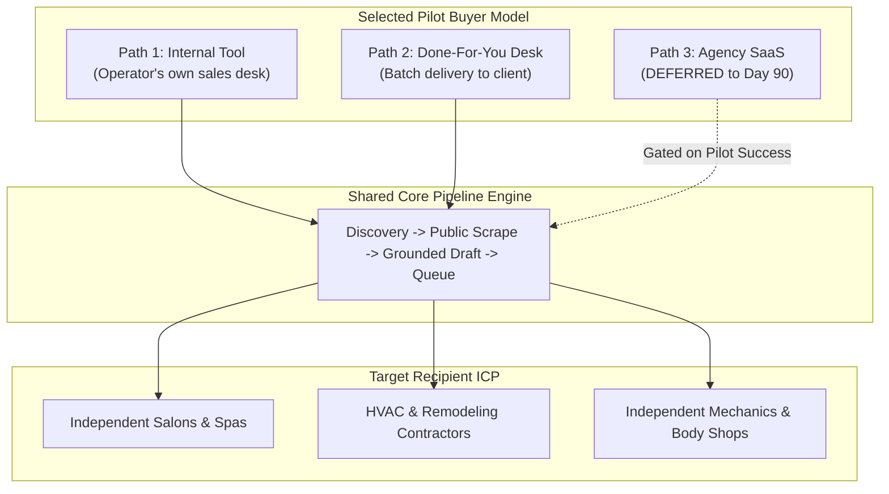

# Who This Serves

## 1. Intent & Business Value
A critical distinction in LocalDraft's architecture is the difference between the **Target Recipient** (the local service business receiving outreach) and the **Paying Customer** (the operator using the system). While the recipient ICP is crystal clear, the paying customer model remains open. This epic formalizes the target recipient profile and evaluates the three commercial buyer pathways to ensure early product engineering focuses on the shared core workflow rather than premature packaging.

## 2. Source Specifications

### A. The Target Recipient ICP (Ideal Customer Profile)
- **Target Category**: Local, independently owned service businesses (e.g., hair salons, barber shops, auto mechanics, residential remodeling contractors, concrete/driveway installers, HVAC technicians, independent dental offices, landscape contractors).
- **Target Characteristics**:
  - Operates a public listing on Google Maps or local search directories.
  - Maintains an active or semi-active public website (template builder, custom WordPress, or static HTML).
  - High customer-interaction frequency where online booking, phone calls, and quote requests are the lifeblood of business.
- **Negative Recipient ICP**: Large enterprise headquarters, national corporate franchise chains with centralized marketing, or businesses without physical local operations.

### B. The Three Commercial Buyer Pathways
| Buyer Path | Primary Operator | Offering Sold | Product & Operational Implication |
|------------|------------------|---------------|-----------------------------------|
| **1. Internal Tool** | You or your direct team. | Whatever services you already sell locally. | Fastest to pilot; zero product packaging or tenant isolation required. |
| **2. Done-For-You (DFY)** | Your desk operating on behalf of a client. | Researched accounts + custom drafts as a service. | Price per campaign batch ($750–$2,500) or per qualified draft; no client UI needed. |
| **3. Agency Software (SaaS)**| External marketing agencies, SDRs, consultants. | Their own service offers, campaign by campaign. | Requires multi-user accounts, self-service onboarding, team roles, and support. |

### C. The 90-Day Operational Recommendation
> **Run the first 90 days exclusively as an internal tool or done-for-you (DFY) pilot in one metropolitan area. Do not build or price a multi-tenant SaaS until reply rates and draft quality are empirically measured.**

## 3. Scope Boundaries
- **In Scope (v1)**: Local service business recipient criteria, documentation of the three buyer paths, decision gate criteria for commercial packaging.
- **Explicit Non-Goals (v2+)**:
  - Multi-tenant client portals or self-serve signup flows.
  - White-label agency branding.

## 4. Recipient vs. Buyer Architecture

## 5. Stories

- [Document list ICP](document-list-icp-2026-09-12.md) (`document-list-icp-2026-09-12`): Comprehensive definition of target local service businesses with positive and negative inclusion criteria.
- [Choose 90-day buyer path](choose-90-day-buyer-path-2026-09-12.md) (`choose-90-day-buyer-path-2026-09-12`): Strategic memo establishing whether the initial pilot operates as an internal sales tool or a DFY agency desk.

## 6. Milestone Definition of Done
- [ ] Recipient ICP documentation is finalized with example inclusion and exclusion guidelines.
- [ ] Campaign creation form defaults align with local trade and service business categories.
- [ ] Architecture validates that the core pipeline remains completely decoupled from client packaging or billing assumptions.
- [ ] Formal sign-off on the 90-day pilot pathway (Internal vs. DFY) before beginning live outreach.

## 7. Dependencies & Sequencing
- **Prerequisites**: [epic-executive-summary](epic-executive-summary-2026-09-12.md).
- **Unblocks**: [epic-beachhead-gtm](epic-beachhead-gtm-2026-09-12.md), [epic-business-model](epic-business-model-2026-09-12.md).
